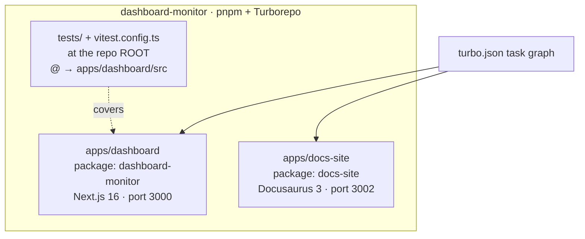
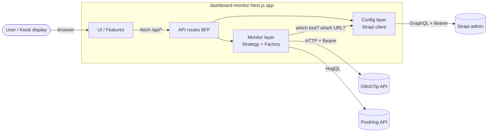
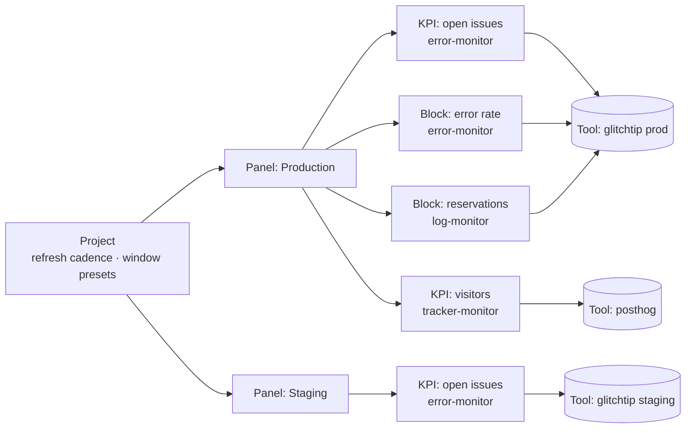
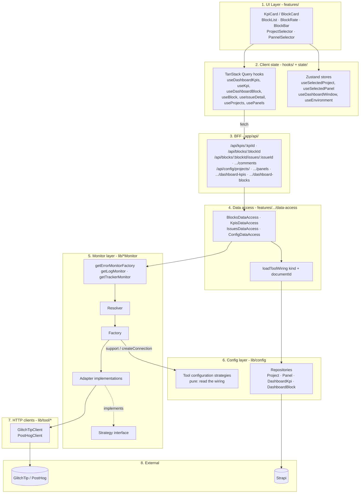
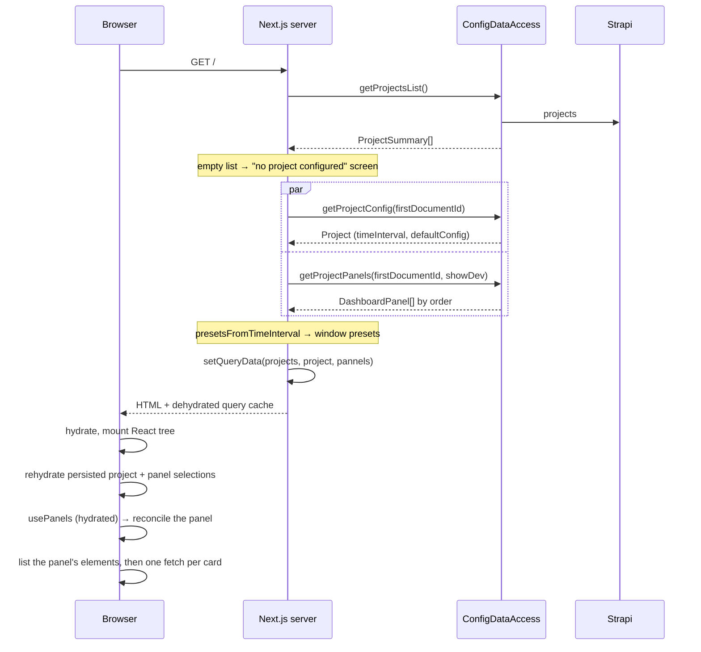

# Architecture

This document describes the overall architecture of `dashboard-monitor`: the layers, the boundaries, and the rationale.

For the deep dive on the Strategy/Factory pattern, see [monitors.md](monitors.md). For the unit that carries provider wiring, see [panels.md](panels.md). For end-to-end request traces, see [data-flow.md](data-flow.md).

## Goals

- **Provider-agnostic dashboard.** The UI should not know whether errors come from GlitchTip, Sentry, or anything else. Swapping providers must be a config change, not a refactor.
- **Multi-project, multi-panel, configured from an admin.** Which projects the kiosk can display, which panels each project offers, which cards each panel holds, which tool backs each card, and each tool's connection details all live in Strapi — not in the codebase, not in the environment.
- **Server-only secrets.** API tokens (GlitchTip, PostHog, Strapi) must never leak to the browser bundle.
- **Snappy kiosk.** The dashboard auto-refreshes on a per-project interval, and its configuration is resolved server-side so the chrome never waits on a round-trip.

## The monorepo

Every script (`dev`, `build`, `lint`, `typecheck`, `test`) is declared at the root and fans out through Turborepo. Two consequences worth remembering: the Vitest suite lives at the repo root rather than inside the app it tests, and `.env.local` belongs to `apps/dashboard/`.

## High-level context

The Next.js app is the only thing the user talks to. All external API calls are server-side. The browser never sees a GlitchTip, PostHog or Strapi token.

Strapi plays two distinct roles: it is the **catalog** (the projects the header lists, the panels each project offers, and the cards each panel holds) and the **wiring table** (which adapter each card loads, and how to reach it).

## Project, panel, element, provider

The unit that carries wiring is the **dashboard element** — a KPI or a block. The panel above it is presentation only: a name, an icon, an order:

The kiosk displays one panel at a time. Which cards it mounts comes from that panel's elements and each element's `type`; which provider a card talks to comes from that element's `tool`. A `Tool` is a shared Strapi entry, so ten cards can read one instance and it is edited once. [panels.md](panels.md) covers the model, the three ids in play, and the selection flow.

## Layered view

Note the shape of the two arrows out of the data-access layer: it is the **only** layer that both reads Strapi (through `loadToolWiring`) and talks to the monitor layer. Below it, resolution is pure — the configuration strategies read the wiring they were handed, never the admin.

### Responsibilities per layer

Paths are relative to `apps/dashboard/`.

1. **UI Layer** (`src/app/features/*/ui/`) — pure React components. No `fetch`, no business logic. Reads data from TanStack Query hooks and UI state from Zustand.
2. **Client state** (`src/app/features/*/hooks/`, `src/app/features/dashboard/state/`) — TanStack Query for server data, Zustand for ephemeral UI state (selected project, selected panel, window, environment).
3. **BFF (Backend-For-Frontend)** (`src/app/api/*/route.ts`) — thin Next.js route handlers. Parse params, call the data access layer, return JSON. Marked `force-dynamic` (no caching).
4. **Data access** (`src/app/features/*/data-access/`) — server-only orchestrators. Turn `(kind, documentId)` into a `ToolWiring`, resolve the factory from it, compose monitor calls, map domain types to feature types (`BlockMeasure`, `KpiMeasure`, `IssueDetailView`, …). Wrapped in React `cache()` for request-level deduplication.
5. **Monitor layer** (`src/lib/{errorMonitor,logMonitor,trackerMonitor}/`) — the Strategy/Factory abstraction, pure and synchronous. See [monitors.md](monitors.md).
6. **Config layer** (`src/lib/config/`) — the Strapi seam: project catalog, panels, dashboard elements, tool connections. One repository per content type over a shared `AbstractStrapiRepository`, and every lookup memoized per request with React `cache()`.
7. **HTTP clients** (`src/lib/tool/glitchtip/`, `src/lib/tool/posthog/`) — low-level transport. Bearer auth, JSON parsing, pagination, error mapping.
8. **External APIs** — the providers and the admin.

## Server / client boundary

All monitor and config code is guarded by `import "server-only"` (see [GetErrorMonitor.ts:1](https://github.com/webteamuxco/dashboard-monitor/tree/main/apps/dashboard/src/lib/errorMonitor/GetErrorMonitor.ts#L1)). If a client component ever imports it by mistake, the build fails. Tokens never reach the bundle.

What crosses the boundary is Strapi `documentId`s — the project's, the panel's, each element's — plus presentation fields (`slug`, `icon`, `name`, `title`, `level`, `type`) and the element's `strategy.kind`, which is what decides the card. All public identifiers. The provider project ids, instance URLs and organization slugs are resolved server-side from the element id, and the list projection of a KPI or a block deliberately does **not** select its `tool`: that projection is repolled at `refreshIntervalMs` and would otherwise ship an instance URL to the browser on every tick.

Variables prefixed `NEXT_PUBLIC_*` are intentionally non-sensitive: display-only knobs (window sizes, environment list, interactivity flag).

## Initial render path (kiosk first load)

The home page is a **Server Component** ([src/app/page.tsx](https://github.com/webteamuxco/dashboard-monitor/tree/main/apps/dashboard/src/app/page.tsx)) that reads the project list from Strapi, picks the first project, resolves its window presets and panel list, and hydrates the client with that configuration.

The project list, its config and its panel list are seeded into the query cache with `setQueryData`, so the header selectors and the window presets render without an extra round-trip.

The measures are **not** prefetched. An earlier design did prefetch each widget server-side, which worked while the widgets were fixed and keyed on the panel; now that a panel's cards are Strapi rows resolved after the panel selection — itself a client concern — the server would have to guess. Each card fetches its own measure on mount instead, and polls from there.

After hydration, `useActiveProject` rehydrates the persisted selection from `localStorage`. Server render and first client render both start from the server-resolved project so the config query keys match; the stored project is applied right after mount. `useActivePanel` and `useActiveWindow` do the same one level down — all three are called by `DashboardContent`, not by the header selectors, so a read-only kiosk resolves a project, a panel and a window too.

## Design rationale

### Why Strategy/Factory for monitors?

The product needs to be **independent of any single vendor**, and different projects may use different vendors at the same time. The Strategy interface fixes the contract from the data-access layer's perspective; the Factory localizes vendor-specific construction (connection lookup, client, secret) in one place. See [monitors.md](monitors.md) for the full pattern.

### Why Strapi instead of env vars for provider selection?

Env vars are per-deployment; the dashboard is per-panel. With `NEXT_PUBLIC_ERROR_MONITOR_DRIVER=glitchtip` the whole instance was locked to one vendor and one project. Moving the mapping into Strapi means a non-developer can add a project, add a panel to it, point that panel's error monitor at a different tool, and change the refresh cadence — without a deploy. Secrets stay in the environment because they must never transit through a CMS.

### Why the element carries the wiring, not the project or the panel

Wiring started on the **project**, which made "project" and "view" the same thing: one project could show exactly one set of widgets, from one set of provider projects. It then moved to the **panel**, which split view from project but still forced every card of a panel to share one tool per family — so a panel could not put a production error list next to a staging one, and adding a card meant editing the code that decided what a panel renders.

It now lives on the **element**. The project keeps what is genuinely global to it (refresh cadence, window presets); the panel is a name, an icon and an order; each KPI and each block declares its own strategy and its own tool. Composing a dashboard becomes pure Strapi work — add a row, pick a `type`, point it at a tool — and the code only has to know how to draw four shapes.

The cost is the [three-identifier ambiguity](panels.md#three-identifiers-one-parameter-name): a project id, a panel slug and an element id all travel under the name `documentId`, and only the call site says which one you hold. The mitigation is that a data route names the collection it addresses (`DASHBOARD_KPI` / `DASHBOARD_BLOCK`), so a mismatch fails immediately with the collection in the message rather than resolving the wrong provider.

### Why a BFF instead of calling monitors from Server Components directly?

Two reasons:

1. **Client-side polling.** TanStack Query needs an HTTP endpoint to poll. Server Components don't expose one.
2. **Clean cache invalidation.** Each query key maps to one route, which gives a clear story for `invalidateQueries`.

Server Components still seed the **configuration** (no round-trip for the chrome on first paint), and TanStack Query handles **everything after** via the BFF.

### Why force-dynamic everywhere?

The dashboard is real-time. Stale data is worse than a slightly slower response. Next.js's default caching would serve hour-old data; `dynamic = "force-dynamic"` opts out. Latency-critical optimization happens at the TanStack Query layer (staleTime, polling interval) and at the React `cache()` layer (per-request dedup of Strapi lookups) instead.

### Why Zustand and TanStack Query both?

They solve different problems:

- **TanStack Query** owns *server state*: cache, invalidation, polling, retry. Anything that came from an API.
- **Zustand** owns *UI state*: selected project, selected panel, selected window size, selected environment. Things that never round-trip to the server.

Mixing the two responsibilities into one tool creates ceremony around what should be trivial. See [state-management.md](state-management.md).

## Extension points

The places you should look first when adding a feature (paths relative to `apps/dashboard/`):

- **New external provider** → new abstract vendor factory + adapter under `src/lib/<family>/adapters/<provider>/`, then point an **element** at a `Tool` carrying that vendor's configuration (see [monitors.md](monitors.md)).
- **New chart for an existing measure** → a body component plus one entry in the `type → { shape, body }` record of `BlockCardContent`, the matching value in the Strapi `type` enum, and `isWindowedBlock` if it reads a series.
- **New data view** → new feature folder under `src/app/features/<name>/`, with `data-access/`, `domain/`, `hooks/`, `ui/`, `queryKeys.ts`, plus a route under `src/app/api/<name>/route.ts` that names the element kind it addresses.
- **New monitor family** (e.g. "uptime") → mirror the structure of `src/lib/errorMonitor/`: `strategy/`, `factory/`, `adapters/`, `Get<Name>Monitor.ts`, a new `STRATEGY_RESOLVER` added to `src/lib/shared/strategiesEnum.ts`, declared in Strapi, and a case in the data-access `switch` that turns it into a measure.
- **New element kind** (beyond KPI and block) → one entry in the `loaders` record of `loadToolWiring.ts`, one wiring query, one repository method. Nothing in the monitor layer changes.
- **New project-level setting** (applies to every panel) → extend the Strapi project schema, `ProjectDto`, the `GetProjectById` selection set, `mapProject`, then read it through `ConfigDataAccess.getProjectConfig`.
- **New panel-level setting** → same, but on `DashboardPanelDto`, `mapDashboardPanel` and `GetPanelsByProjectId`.
- **New documentation page** → add it under `apps/docs-site/docs/` with a `sidebar_position`; the sidebar is autogenerated from the folder.
