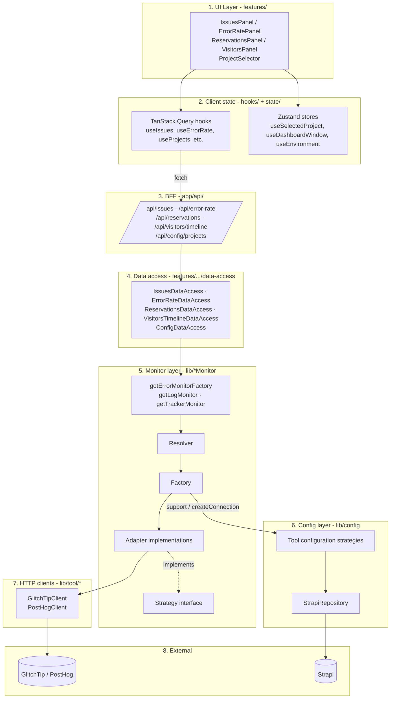
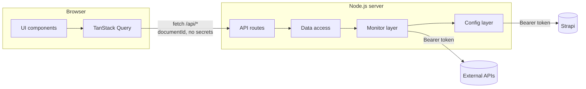
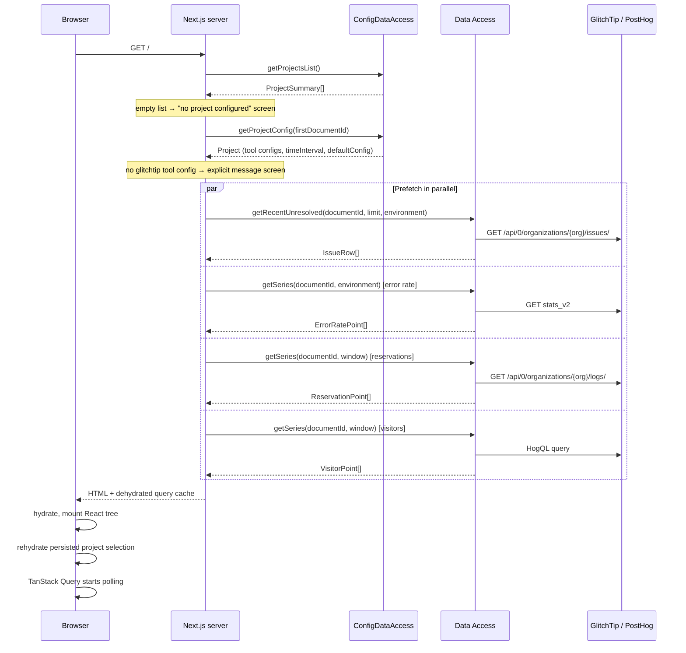

# Architecture

This document describes the overall architecture of `dashboard-monitor`: the layers, the boundaries, and the rationale.

For the deep dive on the Strategy/Factory pattern, see [monitors.md](monitors.md). For end-to-end request traces, see [data-flow.md](data-flow.md).

## Goals

- **Provider-agnostic dashboard.** The UI should not know whether errors come from GlitchTip, Sentry, or anything else. Swapping providers must be a config change, not a refactor.
- **Multi-project, configured from an admin.** Which projects the kiosk can display, which tool backs each monitor, and each tool's connection details all live in Strapi — not in the codebase, not in the environment.
- **Server-only secrets.** API tokens (GlitchTip, PostHog, Strapi) must never leak to the browser bundle.
- **Snappy kiosk.** The dashboard auto-refreshes on a per-project interval and prefetches data server-side on first load.

## High-level context

The Next.js app is the only thing the user talks to. All external API calls are server-side. The browser never sees a GlitchTip, PostHog or Strapi token.

Strapi plays two distinct roles: it is the **project catalog** (what the header selector lists) and the **wiring table** (which adapter each monitor family loads for a given project, and how to reach it).

## Layered view

### Responsibilities per layer

1. **UI Layer** (`src/app/features/*/ui/`) — pure React components. No `fetch`, no business logic. Reads data from TanStack Query hooks and UI state from Zustand.
2. **Client state** (`src/app/features/*/hooks/`, `src/app/features/dashboard/state/`) — TanStack Query for server data, Zustand for ephemeral UI state (selected project, window, environment).
3. **BFF (Backend-For-Frontend)** (`src/app/api/*/route.ts`) — thin Next.js route handlers. Parse query params, call the data access layer, return JSON. Marked `force-dynamic` (no caching).
4. **Data access** (`src/app/features/*/data-access/`) — server-only orchestrators. Resolve the factory for a `documentId`, compose monitor calls, map domain types to feature types (`IssueRow`, `ErrorRatePoint`, …). Wrapped in React `cache()` for request-level deduplication.
5. **Monitor layer** (`src/lib/{errorMonitor,logMonitor,trackerMonitor}/`) — the Strategy/Factory abstraction. See [monitors.md](monitors.md).
6. **Config layer** (`src/lib/config/`) — the Strapi seam: project catalog, mapped tools, tool connections. Every lookup is memoized per request with React `cache()`.
7. **HTTP clients** (`src/lib/tool/glitchtip/`, `src/lib/tool/posthog/`) — low-level transport. Bearer auth, JSON parsing, pagination, error mapping.
8. **External APIs** — the providers and the admin.

## Server / client boundary

All monitor and config code is guarded by `import "server-only"` (see [GetErrorMonitor.ts:1](https://github.com/webteamuxco/dashboard-monitor/tree/main/src/lib/errorMonitor/GetErrorMonitor.ts#L1)). If a client component ever imports it by mistake, the build fails. Tokens never reach the bundle.

What crosses the boundary is the Strapi `documentId` of the selected project — a public identifier. The provider project ids, instance URLs and organization slugs are resolved server-side from it.

Variables prefixed `NEXT_PUBLIC_*` are intentionally non-sensitive: display-only knobs (window sizes, environment list, interactivity flag).

## Initial render path (kiosk first load)

The home page is a **Server Component** ([src/app/page.tsx](https://github.com/webteamuxco/dashboard-monitor/tree/main/src/app/page.tsx)) that reads the project list from Strapi, picks the first project, prefetches all panel queries server-side, and hydrates the client. The kiosk displays data on the first paint without a client-side fetch round-trip.

The project list and the first project's config are seeded into the query cache with `setQueryData`, so the header selector renders without an extra round-trip.

After hydration, `useActiveProject` rehydrates the persisted selection from `localStorage`. Server render and first client render both start from the server-resolved project so the prefetched query keys match; the stored project is applied right after mount.

## Design rationale

### Why Strategy/Factory for monitors?

The product needs to be **independent of any single vendor**, and different projects may use different vendors at the same time. The Strategy interface fixes the contract from the data-access layer's perspective; the Factory localizes vendor-specific construction (connection lookup, client, secret) in one place. See [monitors.md](monitors.md) for the full pattern.

### Why Strapi instead of env vars for provider selection?

Env vars are per-deployment; the dashboard is per-project. With `NEXT_PUBLIC_ERROR_MONITOR_DRIVER=glitchtip` the whole instance was locked to one vendor and one project. Moving the mapping into Strapi means a non-developer can add a project, point its error monitor at a different tool, and change its refresh cadence — without a deploy. Secrets stay in the environment because they must never transit through a CMS.

### Why a BFF instead of calling monitors from Server Components directly?

Two reasons:

1. **Client-side polling.** TanStack Query needs an HTTP endpoint to poll. Server Components don't expose one.
2. **Clean cache invalidation.** Each query key maps to one route, which gives a clear story for `invalidateQueries`.

Server Components still do the **initial prefetch** (no extra round-trip on first paint), and TanStack Query handles **everything after** via the BFF.

### Why force-dynamic everywhere?

The dashboard is real-time. Stale data is worse than a slightly slower response. Next.js's default caching would serve hour-old data; `dynamic = "force-dynamic"` opts out. Latency-critical optimization happens at the TanStack Query layer (staleTime, polling interval) and at the React `cache()` layer (per-request dedup of Strapi lookups) instead.

### Why Zustand and TanStack Query both?

They solve different problems:

- **TanStack Query** owns *server state*: cache, invalidation, polling, retry. Anything that came from an API.
- **Zustand** owns *UI state*: selected project, selected window size, selected environment. Things that never round-trip to the server.

Mixing the two responsibilities into one tool creates ceremony around what should be trivial. See [state-management.md](state-management.md).

## Extension points

The places you should look first when adding a feature:

- **New external provider** → new abstract vendor factory + adapter under `src/lib/<family>/adapters/<provider>/`, then map the tool in Strapi (see [monitors.md](monitors.md)).
- **New data view** → new feature folder under `src/app/features/<name>/`, with `data-access/`, `domain/`, `hooks/`, `ui/`, `queryKeys.ts`. Wire a new route under `src/app/api/<name>/route.ts`.
- **New monitor family** (e.g. "uptime") → mirror the structure of `src/lib/errorMonitor/`: `strategy/`, `factory/`, `adapters/`, `Get<Name>Monitor.ts`, and a new `STRATEGY_RESOLVER` declared in Strapi.
- **New project-level setting** → extend the Strapi project schema, its DTO and `projectMapper`, then read it through `ConfigDataAccess`.
