# Data flow

This doc traces concrete request paths through the layers, so you can map any UI behavior back to its source. For the layered overview, see [architecture.md](architecture.md).

## The identifiers that travel

Three ids are in play, and two of them are called `documentId`:

| Id | Crosses to the browser? | Used for |
|---|---|---|
| project `documentId` | yes | the catalog, the cadence, the window presets, listing panels and strategies |
| panel `documentId` | yes | **every data route** and the whole monitor layer |
| provider project id | **never** | the URL of the provider call |

Data queries are keyed on the **panel** `documentId`: it is what the browser sends as `?documentId=`, what the data routes validate, and what the monitor layer resolves a factory from — because provider wiring lives on the panel ([panels.md](panels.md)). The **provider project id** (GlitchTip numeric id, PostHog project id) never leaves the server: it is read from the panel's tool configuration and handed to the strategy.

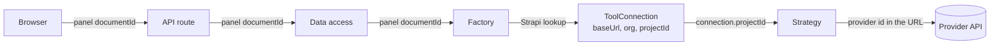

The config routes are the exception: `/api/config/projects/[projectId]` and its `panels` / `strategies` children take a **project** id (plus a panel *slug* for `strategies`).

## The two flavors of request

There are two distinct fetch paths in this app:

1. **Server prefetch** — runs once per page load, inside the Server Component. Hydrates the TanStack Query cache so the first paint already has data.
2. **Client polling** — runs in the browser, on a timer, after hydration. This is what keeps the kiosk fresh.

Both paths go through the *same* data-access layer; the difference is only who calls it.

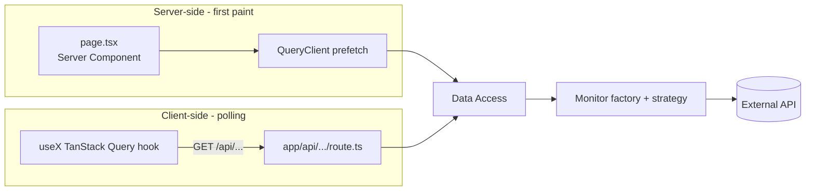

## Path 0: resolving the monitor for a project

Every data-access call starts with the same three steps. They are shown once here and elided in the sequences below.

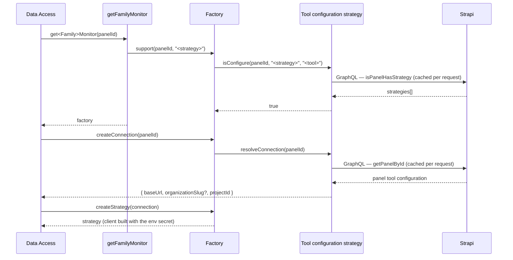

Both Strapi lookups are wrapped in React `cache()`, so four widgets resolving the same panel during one render hit Strapi once per query, not four times.

## Path 1: server prefetch on first load

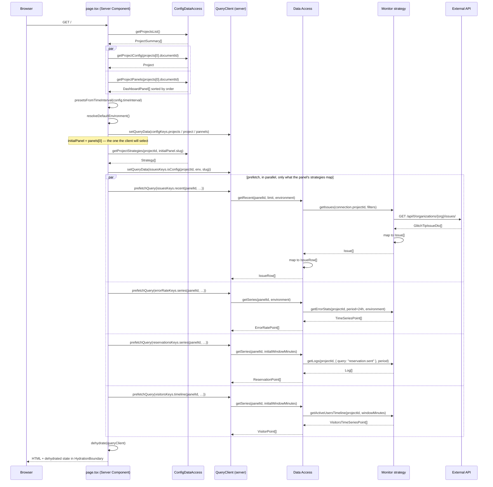

Key properties:

- **The widget queries are keyed on the panel id**, using the default panel resolved server-side — the first entry of `getProjectPanels()`, which Strapi sorts by `order`, and the same one `PannelSelector` selects when nothing is persisted. That is what makes the hydrated entries actually get read.
- **Only the widgets the panel's strategies map are prefetched.** The condition mirrors `DashboardContent`'s mapping; prefetching an unmapped widget would resolve no factory and throw on the server for nothing.
- **The panel list and the strategy list are seeded** with `setQueryData`, so the client resolves what to mount without a round-trip.
- The default environment and the initial window are resolved by shared, isomorphic helpers (`resolveDefaultEnvironment()`, `presetsFromTimeInterval()`) so the server and the client agree on those key segments. The window-scoped keys use `initialWindowMinutes`, the value `useDashboardWindow` holds after `hydrateFromStrapi` — not the env fallback.
- One early exit happens before any prefetch: no published project renders an explicit message instead of an empty dashboard. A project with no panel skips the prefetch entirely and renders an empty grid.

## Path 1b: what the client resolves after mount

The panel selection lives in the browser, so the *composition* of the dashboard is finalized after hydration — but every lookup it needs is already in the hydrated cache:

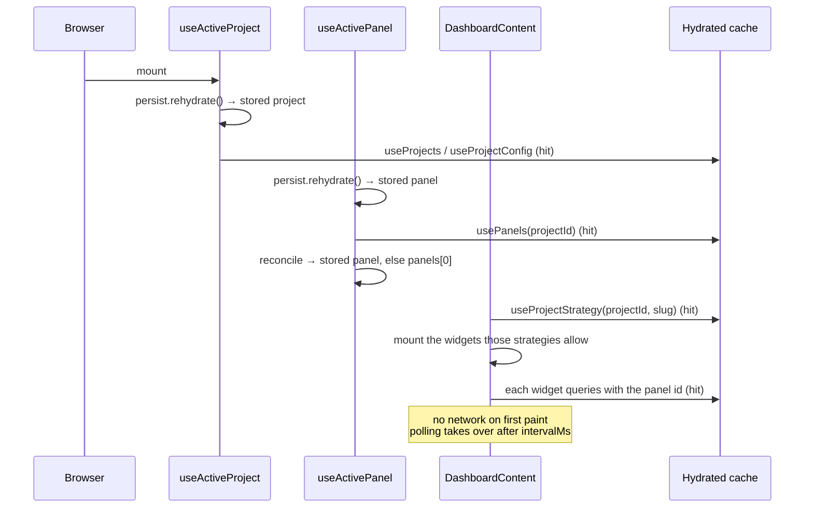

Two cases turn those hits into a refetch, both harmless: a panel restored from `localStorage` that isn't `panels[0]` (the server prefetched for the first one), and a panel list changed in Strapi between the server render and the client's selection.

`useActivePanel` — not `PannelSelector` — is what runs this: the selector is only mounted in interactive mode, so a read-only kiosk would otherwise resolve no panel and mount no widget.

## Path 2: client polling

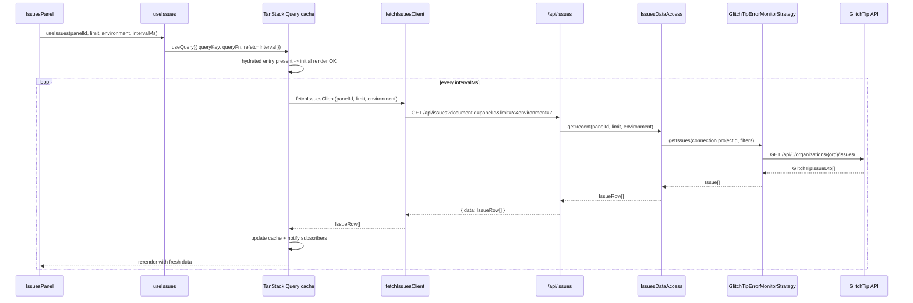

`intervalMs` comes from the selected **project**'s Strapi `defaultConfig.refreshIntervalMs`, falling back to 30 000 ms. Each widget polls independently — there is no global tick.

## Path 3: switching project

Changing the header selector changes one Zustand value; everything downstream follows.

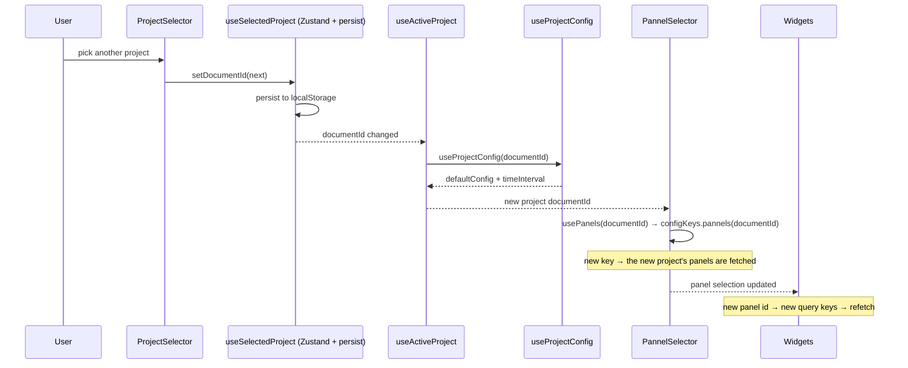

No manual invalidation anywhere: the project id is part of the panel-list key and the panel id is part of every data key, so each switch is just a cache miss.

## Path 3b: switching panel

Same mechanism, one level down — and this is the switch that changes *which widgets exist*:

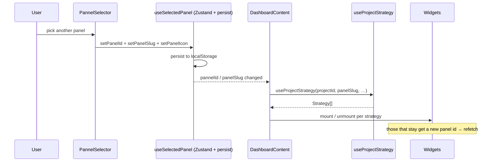

A widget whose strategy is absent from the new panel is unmounted; its cache entry stays under the old panel id, so switching back is instant.

## Path 4: on-demand fetch (issue detail)

A *user-triggered* fetch path: clicking an issue row opens the detail sheet and fetches its full payload (issue + latest event + recent events + comments).

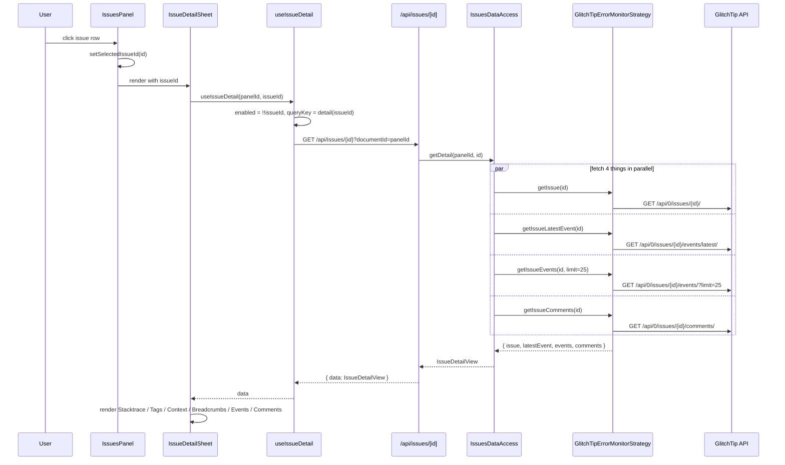

Issue endpoints are organization-scoped rather than project-scoped, so the detail calls take the issue id alone — but the route still requires the panel `documentId` to resolve which GlitchTip instance to talk to.

The detail query is **not** prefetched server-side — it only fires when a row is clicked. Once fetched, it's cached under `["issues", "detail", issueId]` for the rest of the session (subject to `staleTime: 30000`).

## DTO -> domain mapping

Every external response goes through a Mapper before reaching the data access layer. This is what keeps the rest of the codebase provider-agnostic.

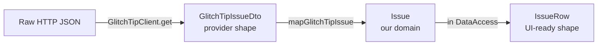

Three shapes, three responsibilities:

- **DTO** — verbatim mirror of the provider's response. Lives in `adapters/<provider>/dto/`.
- **Domain** — our internal monitor-family type (`Issue`, `Log`, `VisitorsTimeSeriesPoint`). Lives in `src/lib/<family>/domain/`.
- **Feature type** — what a widget actually consumes (`IssueRow`, `ErrorRatePoint`). Lives in `src/app/features/<name>/domain/`.

If you find yourself importing a DTO outside its adapter folder, that's a leak. Add a mapper.

The same split exists on the config side: `StrapiProject` DTOs → `projectMapper` → `Project` / `ProjectSummary` / `DashboardPanel` / `ToolConfiguration`. One caveat specific to that side: `StrapiRepository.execute<T>()` is an unchecked cast, so a field missing from the GraphQL selection set arrives as `undefined` with no error — the DTO type says otherwise and nothing checks it at runtime.

## Error handling

API routes wrap their data-access calls and return `{ error: string }` with status `502` on failure. The TanStack Query hook receives the error; the panel renders an error state.

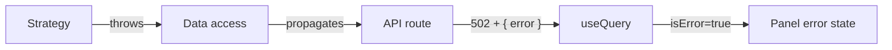

Common error sources:

- Missing `STRAPI_*` env var → `StrapiClientFactory` throws on the very first lookup.
- Panel not mapped in admin → the resolver throws `No <X>Factory supports type "<strategy>"`.
- Panel mapped but its tool configuration is incomplete → the configuration strategy throws, naming the missing fields.
- A **project** id sent where a **panel** id was expected → `Strapi panel "<id>" not found.`
- Missing provider secret → the abstract vendor factory throws when building the client.
- Provider 4xx/5xx → the HTTP client throws with status and a truncated body.
- Mapping failure (unexpected DTO shape) → throw in the mapper.

All of these surface as a 502 with the original message. Nothing is swallowed and no fallback masks a provider outage — the dashboard degrades visibly.

Two silent cases are deliberately *not* errors: a project with no panel and a panel with no strategy both return `data: null`, which renders an empty grid. Nothing was requested, so nothing failed.

TanStack Query retries once (`retry: 1`) before surfacing the error.
