# Data flow

This doc traces concrete request paths through the layers, so you can map any UI behavior back to its source. For the layered overview, see [architecture.md](architecture.md).

## The identifiers that travel

Four values are in play, and three of them are called `documentId` somewhere:

| Id | Crosses to the browser? | Used for |
|---|---|---|
| project `documentId` | yes | the catalog, the cadence, the window presets, listing panels |
| panel `slug` | yes | listing that panel's KPIs and blocks |
| element `documentId` (a KPI's, a block's) | yes | **every data route** and the whole monitor layer |
| provider project id | **never** | the URL of the provider call |

Measures are keyed on the **element** `documentId`: it is what the browser puts in the path, what the data routes validate, and what the data-access layer turns into a `ToolWiring` — because provider wiring lives on the element ([panels.md](panels.md)). The **provider project id** (GlitchTip numeric id, PostHog project id) never leaves the server: it is read from the element's tool configuration and handed to the strategy.

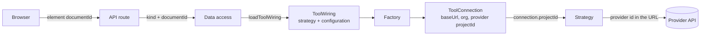

The config routes are the exception: `/api/config/projects/[projectId]` and its `panels` child take a **project** id, and the two element lists take a panel **slug**.

## The two flavors of request

There are two distinct fetch paths in this app:

1. **Server prefetch** — runs once per page load, inside the Server Component. It seeds the *configuration* queries so the chrome renders without a round-trip.
2. **Client polling** — runs in the browser, on a timer, after hydration. This is what fills and refreshes every card.

Both paths go through the *same* data-access layer; the difference is only who calls it.

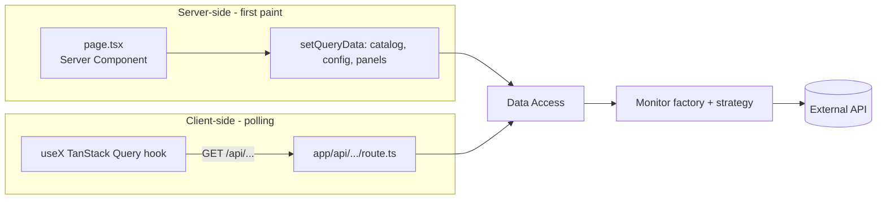

## Path 0: resolving the monitor for an element

Every measure starts with the same four steps. They are shown once here and elided in the sequences below.

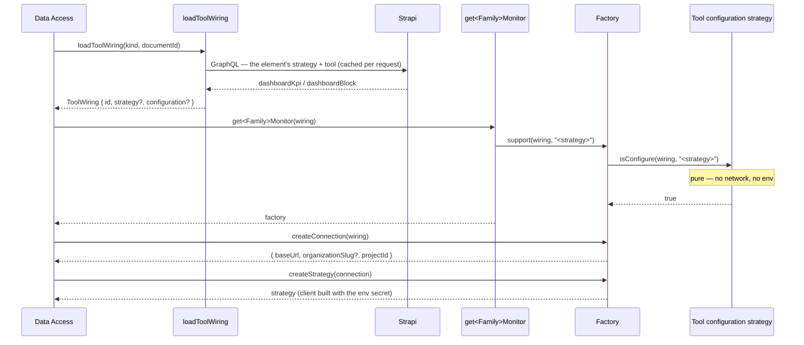

Only the first step touches Strapi, and it is wrapped in React `cache()`, so several cards resolving the same element during one request read it once. Everything below `get<Family>Monitor` is pure and synchronous — that is the invariant that lets the monitor layer stay unaware of Strapi entirely.

## Path 1: server prefetch on first load

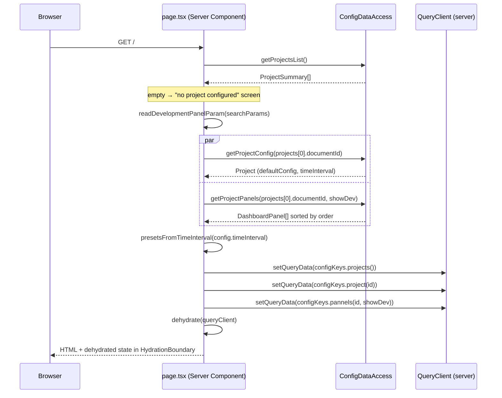

Key properties:

- **Only the configuration is seeded.** The measures are not prefetched: a panel's elements are only known once a panel is selected, and the selection is a client concern. So the header, the presets and the panel list are on the first paint; each card fetches its own measure on mount, then polls.
- **The window presets are resolved by a shared isomorphic helper** (`presetsFromTimeInterval`) so the server and the client agree on the initial window — `initialWindowMinutes` is what `useDashboardWindow` holds after `hydrateFromStrapi`, not the env fallback.
- **The dev-panel flag is part of the panel-list key** on both sides, read through the same `readDevelopmentPanelParam` helper.
- One early exit happens before anything else: no published project renders an explicit message instead of an empty dashboard.

## Path 1b: what the client resolves after mount

The panel selection lives in the browser, so the *composition* of the dashboard is finalized after hydration:

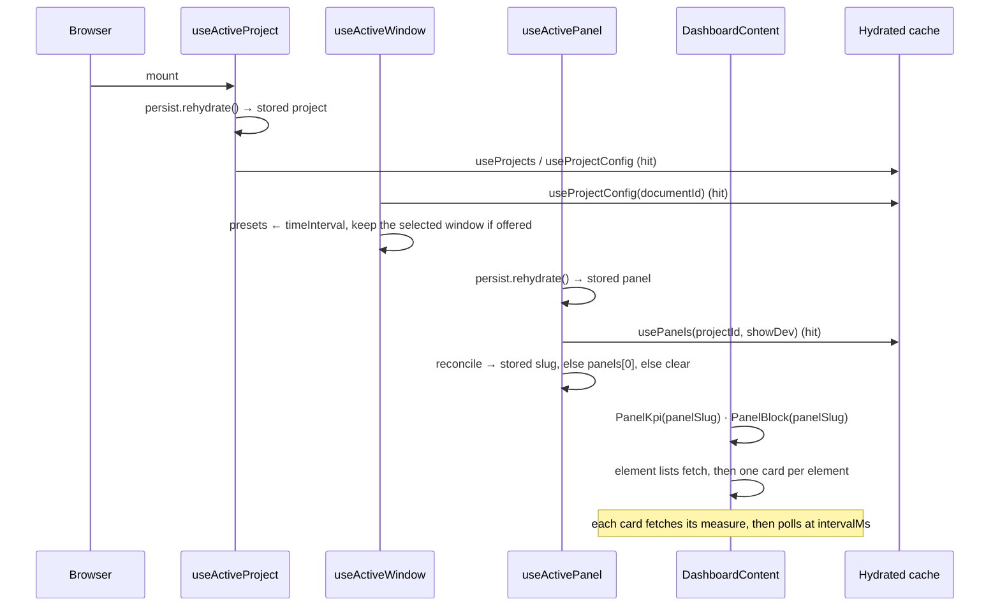

`useActivePanel` — not `PannelSelector` — is what runs this: the selector is only mounted in interactive mode, so a read-only kiosk would otherwise resolve no panel and render nothing.

## Path 2: client polling (a block measure)

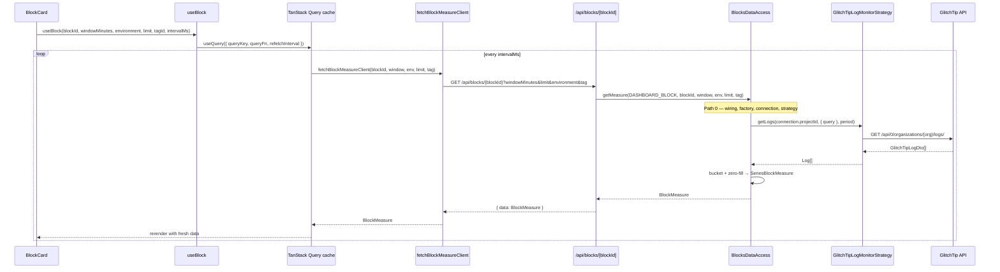

`intervalMs` comes from the selected **project**'s Strapi `defaultConfig.refreshIntervalMs`, falling back to 30 000 ms, and is threaded down as a prop. Each card polls independently — there is no global tick. A KPI follows the identical path through `/api/kpis/[kpiId]` and `KpisDataAccess`, returning a `KpiMeasure` instead.

## Path 3: switching project

Changing the header selector changes one Zustand value; everything downstream follows.

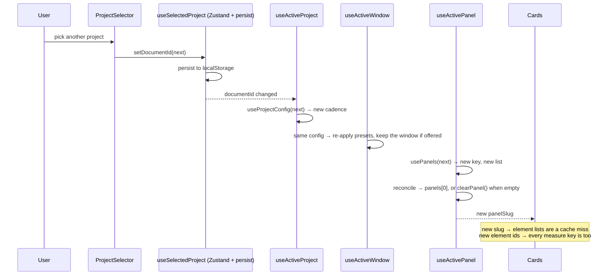

No manual invalidation anywhere: the project id is part of the panel-list key, the panel slug part of the element-list keys, and the element id part of every measure key. Each switch is just a cache miss.

Two things that are *not* automatic and needed explicit handling: the window presets, which live in a Zustand store rather than in a query (hence `useActiveWindow`), and the panel selection when the next project has no panel at all (hence `clearPanel()`).

## Path 3b: switching panel

Same mechanism, one level down — and this is the switch that changes *which cards exist*:

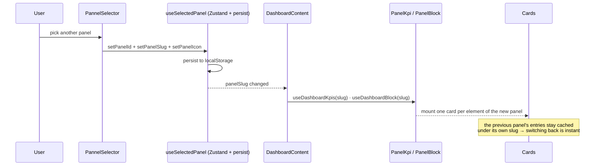

## Path 4: on-demand fetch (issue detail)

A *user-triggered* path: clicking a row in a `list` block opens the detail sheet and fetches its full payload (issue + latest event + recent events + comments).

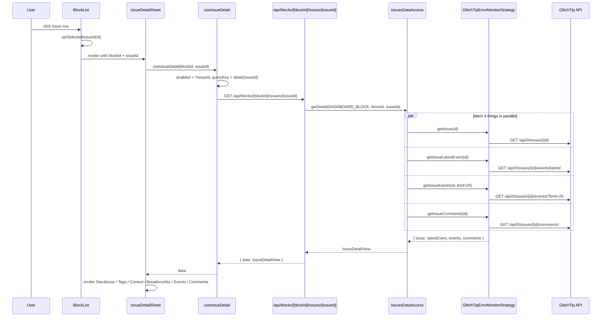

Issue endpoints are organization-scoped rather than project-scoped, so the detail calls take the issue id alone — but the route still requires the **block** `documentId` to resolve which GlitchTip instance to talk to. The sheet is only reachable when the block's entries are issues (`measure.hasDetail`) and the dashboard is interactive.

Posting a comment goes through `POST /api/blocks/[blockId]/issues/[issueId]/comments` and invalidates `["issues", "detail", issueId]`, so the sheet re-reads the thread it just wrote to.

## DTO → domain mapping

Every external response goes through a Mapper before reaching the data access layer. This is what keeps the rest of the codebase provider-agnostic.

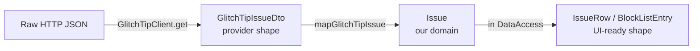

Three shapes, three responsibilities:

- **DTO** — verbatim mirror of the provider's response. Lives in `adapters/<provider>/dto/`.
- **Domain** — our internal monitor-family type (`Issue`, `Log`, `ErrorStatsSeries`, `VisitorsTimeSeriesPoint`). Lives in `src/lib/<family>/domain/`.
- **Feature type** — what a card actually consumes (`BlockMeasure`, `KpiMeasure`, `IssueDetailView`). Lives in `src/app/features/<name>/domain/`.

If you find yourself importing a DTO outside its adapter folder, that's a leak. Add a mapper.

The same split exists on the config side: `StrapiProject` / `StrapiDashboardKpi` / `StrapiTool` DTOs → the mappers in `config/domain/mappers/` → `Project` / `DashboardPanel` / `DashboardKpi` / `ToolWiring`. One caveat specific to that side: `AbstractStrapiRepository.execute<T>()` is an unchecked cast, so a field missing from the GraphQL selection set arrives as `undefined` with no error — the DTO type says otherwise and nothing checks it at runtime. That is exactly how the window presets silently fell back to their defaults once, after `timeInterval` was dropped from `GetProjectById`.

## Error handling

API routes wrap their data-access calls and return `{ error: string }` with status `502` on failure. The TanStack Query hook receives the error; the card renders an error state — and only that card.

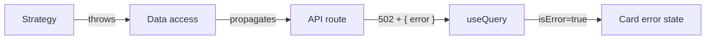

Common error sources:

- Missing `STRAPI_*` env var → `StrapiClientFactory` throws on the very first lookup.
- An id that belongs to another collection, or an unpublished element → `Strapi dashboard-kpi "<id>" not found.` (the message names the collection that was searched).
- An element with no strategy → `Strapi dashboard-block "<id>" declares no strategy. Map one in admin.`
- Strategy and tool disagreeing (e.g. `tracker-monitor` on a GlitchTip tool) → the resolver throws `No <X>Factory supports type "<strategy>"`.
- An incomplete tool configuration → `resolveConnection` throws, naming what is missing (a null organization on GlitchTip is the usual one).
- A log-monitor element with no tag, or a `?tag=` the element does not declare → an explicit throw before any provider call.
- Missing provider secret → the abstract vendor factory throws when building the client.
- Provider 4xx/5xx → the HTTP client throws with status and a truncated body.
- Mapping failure (unexpected DTO shape, or Strapi's own `Error` type in a dynamic zone) → throw in the mapper.

All of these surface as a 502 with the original message, scoped to the one card whose element is misconfigured. Nothing is swallowed and no fallback masks a provider outage — the dashboard degrades visibly.

Three silent cases are deliberately *not* errors: a project with no panel, a panel with no element, and an unwindowed card asking for a list. Nothing was requested, so nothing failed.

TanStack Query retries once (`retry: 1`) before surfacing the error.
