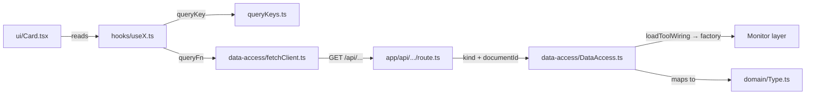

# Features

A "feature" is a self-contained vertical slice of the dashboard: its data fetching, its domain types, its hooks, and its UI. Features live under [apps/dashboard/src/app/features/](https://github.com/webteamuxco/dashboard-monitor/tree/main/apps/dashboard/src/app/features/).

The standard layout of a feature folder is:

```text
<feature>/
├── data-access/    # Server-side orchestration + client-side fetchers
├── domain/         # Internal types (the shape consumed by UI)
├── hooks/          # TanStack Query hooks
├── state/          # Zustand stores (dashboard feature only)
├── ui/             # React components
└── queryKeys.ts    # Centralized query keys (when applicable)
```



## Which id a feature receives

Three Strapi ids circulate, and most signatures call them all `documentId`:

| Feature | Receives | Because |
|---|---|---|
| `config` | **project** `documentId` | it reads the catalog, the cadence, the presets, the panel list |
| `dashboard` (own hooks) | **project** `documentId` | it resolves the active project, panel and window |
| `blocks`, `kpis` (element lists) | **panel** `slug` | the GraphQL filter matches on `dashboard_panels.slug` |
| `blocks`, `kpis`, `issues` (measures) | **dashboard element** `documentId` | provider wiring lives on the KPI or the block |

A data route names the collection its id belongs to; the data-access layer turns the pair into a `ToolWiring`:

```ts
// route
blocksDataAccess.getMeasure(DASHBOARD_BLOCK, blockId, windowMinutes, environment, limit, tag);
// data-access
const wiring = await loadToolWiring(DASHBOARD_BLOCK, blockId);
const factory = getErrorMonitorFactory(wiring);
```

Keep `kind` and `documentId` as separate primitives all the way into the `cache()`d inner function: React's `cache()` keys on argument identity, so passing the resolved wiring object around instead would defeat the per-request dedup. See [panels.md](panels.md#three-identifiers-one-parameter-name).

Because those values are part of every query key, switching panel — like switching project — is a plain cache miss, not a manual invalidation.

## Feature catalog

### kpis

[src/app/features/kpis/](https://github.com/webteamuxco/dashboard-monitor/tree/main/apps/dashboard/src/app/features/kpis/)

Renders a panel's `DashboardKpi` elements — the strip of small cards at the top. One KPI reads one number.

- **Monitors consumed:** whichever family the element's strategy names — `errorMonitor` (`getIssues`, `getErrorStats`), `logMonitor` (`getLogs`), `trackerMonitor` (`getActiveUsersTimeline`, `getTotalVisitors`)
- **API routes:** `GET /api/kpis/[kpiId]?windowMinutes&environment`, `GET /api/config/dashboard-kpis?panelSlug`
- **Domain type:** `KpiMeasure { value: number; windowMinutes: number | null; breakdown?: KpiBreakdownEntry[] }`
- **Hooks:** `useDashboardKpis(panelSlug, intervalMs)`, `useKpi(kpiId, windowMinutes, environment, intervalMs)`
- **UI:** `KpiCard`
- **Query keys:** `["dashboardKpis", "config", panelSlug]`, `["dashboardKpis", "measure", kpiId, windowMinutes, environment]`

The measure shape is uniform on purpose: one count, whichever family produced it, so the browser never has to know the provider. What varies is the *window* — a KPI whose Strapi `type` is `interval` is measured over the selected preset, any other type reads a total and passes `null`, so its key carries no window and changing preset is not a cache miss for it (`isWindowedKpi`). `windowMinutes` is echoed back in the measure so the card can say which of the two it is showing.

**A log KPI declaring several tags says what its total is made of.** `breakdown` carries one entry per tag — `{ key, label, value, color }`, the label being the tag's Strapi `description` and falling back to its `name` — and `KpiCard` prints them where the figure usually goes: `2 Réussie - 2 Echecs`, each count in its tag's colour, with the total moving down into the caption (`4 total - req/min - 30m`). It is an **addition to the uniform shape, not a second shape**: `value` remains the sum whether the field is there or not, so `error-monitor` and `tracker-monitor` leave it out and nothing that reads only the figure changes. A single-tag element carries no breakdown either — there is nothing to split — and renders exactly as before.

### blocks

[src/app/features/blocks/](https://github.com/webteamuxco/dashboard-monitor/tree/main/apps/dashboard/src/app/features/blocks/)

Renders a panel's `DashboardBlock` elements — the large cards under the KPI strip. One block reads one measure, and its Strapi `type` picks the body that draws it.

- **Monitors consumed:** `errorMonitor` (`getIssues`, `getErrorStats`), `logMonitor` (`getLogs`), `trackerMonitor` (`getActiveUsersTimeline`)
- **API routes:** `GET /api/blocks/[blockId]?windowMinutes&limit&environment&tag&showResolved`, `GET /api/config/dashboard-blocks?panelSlug`
- **Domain types:** `BlockMeasure = SeriesBlockMeasure | ListBlockMeasure`, `BlockSeries`, `BlockListEntry`
- **Hooks:** `useDashboardBlock(panelSlug, intervalMs)`, `useBlock(blockId, windowMinutes, environment, limit, tagId, intervalMs, showResolved)`
- **UI:** `BlockCard` → `BlockCardHeader` (+ `BlockTagSelector`, `ShowResolvedToggle`) + `BlockCardContent`, then one body
- **Query keys:** `["dashboardBlocks", "config", panelSlug]`, `["dashboardBlocks", "measure", blockId, windowMinutes, environment, limit, tagId, showResolved]`

| Block `type` | Body | Measure shape it reads |
|---|---|---|
| `list` | `BlockList` (rows, issue detail sheet when the entries are issues) | `list` |
| `rate` | `BlockRate` (Recharts AreaChart) | `series` |
| `bar` | `BlockBar` (Recharts BarChart) | `series` |
| `stackedBar` | `StackedBlockBar` (the same bars, one stack) | `series` |

A measure names its **data shape**, never its chart. `BlocksDataAccess` builds a `series` or a `list` and picks between them from `windowMinutes` alone, so a bar, a stacked bar and an area read the very same payload — `BlockBar` and `BlockRate` differ only in their Recharts marks and both derive their rows and their `ChartConfig` from `useSeriesChart`. Two consequences:

- `isWindowedBlock` must list every series type. A type missing from it asks with no window, receives a list and renders the shape-mismatch message instead of a chart.
- the pairing lives in one record, `type → { shape, body }` in `BlockCardContent`, so wiring a body to the wrong shape is a compile error. Resolve the body by **component reference**: `createElement("BlockBar")` with a string would make React render an empty unknown DOM element without complaining.

The log-monitor bar block is what used to be a standalone reservations panel: the tag filter now comes from the element's strategy in Strapi (`reservation.sent`, sent as the provider's `service` filter while the selected environment travels as its own) instead of being hard-coded in the feature. The series is zero-filled bucket by bucket before aggregation, so a quiet window draws real zeros rather than a gap.

**The card states the granularity it is actually drawing.** `SeriesBlockMeasure` carries an `interval` alongside its `windowMinutes`, and `BlockCardHeader` prints the pair (`1h · 24h`). It matters because a provider may coarsen what the window asked for: below 120 minutes `resolveBuckets` requests minute buckets, but GlitchTip cannot scope a minute series by environment (see [monitors.md](monitors.md#errormonitor)), so an environment-scoped error block gets hourly points — one single bucket on a 30-minute window. The labels follow the served interval too, so the axis never reads as minutes while the data is hourly.

**One query per tag, whether the block draws one of them or all of them.** The provider ANDs the terms of a single log query, so two tags in one query ask for the logs carrying both — an intersection that is almost always empty, since a log line carries one service. The tags are therefore never joined: `getLogsPerTag` issues one query per tag and awaits them together. What differs between block types is how many tags the card asks for, and `isTagSelectableBlock` is the single place that decides:

| Block type | `?tag=` | What the measure carries |
|---|---|---|
| `bar` | the selected tag | one series, named and coloured after that tag |
| `stackedBar` | absent | one series per declared tag, stacked |
| `list` | absent | every tag's logs merged into one time-sorted list |

`BlockCard` holds the selection (local `useState`, since it is scoped to that one card) and derives the active id — `null` for anything but a `bar`, so a stack never pins itself to the first tag. The id travels as `?tag=` down to `BlocksDataAccess`, where the **log strategy** matches it against the tags the element declares — an unknown id throws rather than reaching the provider. Each tag keeps its own cache entry through the last segment of the measure key, so switching back is instant. `BlockCardHeader` renders a `BlockTagSelector` whenever it is handed more than one tag, and `BlockCard` hands it none unless the type is selectable **and** the dashboard is interactive; a kiosk bar stays on the first tag Strapi lists. The card's caption carries both descriptions: the block's own on the left — the unit the card is read in, `req/min` — and the selected tag's on the right, which a stack leaves empty for want of a selection.

A stack's series are aggregated against **one** set of empty buckets built once for the whole measure, so every segment agrees on its epochs — series disagreeing there would leave holes in every stack but the bottom one. Beyond a single series `BlockBar` mounts a `ChartLegend`: a stack of five tags is unreadable without one.

**The resolved issues are asked for, not filtered out on arrival.** An error-monitor list shows the open issues; `ShowResolvedToggle` in the header widens it to both statuses. The flag travels as `?showResolved=true` into the provider query (see [monitors.md](monitors.md#errormonitor)) rather than hiding rows in `BlockList`, for three reasons: the row cap then counts rows the card actually shows, the header's count badge stays truthful without a second filter, and the two lists are genuinely two datasets — so `showResolved` is the last segment of the measure key and each state keeps its own cache entry. `BlockCard` holds the state in a local `useState` like the tag selection, and the toggle is mounted only for a list whose strategy is `error-monitor` and only when the dashboard is interactive: a log line has no resolution status, and a series has no issue to hide (`canFilterResolved`). A resolved row is dimmed rather than plain, from the `isResolved` flag each entry carries.

**The chart marks take the tag's colour.** A tag carries an optional `color` drawn from the very same Strapi enumeration as an element's `level`, so both resolve through `ACCENT_CHART`. It reaches the marks by two routes, because a stack has no single active tag to read:

- **one series** — `BlockCard` resolves `activeTag?.color ?? level` and hands it down as the body's `accent` prop, which `useSeriesChart` applies to the first series.
- **one series per tag** — the colour travels on the measure itself. `BlockSeries.color` carries the level its tag declares, and `useSeriesChart` prefers it over the accent, falling back to the shared palette only for a series declaring none. Without it a five-tag stack would wrap `SECONDARY_SERIES_COLORS` after three and paint two segments alike.

Two boundaries are deliberate:

- **the prop is named `accent`, not `level`**, all the way down `BlockCardContent` → `BlockBody` → `BlockBar` / `BlockRate`. It no longer carries the element's level once a tag overrides it, and only the series bodies ever read it — `BlockList` ignores it.
- **the card chrome keeps the element's `level`.** The 2px accent strip and the header's row count stay on the block's own colour, so switching tag recolours the data and nothing else. A block with no tag, or a tag published without a colour, falls back to `level` and looks exactly as it did before.

### issues

[src/app/features/issues/](https://github.com/webteamuxco/dashboard-monitor/tree/main/apps/dashboard/src/app/features/issues/)

No longer a panel of its own: a `list` block whose strategy is `error-monitor` renders the rows, and this feature owns what happens when one is clicked — the detail sheet (events, stacktrace, tags, breadcrumbs, comments) and posting a comment back.

- **Monitor consumed:** `errorMonitor` (`getIssue`, `getIssueLatestEvent`, `getIssueEvents`, `getIssueComments`, `createIssueComment`)
- **API routes:** `GET /api/blocks/[blockId]/issues/[issueId]`, `GET|POST /api/blocks/[blockId]/issues/[issueId]/comments`
- **Domain types:** `IssueRow`, `IssueDetailView`
- **Hooks:** `useIssueDetail(blockId, issueId)`, `useCreateIssueComment(blockId, issueId)`
- **UI:** `IssueDetailSheet`
- **Query key:** `["issues", "detail", issueId]`

`useIssueDetail` is `enabled: !!issueId`, so nothing is fetched before a row is clicked. The detail endpoints are organization-scoped at GlitchTip, so they take the issue id alone — but the route still needs the **block** id to resolve *which* GlitchTip instance to ask. Posting a comment invalidates the detail key, which is why the mutation hook takes both ids.

`IssuesDataAccess` exposes nothing else: the rows a `list` block shows come from `BlocksDataAccess`, which asks the error-monitor strategy for a `list` measure. This feature owns the detail only.

### config

[src/app/features/config/](https://github.com/webteamuxco/dashboard-monitor/tree/main/apps/dashboard/src/app/features/config/)

The Strapi-backed catalog: projects, per-project configuration, and each project's dashboard panels. Not a widget — it feeds the header selectors and the whole dashboard's composition.

- **Backed by:** [src/lib/config/](https://github.com/webteamuxco/dashboard-monitor/tree/main/apps/dashboard/src/lib/config/) (`StrapiClientFactory` → `StrapiClientStrategy` → one repository per content type)
- **API routes:** `GET /api/config/projects`, `GET /api/config/projects/[projectId]`, `GET /api/config/projects/[projectId]/panels?showDevelopmentPanel`, plus the element lists `GET /api/config/dashboard-kpis?panelSlug` and `GET /api/config/dashboard-blocks?panelSlug` (owned by the `kpis` / `blocks` features)
- **Domain types:** `ProjectSummary` (catalog entry), `Project` (`defaultConfig`, `timeInterval`), `DashboardPanel` (`slug`, `displayName`, `icon`, `order`, `isDevelopment`)
- **Hooks:** `useProjects()`, `useProjectConfig(projectId)`, `usePanels(projectId)` — all `staleTime: 5 min`, this config barely moves
- **Query keys:** `["config", "projects"]`, `["config", "project", projectId]`, `["config", "pannels", projectId, showDevelopmentPanel]`

All three are seeded server-side with `setQueryData` in [page.tsx](https://github.com/webteamuxco/dashboard-monitor/tree/main/apps/dashboard/src/app/page.tsx), so the selectors and the window presets are available on first paint. `usePanels` reads `?showDevelopmentPanel` from the URL and carries it in the key — two different lists, two different cache entries.

### dashboard

[src/app/features/dashboard/](https://github.com/webteamuxco/dashboard-monitor/tree/main/apps/dashboard/src/app/features/dashboard/)

Dashboard-wide state and chrome. Not a data feature — it owns the kiosk's selectors, its header, and the resolution of what the grid points at.

- **Composition root:** `DashboardContent` — resolves the active project, window and panel, then mounts `PanelKpi` and `PanelBlock`.
- **`useActiveProject(initialDocumentId, fallbackRefreshIntervalMs)`** — returns `{ documentId, refreshIntervalMs }`. Rehydrates the persisted project selection after mount, reconciles it against the catalog, and reads the refresh cadence from the project's `defaultConfig`.
- **`useActivePanel(documentId)`** — returns `{ panelId, panelSlug, panels }`. Same contract one level down, plus one rule the others don't have: a project with **no** panel clears the selection instead of keeping the previous project's, which would otherwise leave its cards on screen.
- **`useActiveWindow(documentId)`** — re-applies the project's window presets. `DashboardContent`'s `hydrateFromStrapi` initializer only ever sees the project the server rendered, so without this hook the presets stayed those of the initial project after a switch.
- **`useLastDataUpdate()`** — the freshest `dataUpdatedAt` across every mounted query, subscribed through `useSyncExternalStore`. The header's "Dernier rafraîchissement" reads it: since the tool wiring moved to the dashboard elements the header owns no query of its own, so the cache is the only thing that knows when the grid last received data — the same scope the "Rafraîchir" button invalidates. It returns `0` (rendered `—`) for the server snapshot and for an empty cache.
- **State (Zustand):** `useSelectedProject` (persisted), `useSelectedPanel` (persisted), `useDashboardWindow` (presets + `windowMinutes`), `useEnvironment`. See [state-management.md](state-management.md).
- **UI:** `DashboardHeader`, `ProjectSelector`, `PannelSelector`, `WindowSelector`, `EnvironmentSelector`, `EmptyState`.

Every header control is behind `NEXT_PUBLIC_DASHBOARD_INTERACTIVITY=true`. On a read-only kiosk the first project and its first panel by `order` are displayed with no selectors — which is why project, panel and window *resolution* lives in hooks called by `DashboardContent`, never in the selector components.

### components

[src/app/features/components/](https://github.com/webteamuxco/dashboard-monitor/tree/main/apps/dashboard/src/app/features/components/)

The two list components that turn a panel slug into cards, plus the loading/error strip they share:

- `PanelKpi(panelSlug, intervalMs)` — `useDashboardKpis` then one `KpiCard` per element.
- `PanelBlock(panelSlug, limit, intervalMs)` — `useDashboardBlock` then one `BlockCard` per element, laid out in two columns split on `order` parity (one column when only one is populated).
- `TransitionStates` — the polling dot and the error line, shared by both.

Both return `null` when there is no panel slug, which is what makes an unconfigured project render an empty page rather than an error.

### utils

[src/app/features/utils/](https://github.com/webteamuxco/dashboard-monitor/tree/main/apps/dashboard/src/app/features/utils/)

Cross-feature helpers: `accent.ts` (the `level` → Tailwind class maps, and the chart colour a series inherits), `lucidIcon.ts` (`getLucideIcon`, kebab-case Strapi string → lucide component, `Circle` as fallback) and `queryFilters.ts` (the `showDevelopmentPanel` query param, read identically on both sides of the hydration boundary).

## How a feature is added

1. **Create the folder skeleton** under `src/app/features/<name>/` with `data-access/`, `domain/`, `hooks/`, `ui/`, plus `queryKeys.ts`.
2. **Define the domain type** in `domain/<Name>.ts`. This is what the UI consumes — keep it minimal and presentation-friendly.
3. **Add the data access layer**:
   - `data-access/<Name>DataAccess.ts` (server, first line `import "server-only";`) — take the element **kind** first and the id second, `loadToolWiring(kind, id)`, resolve the factory, call the strategy with `connection.projectId`, map to your domain type. Wrap in `cache()` and export a singleton instance.
   - `data-access/fetch<Name>Client.ts` (client) — small `fetch` wrapper unwrapping `{ data }` and throwing on `{ error }`.
4. **Add the API route** at `src/app/api/<route>/route.ts` (`export const dynamic = "force-dynamic"`), which is the only layer that knows which collection the id belongs to.
5. **Centralize query keys** in `queryKeys.ts`, with the id as the first variable segment.
6. **Wrap the fetch in a TanStack Query hook** in `hooks/use<Name>.ts`. Use `refetchInterval` for polling, never `setInterval`.
7. **Build the card** in `ui/`. Pure UI — no fetch, no env read.
8. **Decide what mounts it.** A new *rendering* of an existing measure is a new entry in `BLOCK_BODIES` plus its Strapi `type`; a genuinely new data source needs a monitor family ([monitors.md](monitors.md#adding-a-new-monitor-family)).
9. **Mirror the folder under `tests/`** — see [tests/CLAUDE.md](https://github.com/webteamuxco/dashboard-monitor/tree/main/tests/CLAUDE.md).

See `blocks` or `kpis` as a working template.
