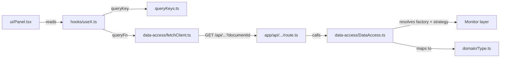

# Features

A "feature" is a self-contained vertical slice of the dashboard: its data fetching, its domain types, its hooks, and its UI. Features live under [apps/dashboard/src/app/features/](https://github.com/webteamuxco/dashboard-monitor/tree/main/apps/dashboard/src/app/features/).

The standard layout of a feature folder is:

```text
<feature>/
├── data-access/    # Server-side orchestration + client-side fetchers
├── domain/         # Internal types (the shape consumed by UI)
├── hooks/          # TanStack Query hooks
├── state/          # Zustand stores (dashboard feature only)
├── ui/             # React components
└── queryKeys.ts    # Centralized query keys (when applicable)
```



## Which id a feature receives

Two Strapi ids circulate, and most signatures call both of them `documentId`:

| Feature | Receives | Because |
|---|---|---|
| `config` | **project** `documentId` | it reads the catalog, the cadence, the presets, the panel list |
| `dashboard` (own hooks) | **project** `documentId` (+ panel `slug`) | it resolves the active project and the selected panel's strategies |
| `issues`, `errorRate`, `reservations`, `visitors` | **panel** `documentId` | provider wiring lives on the panel |

`DashboardContent` reads the panel id from `useSelectedPanel().pannelId` and passes it as the `documentId` prop of every widget, which forwards it down to `get<Family>Monitor()`. So `useIssues(documentId, …)` wants a panel id while `useProjectConfig(documentId)` wants a project id. See [panels.md](panels.md#the-two-identifiers).

Because that id is part of every data query key, switching panel — like switching project — is a plain cache miss, not a manual invalidation.

## Feature catalog

### issues

[src/app/features/issues/](https://github.com/webteamuxco/dashboard-monitor/tree/main/apps/dashboard/src/app/features/issues/)

Lists unresolved error issues and shows full details (events, stacktrace, comments, breadcrumbs) in a side sheet. Also hosts the panel-strategy hook, since the strategy list is what the issues grid keys off.

- **Monitor consumed:** `errorMonitor` (`getIssues`, `getIssue`, `getIssueLatestEvent`, `getIssueEvents`, `getIssueComments`)
- **Gated by strategy:** `error-monitor`
- **API routes:** `GET /api/issues?documentId&limit&environment`, `GET /api/issues/[id]?documentId`
- **Domain types:** `IssueRow`, `IssueDetailView`
- **Hooks:** `useIssues(panelId, limit, environment, intervalMs)`, `useIssueDetail(panelId, issueId)`, `useProjectStrategy(projectId, panelSlug, environment, intervalMs)`
- **UI:** `IssuesPanel`, `IssueDetailSheet`, `IssuesKpi`
- **Query keys:** `["issues", "recent", panelId, limit, environment]`, `["issues", "detail", issueId]`, `["issues", "isConfig", projectId, environment, panelSlug]`

The detail sheet is only mounted when an issue is selected; the `useIssueDetail` hook is `enabled: !!issueId` so no fetch happens before the user clicks a row. `useProjectStrategy` is `enabled` only once a panel slug exists.

### errorRate

[src/app/features/errorRate/](https://github.com/webteamuxco/dashboard-monitor/tree/main/apps/dashboard/src/app/features/errorRate/)

Displays a 24-hour error count chart (one point per hour bucket) using Recharts.

- **Monitor consumed:** `errorMonitor` (`getErrorStats` with a 24h period and a `1h` interval)
- **Gated by strategy:** `error-monitor`
- **API route:** `GET /api/error-rate?documentId&environment`
- **Domain type:** `ErrorRatePoint { bucketEpoch: number; label: string; count: number | null }`
- **Hooks:** `useErrorRate(panelId, environment, intervalMs)`
- **UI:** `ErrorRatePanel` (Recharts AreaChart)
- **Query key:** `["errorRate", "series", panelId, environment]`

A `null` count means "no data for that bucket" and is preserved as-is — it renders as a gap, not as a zero.

### reservations

[src/app/features/reservations/](https://github.com/webteamuxco/dashboard-monitor/tree/main/apps/dashboard/src/app/features/reservations/)

Tracks "reservation sent" business events over a sliding time window. Backed by the log monitor with a tag filter rather than a dedicated metrics endpoint — convenient and provider-agnostic.

- **Monitor consumed:** `logMonitor` (`getLogs` with `query: "reservation.sent"`, suffixed with the environment when one is selected)
- **Gated by strategy:** `log-monitor`
- **API route:** `GET /api/reservations?documentId&windowMinutes&environment`
- **Domain type:** `ReservationPoint { minuteIso: string; label: string; count: number }`
- **Hooks:** `useReservations(panelId, windowMinutes, environment, intervalMs)`
- **UI:** `ReservationsPanel`, `ReservationsKpiCard`
- **Query key:** `["reservations", "series", panelId, windowMinutes, environment]`

The series is zero-filled minute by minute before aggregation, so the chart always has exactly `windowMinutes` points even when nothing happened.

### visitors

[src/app/features/visitors/](https://github.com/webteamuxco/dashboard-monitor/tree/main/apps/dashboard/src/app/features/visitors/)

Shows live visitor counts split between **new** and **returning** users over a sliding window. Powered by a HogQL query against PostHog.

- **Monitor consumed:** `trackerMonitor` (`getActiveUsersTimeline`)
- **Gated by strategy:** `tracker-monitor`
- **API route:** `GET /api/visitors/timeline?documentId&windowMinutes`
- **Domain type:** `VisitorPoint { minuteIso: string; label: string; newCount: number; returningCount: number }`
- **Hooks:** `useVisitorsTimeline(panelId, windowMinutes, intervalMs)`
- **UI:** `VisitorsKpi`, `VisitorsPanel`
- **Query key:** `["visitors", "timeline", panelId, windowMinutes]`

"New" vs "returning" is decided in the HogQL query itself: a visitor whose first-ever event is within the last 30 minutes counts as new.

### config

[src/app/features/config/](https://github.com/webteamuxco/dashboard-monitor/tree/main/apps/dashboard/src/app/features/config/)

The Strapi-backed catalog: projects, per-project configuration, and each project's dashboard panels. Not a widget — it feeds the header selectors and the whole dashboard's wiring.

- **Backed by:** [src/lib/config/](https://github.com/webteamuxco/dashboard-monitor/tree/main/apps/dashboard/src/lib/config/) (`StrapiClientFactory` → `StrapiClientStrategy` → `StrapiRepository`)
- **API routes:** `GET /api/config/projects`, `GET /api/config/projects/[projectId]`, `GET /api/config/projects/[projectId]/panels`, `GET /api/config/projects/[projectId]/strategies?selectedPanel`
- **Domain types:** `ProjectSummary` (catalog entry), `Project` (`defaultConfig`, `timeInterval`), `DashboardPanel` (mapped tools, tool configurations, selector metadata), `Strategy` (just a `name` — the tool it belongs to is matched in the query filter, not selected)
- **Hooks:** `useProjects()`, `useProjectConfig(projectId)`, `usePanels(projectId)` — all `staleTime: 5 min`, this config barely moves
- **Query keys:** `["config", "projects"]`, `["config", "project", projectId]`, `["config", "pannels", projectId]`

All three are seeded server-side with `setQueryData` in [page.tsx](https://github.com/webteamuxco/dashboard-monitor/tree/main/apps/dashboard/src/app/page.tsx) — along with the default panel's strategy list — so the selectors, the window presets and the grid composition are available on first paint.

### dashboard

[src/app/features/dashboard/](https://github.com/webteamuxco/dashboard-monitor/tree/main/apps/dashboard/src/app/features/dashboard/)

Dashboard-wide state and chrome. Not a data feature — it owns the kiosk's selectors, header, KPI row, and the decision of what the grid contains.

- **Composition root:** `DashboardContent` — resolves the active project and panel, hydrates the window store from Strapi, fetches the selected panel's strategies, lays out the grid.
- **`useActiveProject(initialDocumentId, fallbackRefreshIntervalMs)`** — returns `{ documentId, refreshIntervalMs }`. Rehydrates the persisted project selection after mount, reconciles it against the catalog, and reads the refresh cadence from the project's `defaultConfig`.
- **`useActivePanel(documentId)`** — returns `{ panelId, panelSlug, panels }`. Same contract one level down: rehydrates the persisted panel selection, reconciles it against the project's panels (first by `order` when nothing matches, id re-resolved when the stored slug belongs to another project). It lives in a hook rather than in `PannelSelector` because that selector is only mounted in interactive mode — a read-only kiosk must still resolve a panel or nothing renders.
- **State (Zustand):** `useSelectedProject` (persisted), `useSelectedPanel` (persisted), `useDashboardWindow` (presets + `windowMinutes`), `useEnvironment`. See [state-management.md](state-management.md).
- **UI:** `DashboardHeader`, `ProjectSelector`, `PannelSelector`, `WindowSelector`, `EnvironmentSelector`, `KpiRow`, `KpiCard`, `EmptyState`.

Widgets are mounted from the selected panel's strategy list, using the constants of `@/lib/shared/strategiesEnum`:

| Strategy | Widgets mounted |
|---|---|
| `error-monitor` | `IssuesPanel`, `ErrorRatePanel`, `IssueKpi` |
| `log-monitor` | `ReservationsPanel`, `ReservationsKpiCard` |
| `tracker-monitor` | `VisitorsPanel`, `VisitorsKpi` |

The left column is hidden and the grid drops to a single column when the panel maps neither `error-monitor` nor `tracker-monitor`. `KpiRow` is the strip above the main panels; it shows only the cards its strategies allow.

Every header control is behind `NEXT_PUBLIC_DASHBOARD_INTERACTIVITY=true`. On a read-only kiosk the first project and its first panel by `order` are displayed, with no selectors — which is why project and panel *resolution* lives in hooks called by `DashboardContent`, never in the selector components.

## How a feature is added

1. **Create the folder skeleton** under `src/app/features/<name>/` with `data-access/`, `domain/`, `hooks/`, `ui/`, plus `queryKeys.ts`.
2. **Define the domain type** in `domain/<Name>Point.ts`. This is what UI consumes — keep it minimal and presentation-friendly.
3. **Add the data access layer**:
   - `data-access/<Name>DataAccess.ts` (server) — resolve the factory for the **panel** id, call the strategy with `connection.projectId`, map to your domain type. Wrap in `cache()`.
   - `data-access/fetch<Name>Client.ts` (client) — small `fetch` wrapper for the API route.
4. **Add the API route** at `src/app/api/<route>/route.ts` (`export const dynamic = "force-dynamic"`), requiring `documentId`.
5. **Centralize query keys** in `queryKeys.ts`, with the panel id as the first variable segment.
6. **Wrap fetch in a TanStack Query hook** in `hooks/use<Name>.ts`. Use `refetchInterval` for polling.
7. **Build the widget** in `ui/<Name>Panel.tsx`. Pure UI — no fetch.
8. **Decide which strategy gates it** and mount it from `DashboardContent`'s strategy mapping. If it needs a new monitor family, see [monitors.md](monitors.md#adding-a-new-monitor-family).
9. **Wire the prefetch** in [page.tsx](https://github.com/webteamuxco/dashboard-monitor/tree/main/apps/dashboard/src/app/page.tsx) if the widget should be server-prefetched: key it on `initialPanel.id`, gate it on the same strategy that mounts it, and use `initialWindowMinutes` for any window segment. See [panels.md](panels.md#the-server-prefetch-resolves-the-default-panel).

See any of `issues`, `errorRate`, `reservations`, `visitors` as a working template.
