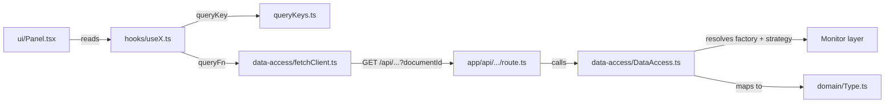

# Features

A "feature" is a self-contained vertical slice of the dashboard: its data fetching, its domain types, its hooks, and its UI. Features live under [src/app/features/](https://github.com/webteamuxco/dashboard-monitor/tree/main/src/app/features/).

The standard layout of a feature folder is:

```text
<feature>/
├── data-access/    # Server-side orchestration + client-side fetchers
├── domain/         # Internal types (the shape consumed by UI)
├── hooks/          # TanStack Query hooks
├── ui/             # React components
└── queryKeys.ts    # Centralized query keys (when applicable)
```



Every data feature is parameterized by the Strapi **`documentId`** of the active project, threaded down from [DashboardContent](https://github.com/webteamuxco/dashboard-monitor/tree/main/src/app/features/dashboard/ui/DashboardContent.tsx) via [useActiveProject](https://github.com/webteamuxco/dashboard-monitor/tree/main/src/app/features/dashboard/hooks/useActiveProject.ts). It is part of every query key, so switching project refetches everything without manual invalidation.

## Feature catalog

### issues

[src/app/features/issues/](https://github.com/webteamuxco/dashboard-monitor/tree/main/src/app/features/issues/)

Lists unresolved error issues and shows full details (events, stacktrace, comments, breadcrumbs) in a side sheet.

- **Monitor consumed:** `errorMonitor` (`getIssues`, `getIssue`, `getIssueLatestEvent`, `getIssueEvents`, `getIssueComments`)
- **API routes:** `GET /api/issues?documentId&limit&environment`, `GET /api/issues/[id]?documentId`
- **Domain types:** `IssueRow`, `IssueDetailView`
- **Hooks:** `useIssues(documentId, limit, environment, intervalMs)`, `useIssueDetail(documentId, issueId)`
- **UI:** `IssuesPanel`, `IssueDetailSheet`
- **Query keys:** `["issues", "recent", documentId, limit, environment]`, `["issues", "detail", issueId]`

The detail sheet is only mounted when an issue is selected; the `useIssueDetail` hook is `enabled: !!issueId` so no fetch happens before the user clicks a row.

### errorRate

[src/app/features/errorRate/](https://github.com/webteamuxco/dashboard-monitor/tree/main/src/app/features/errorRate/)

Displays a 24-hour error count chart (one point per hour bucket) using Recharts.

- **Monitor consumed:** `errorMonitor` (`getErrorStats` with a 24h period and a `1h` interval)
- **API route:** `GET /api/error-rate?documentId&environment`
- **Domain type:** `ErrorRatePoint { bucketEpoch: number; label: string; count: number | null }`
- **Hooks:** `useErrorRate(documentId, environment, intervalMs)`
- **UI:** `ErrorRatePanel` (Recharts AreaChart)
- **Query key:** `["errorRate", "series", documentId, environment]`

A `null` count means "no data for that bucket" and is preserved as-is — it renders as a gap, not as a zero.

### reservations

[src/app/features/reservations/](https://github.com/webteamuxco/dashboard-monitor/tree/main/src/app/features/reservations/)

Tracks "reservation sent" business events over a sliding time window. Backed by the log monitor with a tag filter rather than a dedicated metrics endpoint — convenient and provider-agnostic.

- **Monitor consumed:** `logMonitor` (`getLogs` with `query: "reservation.sent"`, suffixed with the environment when one is selected)
- **API route:** `GET /api/reservations?documentId&windowMinutes&environment`
- **Domain type:** `ReservationPoint { minuteIso: string; label: string; count: number }`
- **Hooks:** `useReservations(documentId, windowMinutes, environment, intervalMs)`
- **UI:** `ReservationsPanel`, `ReservationsKpiCard`
- **Query key:** `["reservations", "series", documentId, windowMinutes, environment]`

The series is zero-filled minute by minute before aggregation, so the chart always has exactly `windowMinutes` points even when nothing happened.

### visitors

[src/app/features/visitors/](https://github.com/webteamuxco/dashboard-monitor/tree/main/src/app/features/visitors/)

Shows live visitor counts split between **new** and **returning** users over a sliding window. Powered by a HogQL query against PostHog.

- **Monitor consumed:** `trackerMonitor` (`getActiveUsersTimeline`)
- **API route:** `GET /api/visitors/timeline?documentId&windowMinutes`
- **Domain type:** `VisitorPoint { minuteIso: string; label: string; newCount: number; returningCount: number }`
- **Hooks:** `useVisitorsTimeline(documentId, windowMinutes, intervalMs)`
- **UI:** `VisitorsKpiCard` (two instances: `new` / `returning`), `VisitorsPanel`
- **Query key:** `["visitors", "timeline", documentId, windowMinutes]`

"New" vs "returning" is decided in the HogQL query itself: a visitor whose first-ever event is within the last 30 minutes counts as new. The current kiosk layout surfaces the two KPI cards; `VisitorsPanel` is the full chart, available but not mounted in the default grid.

### config

[src/app/features/config/](https://github.com/webteamuxco/dashboard-monitor/tree/main/src/app/features/config/)

The Strapi-backed project catalog and per-project configuration. Not a panel — it feeds the header selector and the whole dashboard's wiring.

- **Backed by:** [src/lib/config/](https://github.com/webteamuxco/dashboard-monitor/tree/main/src/lib/config/) (`StrapiClientFactory` → `StrapiClientStrategy` → `StrapiRepository`)
- **API routes:** `GET /api/config/projects`, `GET /api/config/projects/[projectId]`
- **Domain types:** `ProjectSummary` (catalog entry), `Project` (mapped tools, tool configurations, `defaultConfig`, `timeInterval`)
- **Hooks:** `useProjects()`, `useProjectConfig(documentId)` — both `staleTime: 5 min`, this config barely moves
- **Query keys:** `["config", "projects"]`, `["config", "project", documentId]`

Both queries are seeded server-side with `setQueryData` in [page.tsx](https://github.com/webteamuxco/dashboard-monitor/tree/main/src/app/page.tsx), so the selector and the first project's settings are available on first paint.

### dashboard

[src/app/features/dashboard/](https://github.com/webteamuxco/dashboard-monitor/tree/main/src/app/features/dashboard/)

Dashboard-wide state and chrome. Not a data feature — it owns the kiosk's project selector, window selector, environment selector, header and KPI row.

- **Composition root:** `DashboardContent` — resolves the active project, hydrates the window store from Strapi, lays out the grid.
- **`useActiveProject(initialDocumentId, initialProjectId, fallbackRefreshIntervalMs)`** — returns `{ documentId, projectId, refreshIntervalMs }`. Bridges the Strapi `documentId` (what the user picks) and the GlitchTip project id (what the KPI header displays), and reads the refresh cadence from the project's `defaultConfig`.
- **State (Zustand):** `useSelectedProject` (persisted), `useDashboardWindow` (presets + `windowMinutes`), `useEnvironment`. See [state-management.md](state-management.md).
- **UI:** `DashboardHeader`, `ProjectSelector`, `WindowSelector`, `EnvironmentSelector`, `IssuesKpiRow`, `KpiCard`.

`IssuesKpiRow` is a five-card strip above the main panels: open issues, new issues in the window, new visitors, returning visitors, reservations.

## How a feature is added

1. **Create the folder skeleton** under `src/app/features/<name>/` with `data-access/`, `domain/`, `hooks/`, `ui/`, plus `queryKeys.ts`.
2. **Define the domain type** in `domain/<Name>Point.ts`. This is what UI consumes — keep it minimal and presentation-friendly.
3. **Add the data access layer**:
   - `data-access/<Name>DataAccess.ts` (server) — resolve the factory for the `documentId`, call the strategy with `connection.projectId`, map to your domain type. Wrap in `cache()`.
   - `data-access/fetch<Name>Client.ts` (client) — small `fetch` wrapper for the API route.
4. **Add the API route** at `src/app/api/<route>/route.ts` (`export const dynamic = "force-dynamic"`), requiring `documentId`.
5. **Centralize query keys** in `queryKeys.ts`, with `documentId` as the first variable segment.
6. **Wrap fetch in a TanStack Query hook** in `hooks/use<Name>.ts`. Use `refetchInterval` for polling.
7. **Build the panel** in `ui/<Name>Panel.tsx`. Pure UI — no fetch.
8. **Wire it into [page.tsx](https://github.com/webteamuxco/dashboard-monitor/tree/main/src/app/page.tsx)** (prefetch) and into `DashboardContent` (render).

See any of `issues`, `errorRate`, `reservations`, `visitors` as a working template.
