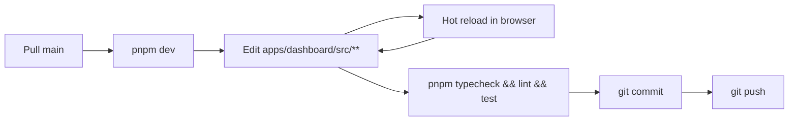

# Getting started

This guide walks you from a fresh clone to a running dashboard.

## Prerequisites

- **Node.js** ≥ 20 and ≤ 24 (declared in the root `engines`; Next.js 16 requires 20+)
- **pnpm** 10 (the repo pins `packageManager: pnpm@10.33.3` and ships a `pnpm-lock.yaml`)
- A reachable **Strapi** instance holding the dashboard's project catalog, with an API token that can read projects, dashboard panels, dashboard KPIs, dashboard blocks and tools
- Access credentials for the backends you intend to use:
  - **GlitchTip:** API token (the instance URL, organization and project id come from Strapi)
  - **PostHog:** personal API key (host and project id come from Strapi)

## 1. Install

```bash
git clone <repo-url>
cd dashboard-monitor
pnpm install
```

This is a **pnpm + Turborepo monorepo**. One `pnpm install` at the root installs both apps:

| App | Package name | Port |
|---|---|---|
| `apps/dashboard` | `dashboard-monitor` | 3000 |
| `apps/docs-site` | `docs-site` | 3002 |

`pnpm install` also runs `husky` to set up git hooks (`prepare` script).

## 2. Configure environment

The env file belongs to the **dashboard app**, not the repo root:

```bash
cp apps/dashboard/.env.example apps/dashboard/.env.local
```

Minimum required to boot:

```bash
STRAPI_BASE_URL=http://localhost:1337
STRAPI_TOKEN=<your-strapi-token>

GLITCHTIP_TOKEN=<your-token>
POSTHOG_PERSONAL_API_KEY=<your-api-key>
```

That is the whole provider configuration in the environment. Everything project-, panel- or card-scoped lives in Strapi. See [configuration.md](configuration.md) for the full list and the Strapi/env split.

> `STRAPI_BASE_URL` is the instance root, not the API path. A value ending in `/api` makes every GraphQL request fail with `405 Method Not Allowed`.

## 3. Configure the project in Strapi

The dashboard renders nothing useful until a **published** project has at least one panel, and that panel at least one KPI or block.

### On the project

1. **Identity** — title and slug. The `documentId` Strapi generates is what the catalog and the header selector key on.
2. *(optional)* **Default config** — `DefaultRefreshIntervalMS`, the polling cadence. Defaults to 30 000 ms.
3. *(optional)* **Time intervals** — the window presets offered in the header (e.g. `30 minutes`, `6 hours`). Defaults to 30m / 1h / 12h / 24h.

### On each dashboard panel

A panel is presentation only — a label in the selector and a container for cards:

1. **Identity** — `name`, `slug`, `display_name` (shown in the header selector), `icon` (a kebab-case [lucide](https://lucide.dev/icons/) name such as `panels-right-bottom`), `order` (the panel list is sorted by it; the first one is selected by default).
2. **`is_development`** — leave it off for a panel the kiosk should show; on, it only appears with `?showDevelopmentPanel=true`.

### On each tool

A `Tool` is a shared entry, so create one per provider instance rather than one per card:

- `slug` — a free label, for humans only. Nothing resolves on it.
- one configuration component — GlitchTip (instance URL, organization slug, provider project id) or PostHog (instance URL, project id).

### On each element — this is where the wiring lives

Add a `DashboardKpi` or a `DashboardBlock`, **attach it to the panel**, then give it:

1. **Identity** — `title`, `description`, `icon`, `level` (also the chart colour), `order`.
2. **`type`** — what draws it: `interval` (measured over the selected window) or `list` for a KPI; `list`, `rate`, `bar` or `stackedBar` for a block.
3. **`strategy`** — exactly one: `error-monitor`, `log-monitor` (with its `tags`, e.g. `reservation.sent`) or `tracker-monitor`.
4. **`tool`** — the `Tool` it reads from.

Two cards on one panel can therefore point at two different instances. A panel with no element renders an empty grid, and an element attached to **no** panel never shows up at all — the element lists filter on the panel slug. See [panels.md](panels.md).

An element whose strategy and tool disagree — `tracker-monitor` on a GlitchTip tool, say — fails loudly with `No <X>Factory supports type "<strategy>"`, and only that card fails. By design: a misconfiguration should be visible rather than silent.

## 4. Run

### Dev servers

```bash
pnpm dev            # dashboard on :3000 + docs site on :3002
```

Scope it if you only need one app:

```bash
pnpm --filter dashboard-monitor dev
pnpm --filter docs-site dev
```

Open [http://localhost:3000](http://localhost:3000). Hot reload is on; saving any `apps/dashboard/src/**` file reloads the page.

### Production build

```bash
pnpm build
pnpm start
```

## 5. Verify the wiring

After the page loads, the chrome is immediate (it comes from the server-hydrated config) and each card fills within ~1s, for the panel selected in the header:

- **the KPI strip** — one card per `DashboardKpi` attached to the panel, in `order`
- **the blocks** — one card per `DashboardBlock`, in two columns split on `order` parity, each drawing what its `type` says

The header carries the project selector, the panel selector and the window presets. All of them only appear when `NEXT_PUBLIC_DASHBOARD_INTERACTIVITY=true`; a read-only kiosk shows the first project and its first panel. The panel selector additionally hides itself when the project has fewer than two panels.

If a card shows an error, check the server logs for the underlying cause — and note that the failure is scoped to that card: the rest of the panel keeps polling. Most causes are a missing strategy or tool on the element, or an incorrect credential — see [Troubleshooting](#troubleshooting).

## 6. Quality gates

Before pushing, from the repo root:

```bash
pnpm typecheck   # TypeScript, both apps
pnpm lint        # ESLint
pnpm test        # Vitest
```

Husky enforces these. The Vitest suite lives in `tests/` at the **repo root** and is driven by the root `vitest.config.ts` (`@/` → `apps/dashboard/src`).

## Daily development workflow



Most changes are inside one feature folder — UI tweaks, mapper adjustments, hook tuning. For deeper changes, consult:

- [architecture.md](architecture.md) — to know what layer you're touching
- [panels.md](panels.md) — if you're touching a data path or the header selectors
- [monitors.md](monitors.md) — if you're adding/modifying an adapter
- [features.md](features.md) — if you're adding a new widget
- [state-management.md](state-management.md) — for query keys and store conventions

## Troubleshooting

### "Strapi env vars missing: STRAPI_BASE_URL, STRAPI_TOKEN"

Neither can be omitted. Set both in `apps/dashboard/.env.local` (not at the repo root) and restart `pnpm dev`.

### "Strapi request failed: 405 Method Not Allowed on …/graphql"

`STRAPI_BASE_URL` points at something that is not the instance root — most often a value ending in `/api`. The GraphQL endpoint is derived as `<root>/graphql`.

### "No project is configured in Strapi"

The catalog query returned nothing. Either no project exists, or none is **published**, or the token lacks read access.

### The dashboard loads but the page is empty

The project has no panel, or the selected panel has no element. Both are legitimate "nothing configured" answers, not errors — so nothing is rendered and nothing throws.

### A card you configured does not appear

Check that the element is **attached to the panel**: the KPI and block lists filter on `dashboard_panels.slug`, so an element whose panel relation is empty is invisible even though it exists and is published. Two other silent cases: an unpublished draft, and a panel with `is_development` on while the URL has no `?showDevelopmentPanel=true`.

If several cards share an `order` value, their relative order is whatever Strapi returns — number them distinctly to freeze the layout.

### "Strapi dashboard-kpi \"X\" not found."

An id reached `loadToolWiring` for a collection it does not belong to (a project id, a panel id, or a block id sent to the KPI route), or the element is not published. The message names the collection that was searched, which is usually enough to identify the wrong call site. A stale persisted selection is *not* a cause — `useActivePanel` discards a stored panel missing from the project's list.

### "No ErrorMonitorFactory supports type 'error-monitor'"

The element declares `error-monitor` but its tool does not carry a configuration for a registered vendor — or it carries none at all. Either:

- fix the element's `tool` in Strapi admin (currently supported: `glitchtip` for errors and logs, `posthog` for the tracker), or
- add a new adapter and register it (see [monitors.md](monitors.md#adding-a-new-adapter)).

Remember the vendor is read from the configuration component, not from the tool's `slug` — a tool named "glitchtip" with a PostHog configuration fails here.

### "Strapi dashboard-block \"X\" declares no strategy. Map one in admin."

The element exists and is attached, but its `strategy` dynamic zone is empty.

### "GlitchTip env var missing: GLITCHTIP_TOKEN is required."

An element points at a GlitchTip tool but the token isn't set. Same for `POSTHOG_PERSONAL_API_KEY` on a PostHog one. The check runs lazily, when the client is built for the first request.

### "GlitchTip configuration of Strapi element X is incomplete"

The tool's configuration exists but one of url / organization / projectId is empty. The message names what is required.

### A log-monitor card is empty, or shows one point

Two distinct causes. If the element declares **several tags**, they are read one at a time — the provider ANDs the terms of a single query, so asking for all of them returns their intersection; use the tag selector in the card's header. If an **environment is selected**, GlitchTip can only scope an error series per hour, so a window under two hours yields one or two buckets: the card's header states the granularity it actually drew (`1h · 30m`). See [monitors.md](monitors.md#errormonitor).

### Cards load but never refresh

The refresh cadence comes from the **project**'s `defaultConfig.DefaultRefreshIntervalMS` — nothing at panel or element level overrides it. A value of `0` disables polling; clear it to fall back to 30 s.

### The window presets don't match the project I selected

They follow the active project through `useActiveWindow`. If they show the 30m / 1h / 12h / 24h defaults on a project that *does* declare intervals, the value never made it out of Strapi — check that `GetProjectById` still selects `timeInterval { duration interval }`, since the DTO cast will not tell you.

### The header selector shows no panel picker

`PannelSelector` renders nothing when the project has fewer than two panels. Resolution happens in `useActivePanel` regardless, so a single-panel project displays normally without a visible control.

### A panel's icon shows as a plain circle

The `icon` string doesn't match a [lucide](https://lucide.dev/icons/) icon once converted from kebab-case to PascalCase. The fallback is deliberate and silent — check the spelling in Strapi.

### The wrong project or panel is displayed on load

Both selections are persisted client-side. Reset them with:

```javascript
localStorage.removeItem("dashboard-selected-project")
localStorage.removeItem("dashboard-selected-pannel")
```

(Then refresh the page.) On a fresh browser the first project of the Strapi list and its first panel by `order` are used. A stored panel that no longer exists — or that belongs to another project — is discarded automatically, so you only need this to *change* a valid selection.

### TanStack Query devtools

To inspect query state in dev, add `@tanstack/react-query-devtools` and mount `<ReactQueryDevtools />` inside `Providers`. Not included by default to keep the bundle clean.

## Useful project pointers

- **Understand the panel system** → [panels.md](panels.md)
- **Add a new external provider** → [monitors.md](monitors.md#adding-a-new-adapter)
- **Add a new data view** → [features.md](features.md#how-a-feature-is-added)
- **Understand the request lifecycle** → [data-flow.md](data-flow.md)
- **Tune polling / caching** → [state-management.md](state-management.md)
