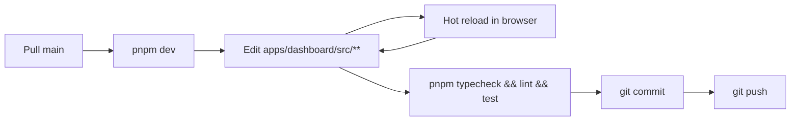

# Getting started

This guide walks you from a fresh clone to a running dashboard.

## Prerequisites

- **Node.js** ≥ 20 and ≤ 24 (declared in the root `engines`; Next.js 16 requires 20+)
- **pnpm** 10 (the repo pins `packageManager: pnpm@10.33.3` and ships a `pnpm-lock.yaml`)
- A reachable **Strapi** instance holding the dashboard's project catalog, with an API token that can read projects, dashboard panels, mapped tools, strategies and tool configurations
- Access credentials for the backends you intend to use:
  - **GlitchTip:** API token (the instance URL, organization and project id come from Strapi)
  - **PostHog:** personal API key (host and project id come from Strapi)

## 1. Install

```bash
git clone <repo-url>
cd dashboard-monitor
pnpm install
```

This is a **pnpm + Turborepo monorepo**. One `pnpm install` at the root installs both apps:

| App | Package name | Port |
|---|---|---|
| `apps/dashboard` | `dashboard-monitor` | 3000 |
| `apps/docs-site` | `docs-site` | 3002 |

`pnpm install` also runs `husky` to set up git hooks (`prepare` script).

## 2. Configure environment

The env file belongs to the **dashboard app**, not the repo root:

```bash
cp apps/dashboard/.env.example apps/dashboard/.env.local
```

Minimum required to boot:

```bash
STRAPI_BASE_URL=http://localhost:1337
STRAPI_TOKEN=<your-strapi-token>

GLITCHTIP_TOKEN=<your-token>
POSTHOG_PERSONAL_API_KEY=<your-api-key>
```

That is the whole provider configuration in the environment. Everything project- or panel-scoped lives in Strapi. See [configuration.md](configuration.md) for the full list and the Strapi/env split.

> `STRAPI_BASE_URL` is the instance root, not the API path. A value ending in `/api` makes every GraphQL request fail with `405 Method Not Allowed`.

## 3. Configure the project in Strapi

The dashboard renders nothing useful until at least one **published** project with at least one **dashboard panel** exists.

### On the project

1. **Identity** — title and slug. The `documentId` Strapi generates is what the catalog and the header selector key on.
2. *(optional)* **Default config** — `DefaultRefreshIntervalMS`, the polling cadence. Defaults to 30 000 ms.
3. *(optional)* **Time intervals** — the window presets offered in the header (e.g. `30 minutes`, `6 hours`). Defaults to 30m / 1h / 12h / 24h.

### On each dashboard panel

Panels are what carry the provider wiring — a project with no panel shows an empty dashboard. For each one:

1. **Identity** — `name`, `slug`, `display_name` (shown in the header selector), `icon` (a kebab-case [lucide](https://lucide.dev/icons/) name such as `panels-right-bottom`), `order` (the panel list is sorted by it; the first one is selected by default).
2. **Mapped tools** — pair a strategy with a tool:
   - `error-monitor` × `glitchtip`
   - `log-monitor` × `glitchtip`
   - `tracker-monitor` × `posthog`
3. **Tool configurations** — the connection details for each mapped tool:
   - GlitchTip: instance URL, organization slug, project id
   - PostHog: instance URL, project id

Only the strategies a panel maps get rendered: `error-monitor` brings the issues list, the error-rate chart and the issues KPI; `log-monitor` the reservations panel and its KPI; `tracker-monitor` the visitors panel and KPI. A panel mapping nothing renders an empty grid. See [panels.md](panels.md).

A strategy that is mapped but whose tool has no registered adapter makes the matching panel fail loudly with `No <X>Factory supports type "<strategy>"` — by design, so a misconfiguration is visible rather than silent.

## 4. Run

### Dev servers

```bash
pnpm dev            # dashboard on :3000 + docs site on :3002
```

Scope it if you only need one app:

```bash
pnpm --filter dashboard-monitor dev
pnpm --filter docs-site dev
```

Open [http://localhost:3000](http://localhost:3000). Hot reload is on; saving any `apps/dashboard/src/**` file reloads the page.

### Production build

```bash
pnpm build
pnpm start
```

## 5. Verify the wiring

After the page loads you should see the KPI strip and the panels populated within ~1s — for the panel selected in the header, and only for the strategies that panel maps:

- **KPI row** — open issues, new visitors, returning visitors, reservations
- **Issues** (left) — list of recent unresolved errors
- **Error Rate** (right) — 24h area chart
- **Reservations** (right) — sliding-window event timeline
- **Visitors** (left) — new vs returning timeline

The header carries the project selector, the panel selector, the window presets and — when `NEXT_PUBLIC_DASHBOARD_ENVIRONMENTS` is set — the environment selector. All of them only appear when `NEXT_PUBLIC_DASHBOARD_INTERACTIVITY=true`; a read-only kiosk shows the first project and its first panel.

If a panel shows an error, check the server logs for the underlying cause. Most issues are a missing Strapi mapping on the panel or an incorrect credential — see [Troubleshooting](#troubleshooting).

## 6. Quality gates

Before pushing, from the repo root:

```bash
pnpm typecheck   # TypeScript, both apps
pnpm lint        # ESLint
pnpm test        # Vitest
```

Husky enforces these. The Vitest suite lives in `tests/` at the **repo root** and is driven by the root `vitest.config.ts` (`@/` → `apps/dashboard/src`).

## Daily development workflow



Most changes are inside one feature folder — UI tweaks, mapper adjustments, hook tuning. For deeper changes, consult:

- [architecture.md](architecture.md) — to know what layer you're touching
- [panels.md](panels.md) — if you're touching a data path or the header selectors
- [monitors.md](monitors.md) — if you're adding/modifying an adapter
- [features.md](features.md) — if you're adding a new widget
- [state-management.md](state-management.md) — for query keys and store conventions

## Troubleshooting

### "Strapi env vars missing: STRAPI_BASE_URL, STRAPI_TOKEN"

Neither can be omitted. Set both in `apps/dashboard/.env.local` (not at the repo root) and restart `pnpm dev`.

### "Strapi request failed: 405 Method Not Allowed on …/graphql"

`STRAPI_BASE_URL` points at something that is not the instance root — most often a value ending in `/api`. The GraphQL endpoint is derived as `<root>/graphql`.

### "No project is configured in Strapi"

The catalog query returned nothing. Either no project exists, or none is **published**, or the token lacks read access.

### The dashboard loads but the grid is empty

The selected panel maps no strategy, or the project has no panel at all. `/api/config/projects/<projectId>/panels` returning `null` and `/api/config/projects/<projectId>/strategies?selectedPanel=<slug>` returning `null` are both legitimate "nothing configured" answers, not errors — so nothing is rendered and nothing throws.

### "Strapi panel \"X\" not found."

A **project** `documentId` reached the monitor layer where a **panel** `documentId` was expected. A stale persisted selection is *not* a cause — `useActivePanel` discards a stored panel that is missing from the project's list — so look at the call site: only `getPanelById` / `isPanelHasStrategy` and the data routes take a panel id.

### "No ErrorMonitorFactory supports type 'error-monitor'"

The selected panel has no mapped tool pairing the `error-monitor` strategy with a registered tool. Either:

- add the mapping on the panel in Strapi admin (currently supported tool: `glitchtip`), or
- add a new adapter and register it (see [monitors.md](monitors.md#adding-a-new-adapter)).

The same message shape applies to `log-monitor` and `tracker-monitor`.

### "GlitchTip env var missing: GLITCHTIP_TOKEN is required."

The panel maps GlitchTip but the token isn't set. Same for `POSTHOG_PERSONAL_API_KEY` on the visitors panels. The check runs lazily on first request.

### "GlitchTip configuration of Strapi panel X is incomplete"

The panel's tool configuration exists but one of url / organization / projectId is empty. The message names what is required.

### Panels load but never refresh

The refresh cadence comes from the **project**'s `defaultConfig.DefaultRefreshIntervalMS` — not the panel's. A value of `0` disables polling; clear it to fall back to 30 s.

### The header selector shows no panel picker

`PannelSelector` renders nothing when the project has fewer than two panels. Resolution happens in `useActivePanel` regardless, so a single-panel project displays normally without a visible control.

### A panel's icon shows as a plain circle

The `icon` string doesn't match a [lucide](https://lucide.dev/icons/) icon once converted from kebab-case to PascalCase. The fallback is deliberate and silent — check the spelling in Strapi.

### The wrong project or panel is displayed on load

Both selections are persisted client-side. Reset them with:

```javascript
localStorage.removeItem("dashboard-selected-project")
localStorage.removeItem("dashboard-selected-pannel")
```

(Then refresh the page.) On a fresh browser the first project of the Strapi list and its first panel by `order` are used. A stored panel that no longer exists — or that belongs to another project — is discarded automatically, so you only need this to *change* a valid selection.

### TanStack Query devtools

To inspect query state in dev, add `@tanstack/react-query-devtools` and mount `<ReactQueryDevtools />` inside `Providers`. Not included by default to keep the bundle clean.

## Useful project pointers

- **Understand the panel system** → [panels.md](panels.md)
- **Add a new external provider** → [monitors.md](monitors.md#adding-a-new-adapter)
- **Add a new data view** → [features.md](features.md#how-a-feature-is-added)
- **Understand the request lifecycle** → [data-flow.md](data-flow.md)
- **Tune polling / caching** → [state-management.md](state-management.md)
