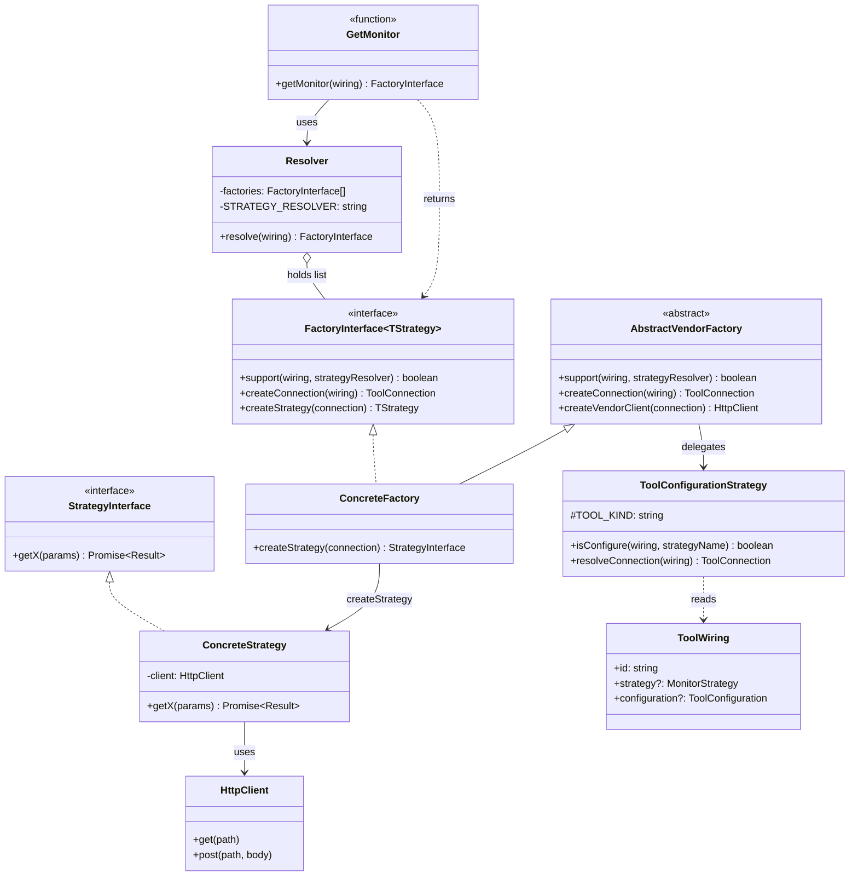
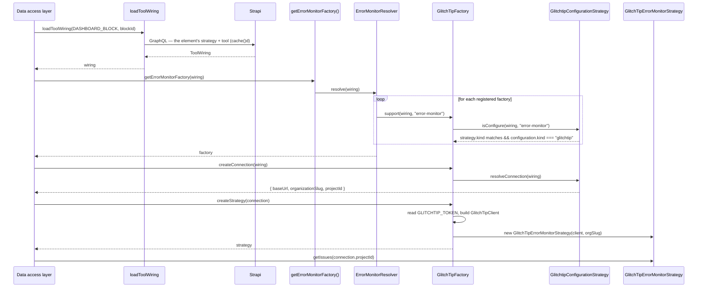
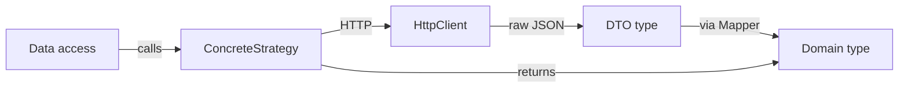

# Monitors: Strategy & Factory pattern

The monitor layer is the **central abstraction** of this project. It defines how the dashboard talks to external observability providers (GlitchTip, PostHog, …) without coupling the UI to any of them.

There are three monitor *families*, each independent:

- **`errorMonitor`** — issues, events, error stats (currently: GlitchTip)
- **`logMonitor`** — log aggregation with filtering (currently: GlitchTip)
- **`trackerMonitor`** — visitor timeline / live users (currently: PostHog)

All three follow the same shape. This doc describes that shape once, then shows how to add a new adapter.

Every `src/…` path below is relative to `apps/dashboard/`.

## What decides which adapter runs

**Strapi admin, not an env var.** Every **dashboard element** — a `DashboardKpi` or a `DashboardBlock` — declares:

- one **strategy**: `error-monitor`, `log-monitor` (with its `tags`) or `tracker-monitor`;
- one **tool** relation, whose `configuration` carries the connection details (instance URL, organization, provider project id).

The only thing left in the environment is the **API secret** of each vendor (`GLITCHTIP_TOKEN`, `POSTHOG_PERSONAL_API_KEY`). See [configuration.md](configuration.md).

:::info This layer does not speak ids — it speaks `ToolWiring`

**Nothing under `errorMonitor/`, `logMonitor/` or `trackerMonitor/` reads Strapi.** They receive a [`ToolWiring`](https://github.com/webteamuxco/dashboard-monitor/tree/main/apps/dashboard/src/lib/config/domain/ToolWiring.ts) — `{ id, strategy?, configuration? }` — and everything below `get<Family>Monitor` is **pure and synchronous**: no network, no env, nothing to await in `support()` or `createConnection()`.

Whoever knows which collection an id belongs to loads that wiring and passes it in — the data-access layer, through `loadToolWiring(kind, documentId)`. Both Strapi content types project onto the same `ToolWiring`, which is why adding a third element kind changes nothing here. See [panels.md](panels.md#resolution-from-element-to-provider).
:::

## The pattern



### Roles

- **Strategy interface** — the contract the data-access layer depends on. Stable across providers.
- **`FactoryInterface<TStrategy>`** ([shared/factory/FactoryInterface.ts](https://github.com/webteamuxco/dashboard-monitor/tree/main/apps/dashboard/src/lib/shared/factory/FactoryInterface.ts)) — the three-step contract every factory honours: *do you support this wiring?* → *shape its connection* → *build me a strategy*. The first two are synchronous.
- **Abstract vendor factory** ([shared/factory/](https://github.com/webteamuxco/dashboard-monitor/tree/main/apps/dashboard/src/lib/shared/factory/)) — one per vendor (`AbstractGlitchTipFactory`, `AbstractPostHogFactory`). Owns everything that is vendor-specific but family-agnostic: `support()`, `createConnection()`, the connection type guard, and the HTTP client construction (including the env secret check). Shared by every family using that vendor.
- **Concrete factory** — one per (family × vendor). Implements only `createStrategy(connection)`.
- **Resolver** — holds the family's factory list and its `STRATEGY_RESOLVER` name. Returns the first factory whose `support()` answers true, throws otherwise — naming the element.
- **`get<Family>Monitor(wiring)`** — the public entry point. Returns the resolved **Factory** (not a Strategy), synchronously. Marked `import "server-only"`.
- **Tool configuration strategy** ([config/domain/tool/](https://github.com/webteamuxco/dashboard-monitor/tree/main/apps/dashboard/src/lib/config/domain/tool/)) — the vendor seam, and it is **pure**: `isConfigure()` compares the wiring's strategy name and vendor, `resolveConnection()` shapes and validates the connection out of the configuration it already holds. Neither reads Strapi — `loadToolWiring` did that once, upstream.
- **Concrete Strategy** — provider-specific implementation. Holds an HTTP client, runs requests, calls **Mappers** to translate DTOs to domain types.
- **HTTP client** — low-level transport (`GlitchTipClient`, `PostHogClient`). No business logic.

### The two constants that must match Strapi

| Constant | Declared in | Values today |
|---|---|---|
| `STRATEGY_RESOLVER` | each family's `<Family>MonitorResolver.ts`, sourced from [shared/strategiesEnum.ts](https://github.com/webteamuxco/dashboard-monitor/tree/main/apps/dashboard/src/lib/shared/strategiesEnum.ts) | `error-monitor`, `log-monitor`, `tracker-monitor` |
| `TOOL_KIND` | each `config/domain/tool/<Vendor>ConfigurationStrategy.ts` | `glitchtip`, `posthog` |

`support()` is answered by the wiring alone:

```typescript
wiring.strategy?.kind === strategyName && wiring.configuration?.kind === TOOL_KIND
```

That vendor comes from the configuration component's `__typename`, mapped into `configuration.kind` — **never from `tool.slug`**, which is an editable label in admin and can drift. An element whose strategy and tool disagree makes the resolver throw, naming the element: the intended visible failure, not a fallback. Its blast radius is one card.

`strategiesEnum.ts` is shared with the UI, which reads an element's `strategy.kind` — the only piece of wiring that crosses to the browser. That is what keeps the rendered cards and the resolvable adapters from drifting apart.

## Resolution flow



The call site is always the same four lines — one `await`, then pure composition:

```typescript
const wiring = await loadToolWiring(DASHBOARD_BLOCK, blockId);
const factory = getErrorMonitorFactory(wiring);
const connection = factory.createConnection(wiring);
const strategy = factory.createStrategy(connection);
```

`connection.projectId` is the **provider's** project id (GlitchTip numeric id, PostHog project id) — never a Strapi `documentId`. Confusing the two is the most common wiring bug in this codebase, now that four values are in circulation: project id, panel slug, element id, provider project id.

## The three monitor families

### errorMonitor

[src/lib/errorMonitor/strategy/ErrorMonitorStrategyInterface.ts](https://github.com/webteamuxco/dashboard-monitor/tree/main/apps/dashboard/src/lib/errorMonitor/strategy/ErrorMonitorStrategyInterface.ts)

```typescript
export interface ErrorMonitorStrategyInterface {
  getIssues(projectId: string, filters?: IssueFilters): Promise<Issue[]>;
  getErrorStats(projectId: string, period: Period, environment?: string): Promise<ErrorStatsSeries>;
  getIssue(issueId: string): Promise<Issue>;
  getIssueLatestEvent(issueId: string): Promise<IssueEvent | null>;
  getIssueEvents(issueId: string, limit?: number): Promise<IssueEvent[]>;
  getIssueComments(issueId: string): Promise<IssueComment[]>;
}
```

- **Strapi strategy name:** `error-monitor`
- **Entry point:** [GetErrorMonitor.ts](https://github.com/webteamuxco/dashboard-monitor/tree/main/apps/dashboard/src/lib/errorMonitor/GetErrorMonitor.ts) — `getErrorMonitorFactory(wiring)`
- **Registered adapters:** `glitchtip` ([GlitchTipErrorMonitorFactory.ts](https://github.com/webteamuxco/dashboard-monitor/tree/main/apps/dashboard/src/lib/errorMonitor/adapters/glitchtip/GlitchTipErrorMonitorFactory.ts))
- **Domain types:** `Issue`, `IssueEvent`, `IssueComment`, `TimeSeriesPoint`, `ErrorStatsSeries`, `ErrorLevel`

`getErrorStats` returns an `ErrorStatsSeries` — `{ interval, points }` — rather than bare points, because a provider does not always serve the granularity the period asked for. GlitchTip's `stats_v2` honours the requested interval, but it ignores `environment`; an environment-scoped series is therefore summed per issue from `issues-stats`, which only exposes **hourly** buckets (span ≤ 24h) and **daily** ones beyond. A 30-minute window asking for minutes gets one hourly bucket, and the served `interval` is what tells the card to say so instead of drawing a near-empty minute series. Whoever labels the points reads `interval`, never the one it requested.

### logMonitor

[src/lib/logMonitor/strategy/LogMonitorStrategyInterface.ts](https://github.com/webteamuxco/dashboard-monitor/tree/main/apps/dashboard/src/lib/logMonitor/strategy/LogMonitorStrategyInterface.ts)

```typescript
export interface LogMonitorStrategyInterface {
  getLogs(projectId: string, filters?: LogFilters, period?: Period): Promise<Log[]>;
}
```

- **Strapi strategy name:** `log-monitor`
- **Entry point:** [GetLogMonitor.ts](https://github.com/webteamuxco/dashboard-monitor/tree/main/apps/dashboard/src/lib/logMonitor/GetLogMonitor.ts) — `getLogMonitor(wiring)`
- **Registered adapters:** `glitchtip` ([GlitchTipLogMonitorFactory.ts](https://github.com/webteamuxco/dashboard-monitor/tree/main/apps/dashboard/src/lib/logMonitor/adapters/glitchtip/GlitchTipLogMonitorFactory.ts))
- **Domain types:** `Log`, `LogLevel`, `LogFilters`

> A bar block consumes this monitor with the tag filter its Strapi strategy declares (`reservation.sent`, suffixed with the selected environment) to aggregate business events on top of the log layer.

### trackerMonitor

[src/lib/trackerMonitor/strategy/TrackerMonitorStrategyInterface.ts](https://github.com/webteamuxco/dashboard-monitor/tree/main/apps/dashboard/src/lib/trackerMonitor/strategy/TrackerMonitorStrategyInterface.ts)

```typescript
export interface TrackerMonitorStrategyInterface {
  getActiveUsersTimeline(
    projectId: string,
    windowMinutes: number,
  ): Promise<VisitorsTimeSeriesPoint[]>;
  getTotalVisitors(projectId: string): Promise<number>;
}
```

The two methods are the windowed and unwindowed readings of the same thing, and which one runs is decided by the **KPI**, not by the family: a `DashboardKpi` whose Strapi `type` is `interval` is measured over the selected window preset, any other type reads a total. `getTotalVisitors` therefore carries no time bound at all — its only horizon is the provider's own event retention.

- **Strapi strategy name:** `tracker-monitor`
- **Entry point:** [GetTrackerMonitor.ts](https://github.com/webteamuxco/dashboard-monitor/tree/main/apps/dashboard/src/lib/trackerMonitor/GetTrackerMonitor.ts) — `getTrackerMonitor(wiring)`
- **Registered adapters:** `posthog` ([PostHogFactory.ts](https://github.com/webteamuxco/dashboard-monitor/tree/main/apps/dashboard/src/lib/trackerMonitor/adapters/posthog/PostHogFactory.ts))
- **Domain types:** `VisitorsTimeSeriesPoint`

## Anatomy of an adapter

Vendor plumbing lives once, in the abstract factory:

```typescript
// src/lib/shared/factory/AbstractPosthogFactory.ts
export abstract class AbstractPostHogFactory {
  support(wiring: ToolWiring, strategyResolver: string): boolean {
    return new PosthogConfigurationStrategy().isConfigure(wiring, strategyResolver);
  }

  createConnection(wiring: ToolWiring): ToolConnection {
    return new PosthogConfigurationStrategy().resolveConnection(wiring);
  }

  createPostHogClient(connection: ToolConnection): PostHogClient {
    const token = process.env.POSTHOG_PERSONAL_API_KEY;
    if (!token) {
      throw new Error("PostHog env var missing: POSTHOG_PERSONAL_API_KEY is required.");
    }
    return new PostHogClient({
      baseUrl: connection.baseUrl,
      token,
      projectId: connection.projectId,
    });
  }
}
```

The family adapter adds only the strategy wiring:

```typescript
// src/lib/trackerMonitor/adapters/posthog/PostHogFactory.ts
export class PostHogFactory
  extends AbstractPostHogFactory
  implements TrackerMonitorFactoryInterface<TrackerMonitorStrategyInterface>
{
  createStrategy(connection: ToolConnection): PostHogStrategy {
    return new PostHogStrategy(this.createPostHogClient(connection));
  }
}
```

When a vendor's connection carries more than `{ baseUrl, projectId }`, the abstract factory also exposes a type guard. GlitchTip needs an organization slug, so `AbstractGlitchTipFactory` provides `isGlitchtipConnection()` and each `createStrategy()` rejects a connection without it. PostHog adds no field beyond `ToolConnection`, so it has no guard — adding one would assert nothing.

The Strategy holds the business logic for translating the interface methods into HTTP calls and mapping DTOs:



DTOs (`GlitchTipIssueDto`, `PostHogQueryResponseDto`, …) mirror the external API shape exactly. Mappers translate them into our internal `Issue`, `Log`, `VisitorsTimeSeriesPoint`, so the rest of the codebase never sees a provider-specific field.

## Adding a new adapter

Suppose you want to add **Sentry** as a second `errorMonitor` backend.

### 1. Register the tool slug

[src/lib/errorMonitor/ErrorMonitorTypeEnums.ts](https://github.com/webteamuxco/dashboard-monitor/tree/main/apps/dashboard/src/lib/errorMonitor/ErrorMonitorTypeEnums.ts):

```typescript
export const GLITCHTIP = "glitchtip";
export const SENTRY = "sentry"; // <-- add

export const errorMonitorMapper: ErrorMonitorType = {
  toolList: [GLITCHTIP, SENTRY], // <-- add
};
```

### 2. Add the Strapi seam for the vendor

A new vendor needs a tool configuration strategy next to the existing ones, implementing [ToolConfigurationStrategyInterface](https://github.com/webteamuxco/dashboard-monitor/tree/main/apps/dashboard/src/lib/config/domain/tool/ToolConfigurationStrategyInterface.ts):

```text
src/lib/config/domain/tool/SentryConfigurationStrategy.ts
  TOOL_KIND = "sentry"
  SentryConfiguration  (kind: "sentry", url, projectId, organization, …)
  isConfigure() / resolveConnection()   — both pure
```

Then add `SentryConfiguration` to the [ToolConfiguration](https://github.com/webteamuxco/dashboard-monitor/tree/main/apps/dashboard/src/lib/config/domain/tool/ToolConfiguration.ts) union, add a `SentryConfigurationDto` (with its `__typename`) in [dto/StrapiTool.ts](https://github.com/webteamuxco/dashboard-monitor/tree/main/apps/dashboard/src/lib/config/domain/dto/StrapiTool.ts) plus a `mapToolConfiguration` case in [toolWiringMapper.ts](https://github.com/webteamuxco/dashboard-monitor/tree/main/apps/dashboard/src/lib/config/domain/mappers/toolWiringMapper.ts), and add the matching inline fragment to **both** wiring queries — `gql/kpis/GetDashboardKpiById.ts` and `gql/blocks/GetDashboardBlockById.ts`, which share a DTO and must therefore share a selection set:

```graphql
tool {
  slug
  configuration {
    __typename
    ... on ComponentConfigSentryConfiguration {
      id
      url
      projectId
      organization
    }
    ... on Error { code message }
  }
}
```

Forgetting `__typename` or the fragment is silent: the mapper's `switch` matches nothing and the configuration becomes `undefined`, which then reads as "this element is not wired". `Error` is a real member of both unions — select it too, the mappers report its `code`.

### 3. Add the abstract vendor factory

```typescript
// src/lib/shared/factory/AbstractSentryFactory.ts
export abstract class AbstractSentryFactory {
  support(wiring: ToolWiring, strategyResolver: string): boolean {
    return new SentryConfigurationStrategy().isConfigure(wiring, strategyResolver);
  }

  createConnection(wiring: ToolWiring): ToolConnection {
    return new SentryConfigurationStrategy().resolveConnection(wiring);
  }

  createSentryClient(connection: ToolConnection): SentryClient {
    const token = process.env.SENTRY_TOKEN;
    if (!token) throw new Error("Sentry env var missing: SENTRY_TOKEN is required.");
    return new SentryClient({ baseUrl: connection.baseUrl, token });
  }
}
```

This step is skipped entirely when the vendor already exists — a second family reusing GlitchTip just extends `AbstractGlitchTipFactory`, as `logMonitor` does.

### 4. Create the adapter folder

```text
src/lib/errorMonitor/adapters/sentry/
├── SentryErrorMonitorFactory.ts   # extends AbstractSentryFactory, only createStrategy()
├── SentryStrategy.ts              # implements ErrorMonitorStrategyInterface
├── dto/                           # raw API response shapes
└── mappers/                       # DTO -> domain
```

The low-level HTTP client goes under `src/lib/tool/sentry/SentryClient.ts` — transport only.

### 5. Implement the Strategy

Match every method of `ErrorMonitorStrategyInterface`. Inside each method: HTTP call → DTO → Mapper → domain object. Tests mock the HTTP client and assert the mapper output.

### 6. Register in GetErrorMonitor

[src/lib/errorMonitor/GetErrorMonitor.ts](https://github.com/webteamuxco/dashboard-monitor/tree/main/apps/dashboard/src/lib/errorMonitor/GetErrorMonitor.ts):

```typescript
const factories: ErrorMonitorFactoryInterface<ErrorMonitorStrategyInterface>[] = [
  new GlitchTipFactory(),
  new SentryErrorMonitorFactory(), // <-- add
];
```

### 7. Document the secret and map the tool

Add `SENTRY_TOKEN` to `apps/dashboard/.env.example` and [configuration.md](configuration.md). Then, in Strapi admin, create a `Tool` carrying a Sentry configuration (url, organization, project id) and point the target **KPI or block** at it, keeping its strategy on `error-monitor`.

Nothing else changes: no UI, hook, API route or data-access edit. Switching from GlitchTip to Sentry is a Strapi edit, and it can differ per element — one panel can keep GlitchTip on its error list and try Sentry on the card next to it.

## Adding a new monitor family

If you need a *new family* (e.g. uptime monitoring), mirror the structure of `src/lib/errorMonitor/`:

```text
src/lib/uptimeMonitor/
├── domain/                      # internal types
├── strategy/
│   └── UptimeMonitorStrategyInterface.ts
├── factory/
│   ├── UptimeMonitorFactoryInterface.ts   # alias of FactoryInterface<TStrategy>
│   └── UptimeMonitorResolver.ts           # STRATEGY_RESOLVER = "uptime-monitor"
├── adapters/<provider>/
│   ├── <Provider>UptimeMonitorFactory.ts
│   ├── <Provider>Strategy.ts
│   ├── dto/
│   └── mappers/
├── UptimeMonitorTypeEnums.ts
└── GetUptimeMonitor.ts          # public entry point
```

Add `uptime-monitor` to [shared/strategiesEnum.ts](https://github.com/webteamuxco/dashboard-monitor/tree/main/apps/dashboard/src/lib/shared/strategiesEnum.ts) — the UI reads the same constants — declare the strategy component in Strapi admin, add its case to `mapMonitorStrategy` and to both wiring queries, then handle it in the `switch` of `BlocksDataAccess` / `KpisDataAccess`, which is where a family becomes a measure. No env var is involved in family resolution.

## Testing strategy

- **Mappers** — pure functions, test with a frozen DTO fixture asserting the output shape.
- **Strategies** — mock the HTTP client, verify that the right path/params are called and the mapper output flows through.
- **Factories** — mock the tool configuration strategy; assert `support()` forwards the wiring and the strategy name, `createConnection()` delegates, and `createStrategy()` throws on a missing secret.
- **Configuration strategies** — no mock at all: both methods are pure. Feed them a `ToolWiring` and assert what they accept and how they refuse.
- **Resolver / entry point** — assert it returns the supporting factory and throws when none matches.

Build the wiring with the `glitchtipWiring()` / `posthogWiring()` helpers rather than by hand, and assert `support()` was handed that exact object. A factory test that still mocks `StrapiClientFactory` is testing at the wrong seam — nothing below `get<Family>Monitor` reads Strapi any more. See [tests/CLAUDE.md](https://github.com/webteamuxco/dashboard-monitor/tree/main/tests/CLAUDE.md).

## Common pitfalls

- **Importing a `Get*Monitor` from a client component.** Fails at build time because of `import "server-only"`. Intentional — keep monitor logic on the server.
- **Passing a Strapi `documentId` where a provider project id is expected.** Strategies take `connection.projectId`; only `loadToolWiring` and the repositories speak `documentId`.
- **Passing an id from the wrong collection.** Every id here is an opaque string, so nothing type-checks it. The symptom is `Strapi dashboard-kpi "<id>" not found.` — the message names the collection that was searched. See [panels.md](panels.md#three-identifiers-one-parameter-name).
- **Forgetting to register the new Factory in `Get*Monitor.ts`.** The resolver throws `No <X>Factory supports type "<strategy>"` — the same message you get when the element's strategy and tool disagree, so check both.
- **Wiring the tool on the panel instead of the element.** The panel carries no wiring at all any more; a `Tool` attached to anything but a `DashboardKpi` / `DashboardBlock` resolves nothing.
- **Reading the vendor from `tool.slug`.** It is an editable label. `support()` reads `configuration.kind`, which comes from the component's `__typename`.
- **Leaking provider DTO types upward.** The data access layer must only see domain types (`Issue`, `Log`, `ErrorStatsSeries`, …). Importing `GlitchTipIssueDto` in `IssuesDataAccess.ts` means a missing mapper.
