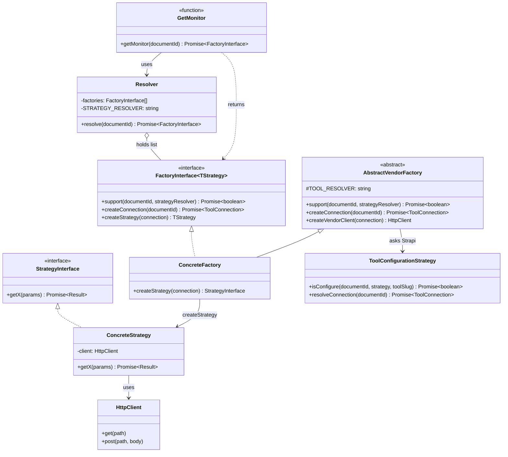
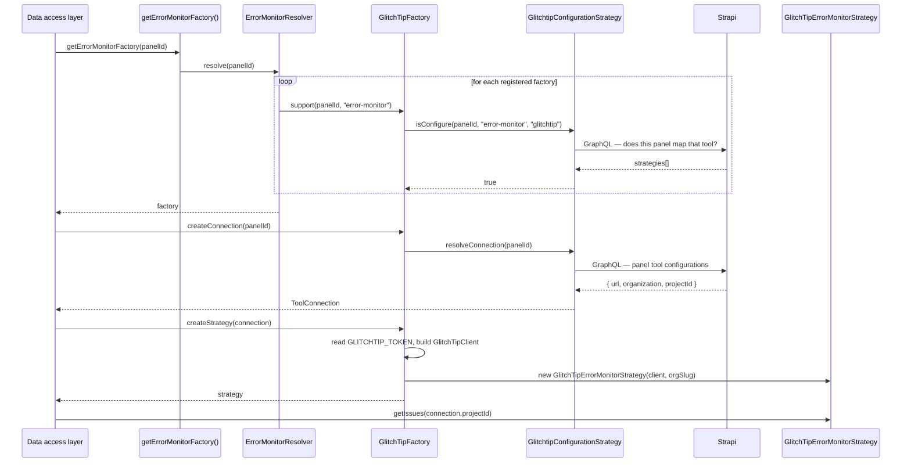
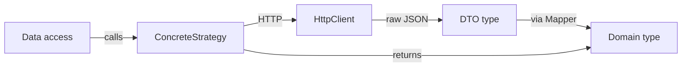

# Monitors: Strategy & Factory pattern

The monitor layer is the **central abstraction** of this project. It defines how the dashboard talks to external observability providers (GlitchTip, PostHog, …) without coupling the UI to any of them.

There are three monitor *families*, each independent:

- **`errorMonitor`** — issues, events, error stats (currently: GlitchTip)
- **`logMonitor`** — log aggregation with filtering (currently: GlitchTip)
- **`trackerMonitor`** — visitor timeline / live users (currently: PostHog)

All three follow the same shape. This doc describes that shape once, then shows how to add a new adapter.

Every `src/…` path below is relative to `apps/dashboard/`.

## What decides which adapter runs

**Strapi admin, not an env var.** Every **dashboard panel** is a Strapi entry that declares:

- its **mapped tools** — which tool (`glitchtip`, `posthog`, …) backs which strategy (`error-monitor`, `log-monitor`, `tracker-monitor`);
- its **tool configurations** — the connection details for each tool (instance URL, organization, project id).

The only thing left in the environment is the **API secret** of each vendor (`GLITCHTIP_TOKEN`, `POSTHOG_PERSONAL_API_KEY`). See [configuration.md](configuration.md).

:::warning The `documentId` this layer receives is a **panel** id

Provider wiring lives on the panel, not on the project ([panels.md](panels.md)). So everything in this document — `get<Family>Monitor(documentId)`, `support(documentId, …)`, `createConnection(documentId)` — receives the Strapi `documentId` of the selected **dashboard panel**. The parameter name is a leftover from when wiring lived on the project. Hand a project id to any of them and the lookup fails with `Strapi panel "<id>" not found.`
:::

## The pattern



### Roles

- **Strategy interface** — the contract the data-access layer depends on. Stable across providers.
- **`FactoryInterface<TStrategy>`** ([shared/factory/FactoryInterface.ts](https://github.com/webteamuxco/dashboard-monitor/tree/main/apps/dashboard/src/lib/shared/factory/FactoryInterface.ts)) — the three-step contract every factory honours: *do you support this panel?* → *give me its connection* → *build me a strategy*.
- **Abstract vendor factory** ([shared/factory/](https://github.com/webteamuxco/dashboard-monitor/tree/main/apps/dashboard/src/lib/shared/factory/)) — one per vendor (`AbstractGlitchTipFactory`, `AbstractPostHogFactory`). Owns everything that is vendor-specific but family-agnostic: the tool slug, the Strapi lookup, the connection type guard, and the HTTP client construction (including the env secret check). Shared by every family using that vendor.
- **Concrete factory** — one per (family × vendor). Implements only `createStrategy(connection)`.
- **Resolver** — holds the family's factory list and its `STRATEGY_RESOLVER` name. Returns the first factory whose `support()` answers true, throws otherwise.
- **`get<Family>Monitor(documentId)`** — the public entry point. Returns the resolved **Factory** (not a Strategy). Marked `import "server-only"`.
- **Tool configuration strategy** ([config/domain/tool/](https://github.com/webteamuxco/dashboard-monitor/tree/main/apps/dashboard/src/lib/config/domain/tool/)) — the Strapi seam. `isConfigure()` answers the mapped-tool question via `isPanelHasStrategy()`, `resolveConnection()` reads the panel's tool configuration via `getPanelById()`. Both wrapped in React `cache()` so one request hits Strapi once.
- **Concrete Strategy** — provider-specific implementation. Holds an HTTP client, runs requests, calls **Mappers** to translate DTOs to domain types.
- **HTTP client** — low-level transport (`GlitchTipClient`, `PostHogClient`). No business logic.

### The two constants that must match Strapi

| Constant | Declared in | Values today |
|---|---|---|
| `STRATEGY_RESOLVER` | each family's `<Family>MonitorResolver.ts`, sourced from [shared/strategiesEnum.ts](https://github.com/webteamuxco/dashboard-monitor/tree/main/apps/dashboard/src/lib/shared/strategiesEnum.ts) | `error-monitor`, `log-monitor`, `tracker-monitor` |
| `TOOL_RESOLVER` | each `shared/factory/Abstract<Vendor>Factory.ts` | `glitchtip`, `posthog` |

A panel whose Strapi mapped tools do not pair those two strings gets a thrown resolver error — an intentional, visible failure rather than a silent fallback.

`strategiesEnum.ts` is shared with the UI: `DashboardContent` matches the same three constants against the panel's strategy list to decide which widgets to mount. That is what keeps the rendered grid and the resolvable adapters from drifting apart.

## Resolution flow



The call site is always the same three lines:

```typescript
const factory = await getErrorMonitorFactory(panelId);
const connection = await factory.createConnection(panelId);
const strategy = factory.createStrategy(connection);
```

`connection.projectId` is the **provider's** project id (GlitchTip numeric id, PostHog project id) — never a Strapi `documentId`. Confusing the two is the most common wiring bug in this codebase, now that three ids are in circulation: project id, panel id, provider project id.

## The three monitor families

### errorMonitor

[src/lib/errorMonitor/strategy/ErrorMonitorStrategyInterface.ts](https://github.com/webteamuxco/dashboard-monitor/tree/main/apps/dashboard/src/lib/errorMonitor/strategy/ErrorMonitorStrategyInterface.ts)

```typescript
export interface ErrorMonitorStrategyInterface {
  getIssues(projectId: string, filters?: IssueFilters): Promise<Issue[]>;
  getErrorStats(projectId: string, period: Period, environment?: string): Promise<TimeSeries>;
  getIssue(issueId: string): Promise<Issue>;
  getIssueLatestEvent(issueId: string, environment?: string): Promise<IssueEvent | null>;
  getIssueEvents(issueId: string, limit?: number, environment?: string): Promise<IssueEvent[]>;
  getIssueComments(issueId: string): Promise<IssueComment[]>;
}
```

- **Strapi strategy name:** `error-monitor`
- **Entry point:** [GetErrorMonitor.ts](https://github.com/webteamuxco/dashboard-monitor/tree/main/apps/dashboard/src/lib/errorMonitor/GetErrorMonitor.ts) — `getErrorMonitorFactory(documentId)`
- **Registered adapters:** `glitchtip` ([GlitchTipErrorMonitorFactory.ts](https://github.com/webteamuxco/dashboard-monitor/tree/main/apps/dashboard/src/lib/errorMonitor/adapters/glitchtip/GlitchTipErrorMonitorFactory.ts))
- **Domain types:** `Issue`, `IssueEvent`, `IssueComment`, `TimeSeries` / `TimeSeriesPoint`, `ErrorLevel`

#### The environment filter is the adapter's problem, not the provider's

Every read that can be scoped takes an optional `environment`, and an adapter must
honour it **whether or not its provider does**. GlitchTip honours it in exactly one
place, measured endpoint by endpoint (always with a bogus environment value — the only
test that distinguishes "filtered" from "ignored"):

| GlitchTip endpoint | Honours `environment` | Used for |
|---|---|---|
| `/organizations/{org}/issues/` | yes | the issues list and KPI |
| `/issues/{id}/events/` | no — neither as a param nor as a `query` token | the detail feed, and the error-rate series |
| `/issues/{id}/events/latest/` | no | nothing when an environment is set — the head of the scoped feed replaces it |
| `/issues/{id}/` | no | the group's own counters, which span every environment |
| `/organizations/{org}/stats_v2/` | no | **nothing — no longer used** |
| `/organizations/{org}/issues-stats/` | no | **nothing — no longer used** |

So every per-environment number is computed from **each event's own `environment`
tag**, read off the issue event feed. That is the only per-event source GlitchTip
exposes, and the reason the error-rate series is built from feeds rather than from a
ready-made counter:

- `stats_v2` ignores the filter, and counts *ingestion volume* rather than events
  attached to issues — on a live project it read 11 where the feeds held 6.
- `issues-stats` ignores it too.
- Scoping the *issues list* and then summing whole issues is per group, not per
  event: an issue with one production event hands its entire event volume to the
  production series. On a live project that made the four environments total 16
  events for 6 real ones, and reported activity in an environment that had none.

Because it is one source, **a total is always the sum of its environments** — which is
the property to check first when the numbers look wrong.

Three consequences the UI has to state rather than hide:

- **Scoping the issues list is per group, not per event.** An issue with a single
  production event appears in the production list, carrying its all-environment
  counters. The issue detail labels those counters accordingly.
- **Filtering a feed is capped.** The detail scans at most `EVENTS_SCAN_LIMIT`
  events per issue; since the feed is sorted by date descending, an issue whose recent
  activity is entirely in another environment can legitimately come back with an empty
  scoped list. The sheet says so instead of rendering nothing.
- **A series says when it is incomplete.** `getErrorStats` reads at most
  `EVENT_SCAN_BUDGET` events across every issue active in the window, and only reads
  the feed of an issue whose `lastSeen` falls inside it. Exhausting the budget — or
  capping the issues list while its oldest entry is still active — returns
  `truncated: true`, and the panel labels the chart as a floor. Never drop that flag on
  the way to the UI: a silently shortened error rate reads as an improvement.

A new adapter must probe its provider the same way and compute per-event in the
adapter for whatever the provider cannot filter.

### logMonitor

[src/lib/logMonitor/strategy/LogMonitorStrategyInterface.ts](https://github.com/webteamuxco/dashboard-monitor/tree/main/apps/dashboard/src/lib/logMonitor/strategy/LogMonitorStrategyInterface.ts)

```typescript
export interface LogMonitorStrategyInterface {
  getLogs(projectId: string, filters?: LogFilters, period?: Period): Promise<Log[]>;
}
```

- **Strapi strategy name:** `log-monitor`
- **Entry point:** [GetLogMonitor.ts](https://github.com/webteamuxco/dashboard-monitor/tree/main/apps/dashboard/src/lib/logMonitor/GetLogMonitor.ts) — `getLogMonitor(documentId)`
- **Registered adapters:** `glitchtip` ([GlitchTipLogMonitorFactory.ts](https://github.com/webteamuxco/dashboard-monitor/tree/main/apps/dashboard/src/lib/logMonitor/adapters/glitchtip/GlitchTipLogMonitorFactory.ts))
- **Domain types:** `Log`, `LogLevel`, `LogFilters`

> The reservations feature consumes this monitor with a tag filter (`reservation.sent`) to aggregate business events on top of the log layer.

### trackerMonitor

[src/lib/trackerMonitor/strategy/TrackerMonitorStrategyInterface.ts](https://github.com/webteamuxco/dashboard-monitor/tree/main/apps/dashboard/src/lib/trackerMonitor/strategy/TrackerMonitorStrategyInterface.ts)

```typescript
export interface TrackerMonitorStrategyInterface {
  getActiveUsersTimeline(
    projectId: string,
    windowMinutes: number,
  ): Promise<VisitorsTimeSeriesPoint[]>;
}
```

- **Strapi strategy name:** `tracker-monitor`
- **Entry point:** [GetTrackerMonitor.ts](https://github.com/webteamuxco/dashboard-monitor/tree/main/apps/dashboard/src/lib/trackerMonitor/GetTrackerMonitor.ts) — `getTrackerMonitor(documentId)`
- **Registered adapters:** `posthog` ([PostHogFactory.ts](https://github.com/webteamuxco/dashboard-monitor/tree/main/apps/dashboard/src/lib/trackerMonitor/adapters/posthog/PostHogFactory.ts))
- **Domain types:** `VisitorsTimeSeriesPoint`

## Anatomy of an adapter

Vendor plumbing lives once, in the abstract factory:

```typescript
// src/lib/shared/factory/AbstractPosthogFactory.ts
const TOOL_RESOLVER = "posthog";

export abstract class AbstractPostHogFactory {
  async support(documentId: string, strategyResolver: string): Promise<boolean> {
    return await new PosthogConfigurationStrategy()
      .isConfigure(documentId, strategyResolver, TOOL_RESOLVER);
  }

  createConnection(documentId: string): Promise<ToolConnection> {
    return new PosthogConfigurationStrategy().resolveConnection(documentId);
  }

  createPostHogClient(connection: ToolConnection): PostHogClient {
    const token = process.env.POSTHOG_PERSONAL_API_KEY;
    if (!token) {
      throw new Error("PostHog env var missing: POSTHOG_PERSONAL_API_KEY is required.");
    }
    return new PostHogClient({
      baseUrl: connection.baseUrl,
      token,
      projectId: connection.projectId,
    });
  }
}
```

The family adapter adds only the strategy wiring:

```typescript
// src/lib/trackerMonitor/adapters/posthog/PostHogFactory.ts
export class PostHogFactory
  extends AbstractPostHogFactory
  implements TrackerMonitorFactoryInterface<TrackerMonitorStrategyInterface>
{
  createStrategy(connection: ToolConnection): PostHogStrategy {
    return new PostHogStrategy(this.createPostHogClient(connection));
  }
}
```

When a vendor's connection carries more than `{ baseUrl, projectId }`, the abstract factory also exposes a type guard. GlitchTip needs an organization slug, so `AbstractGlitchTipFactory` provides `isGlitchtipConnection()` and each `createStrategy()` rejects a connection without it. PostHog adds no field beyond `ToolConnection`, so it has no guard — adding one would assert nothing.

The Strategy holds the business logic for translating the interface methods into HTTP calls and mapping DTOs:



DTOs (`GlitchTipIssueDto`, `PostHogQueryResponseDto`, …) mirror the external API shape exactly. Mappers translate them into our internal `Issue`, `Log`, `VisitorsTimeSeriesPoint`, so the rest of the codebase never sees a provider-specific field.

## Adding a new adapter

Suppose you want to add **Sentry** as a second `errorMonitor` backend.

### 1. Register the tool slug

[src/lib/errorMonitor/ErrorMonitorTypeEnums.ts](https://github.com/webteamuxco/dashboard-monitor/tree/main/apps/dashboard/src/lib/errorMonitor/ErrorMonitorTypeEnums.ts):

```typescript
export const GLITCHTIP = "glitchtip";
export const SENTRY = "sentry"; // <-- add

export const errorMonitorMapper: ErrorMonitorType = {
  toolList: [GLITCHTIP, SENTRY], // <-- add
};
```

### 2. Add the Strapi seam for the vendor

A new vendor needs a tool configuration strategy next to the existing ones, implementing [ToolConfigurationStrategyInterface](https://github.com/webteamuxco/dashboard-monitor/tree/main/apps/dashboard/src/lib/config/domain/tool/ToolConfigurationStrategyInterface.ts):

```text
src/lib/config/domain/tool/SentryConfigurationStrategy.ts
  SentryConfiguration  (kind: "sentry", url, projectId, organization, …)
  SentryConnection extends ToolConnection
  isConfigure() / resolveConnection()   — both wrapped in cache()
```

Then add `SentryConfiguration` to the [ToolConfiguration](https://github.com/webteamuxco/dashboard-monitor/tree/main/apps/dashboard/src/lib/config/domain/tool/ToolConfiguration.ts) union, add a `SentryConfigurationDto` (with its `__typename`) plus a `mapToolConfiguration` case in [projectMapper.ts](https://github.com/webteamuxco/dashboard-monitor/tree/main/apps/dashboard/src/lib/config/domain/mappers/projectMapper.ts), and add the matching inline fragment to the panel query:

```graphql
tool_configuration {
  __typename
  ... on ComponentConfigSentryConfiguration {
    url
    projectId
    organization
    id
  }
}
```

Forgetting `__typename` or the fragment is silent: the mapper's `switch` matches nothing and the configuration becomes `undefined`.

### 3. Add the abstract vendor factory

```typescript
// src/lib/shared/factory/AbstractSentryFactory.ts
const TOOL_RESOLVER = "sentry";

export abstract class AbstractSentryFactory {
  async support(documentId: string, strategyResolver: string): Promise<boolean> {
    return await new SentryConfigurationStrategy()
      .isConfigure(documentId, strategyResolver, TOOL_RESOLVER);
  }

  createConnection(documentId: string): Promise<ToolConnection> {
    return new SentryConfigurationStrategy().resolveConnection(documentId);
  }

  createSentryClient(connection: ToolConnection): SentryClient {
    const token = process.env.SENTRY_TOKEN;
    if (!token) throw new Error("Sentry env var missing: SENTRY_TOKEN is required.");
    return new SentryClient({ baseUrl: connection.baseUrl, token });
  }
}
```

This step is skipped entirely when the vendor already exists — a second family reusing GlitchTip just extends `AbstractGlitchTipFactory`, as `logMonitor` does.

### 4. Create the adapter folder

```text
src/lib/errorMonitor/adapters/sentry/
├── SentryErrorMonitorFactory.ts   # extends AbstractSentryFactory, only createStrategy()
├── SentryStrategy.ts              # implements ErrorMonitorStrategyInterface
├── dto/                           # raw API response shapes
└── mappers/                       # DTO -> domain
```

The low-level HTTP client goes under `src/lib/tool/sentry/SentryClient.ts` — transport only.

### 5. Implement the Strategy

Match every method of `ErrorMonitorStrategyInterface`. Inside each method: HTTP call → DTO → Mapper → domain object. Tests mock the HTTP client and assert the mapper output.

### 6. Register in GetErrorMonitor

[src/lib/errorMonitor/GetErrorMonitor.ts](https://github.com/webteamuxco/dashboard-monitor/tree/main/apps/dashboard/src/lib/errorMonitor/GetErrorMonitor.ts):

```typescript
const factories: ErrorMonitorFactoryInterface<ErrorMonitorStrategyInterface>[] = [
  new GlitchTipFactory(),
  new SentryErrorMonitorFactory(), // <-- add
];
```

### 7. Document the secret and map the tool

Add `SENTRY_TOKEN` to `apps/dashboard/.env.example` and [configuration.md](configuration.md). Then, in Strapi admin, map the `sentry` tool to the `error-monitor` strategy of the target **dashboard panel** and fill its tool configuration (url, organization, project id).

Nothing else changes: no UI, hook, API route or data-access edit. Switching from GlitchTip to Sentry is a Strapi edit, and it can differ per panel — one project can keep GlitchTip on its production panel and try Sentry on another.

## Adding a new monitor family

If you need a *new family* (e.g. uptime monitoring), mirror the structure of `src/lib/errorMonitor/`:

```text
src/lib/uptimeMonitor/
├── domain/                      # internal types
├── strategy/
│   └── UptimeMonitorStrategyInterface.ts
├── factory/
│   ├── UptimeMonitorFactoryInterface.ts   # alias of FactoryInterface<TStrategy>
│   └── UptimeMonitorResolver.ts           # STRATEGY_RESOLVER = "uptime-monitor"
├── adapters/<provider>/
│   ├── <Provider>UptimeMonitorFactory.ts
│   ├── <Provider>Strategy.ts
│   ├── dto/
│   └── mappers/
├── UptimeMonitorTypeEnums.ts
└── GetUptimeMonitor.ts          # public entry point
```

Add `uptime-monitor` to [shared/strategiesEnum.ts](https://github.com/webteamuxco/dashboard-monitor/tree/main/apps/dashboard/src/lib/shared/strategiesEnum.ts) so both the resolver and `DashboardContent` read the same constant, declare the strategy in Strapi admin, map a tool to it on a panel, and mount the widget from the strategy mapping in `DashboardContent`. No env var is involved in family resolution.

## Testing strategy

- **Mappers** — pure functions, test with a frozen DTO fixture asserting the output shape.
- **Strategies** — mock the HTTP client, verify that the right path/params are called and the mapper output flows through.
- **Factories** — mock the tool configuration strategy; assert `support()` forwards `(documentId, strategy, toolSlug)`, `createConnection()` delegates, and `createStrategy()` throws on a missing secret.
- **Resolver / entry point** — assert it returns the supporting factory and throws when none matches.

Never let a factory test reach `StrapiClientFactory`: an unmocked configuration strategy fails on missing `STRAPI_*` env vars. See [tests/CLAUDE.md](https://github.com/webteamuxco/dashboard-monitor/tree/main/tests/CLAUDE.md).

## Common pitfalls

- **Importing a `Get*Monitor` from a client component.** Fails at build time because of `import "server-only"`. Intentional — keep monitor logic on the server.
- **Passing a Strapi `documentId` where a provider project id is expected.** Strategies take `connection.projectId`; only the factory and the resolver speak `documentId`.
- **Passing the *project* `documentId` where the *panel* one is expected.** Both are opaque strings, so nothing type-checks it. The symptom is `Strapi panel "<id>" not found.` See [panels.md](panels.md#the-two-identifiers).
- **Forgetting to register the new Factory in `Get*Monitor.ts`.** The resolver throws `No <X>Factory supports type "<strategy>"` — the same message you get when the Strapi mapping is missing, so check both.
- **Mapping the tool on the project instead of the panel.** `support()` only looks at panels; a mapping left at project level resolves nothing.
- **Leaking provider DTO types upward.** The data access layer must only see domain types (`Issue`, `Log`, …). Importing `GlitchTipIssueDto` in `IssuesDataAccess.ts` means a missing mapper.
