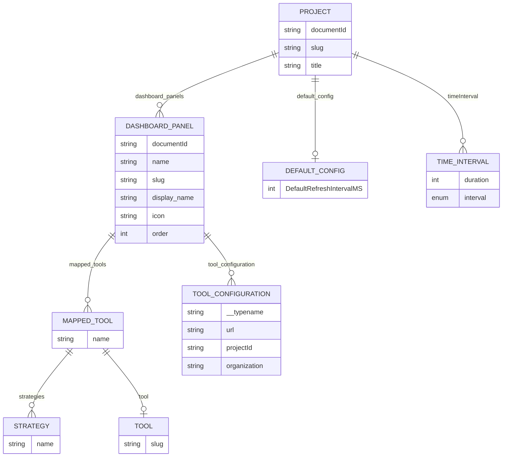
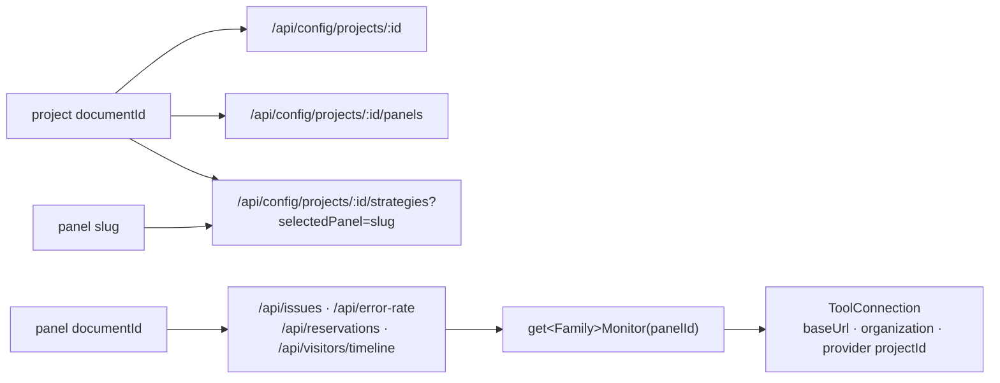
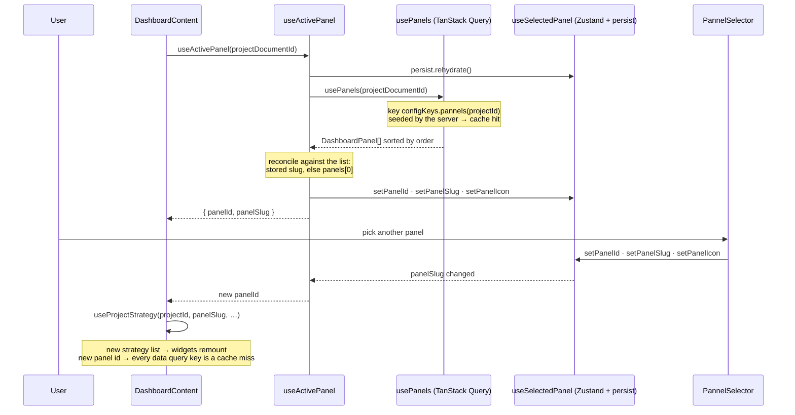
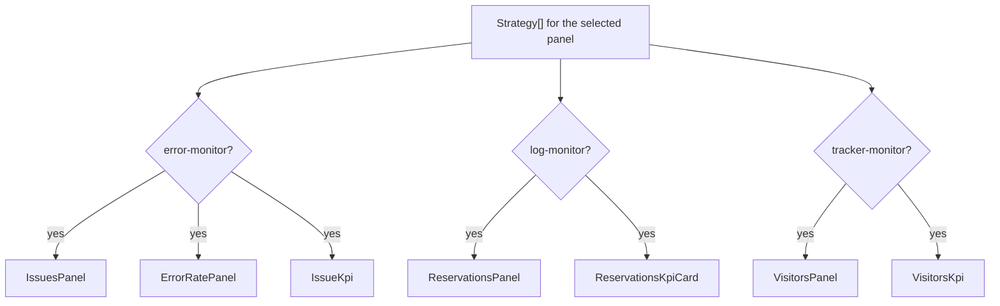
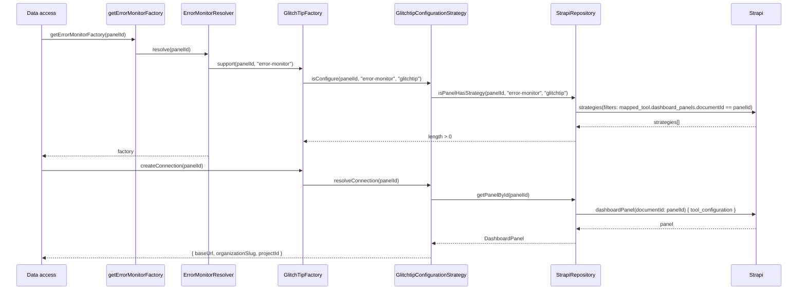
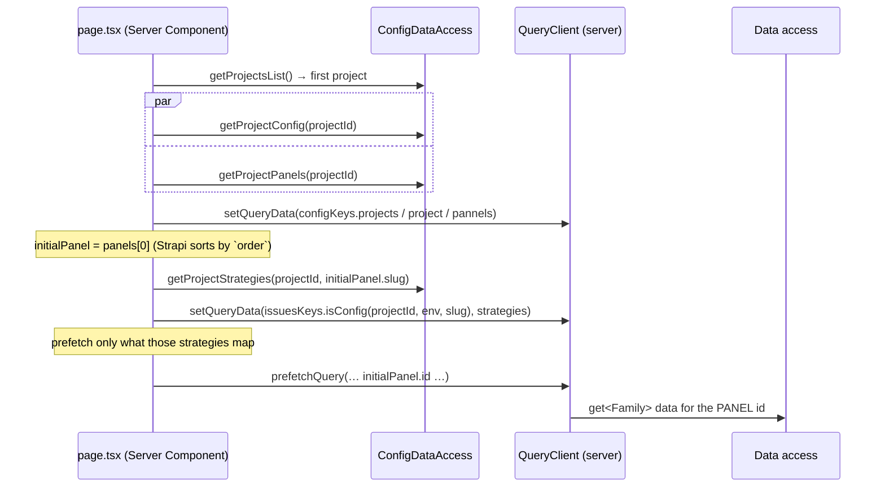

# Dashboard panels

A **dashboard panel** is the unit that carries tool wiring. A Strapi project owns an ordered list of panels; each panel declares which tools back which monitor families and how to reach them. The kiosk shows one panel at a time, picked in the header.

Before panels existed, a project mapped tools directly, so a project could show exactly one set of widgets from one set of providers. Panels split that: one project — one refresh cadence, one set of window presets — can now expose several views, each pointed at different provider projects.

## The Strapi content model



What lives where:

| Level | Fields | Why there |
|---|---|---|
| Project | `default_config.DefaultRefreshIntervalMS`, `timeInterval[]` | the polling cadence and the window presets are the same whichever panel you look at |
| Panel | `mapped_tools[]`, `tool_configuration[]` | this is the wiring — it is what differs between two views of the same project |
| Panel | `slug`, `display_name`, `icon`, `order` | the header selector's entry |

## The two identifiers

Both are Strapi `documentId`s and both are called `documentId` in most signatures. Getting them mixed up is the most common wiring bug in the codebase.

| Value | Read from | Consumed by |
|---|---|---|
| **project `documentId`** | `useSelectedProject` / the catalog | `/api/config/projects/*`, `defaultConfig`, `timeInterval`, the panel list, the strategy list |
| **panel `documentId`** | `useSelectedPanel().pannelId` | **every data route** (`?documentId=`) and the whole monitor layer |
| **panel `slug`** | `useSelectedPanel().panelSlug` | the GraphQL filter that lists a panel's strategies |



Hand a project id to the monitor layer and Strapi answers nothing, which surfaces as `Strapi panel "<id>" not found.`

## Selecting a panel

Two responsibilities, deliberately split:

- **[useActivePanel](https://github.com/webteamuxco/dashboard-monitor/tree/main/apps/dashboard/src/app/features/dashboard/hooks/useActivePanel.ts)** *resolves* the active panel. Called by `DashboardContent`, so it runs on every kiosk.
- **`PannelSelector`** only handles *user changes*. It is mounted solely in interactive mode, which is why resolution cannot live there — a read-only kiosk would otherwise select no panel at all and mount no widget.

This mirrors `useActiveProject` / `ProjectSelector` exactly.



Details that matter:

- **The selection is reconciled against the current project's panels**, never trusted as-is: the first panel by `order` is selected when nothing matches, and the id is re-resolved from the list when the stored *slug* belongs to another project — two projects can both have a `production` panel, and keeping the stale id would point the widgets at the wrong provider project.
- **The selector hides itself below two panels** (`if (panels.length < 2) return`) — resolution is unaffected, so a single-panel project works with no visible control.
- **The panel list comes from the hydrated cache** on first load: the server seeds `configKeys.pannels(projectId)`, so the selection happens without a round-trip.
- **The list key carries the project id** (`["config", "pannels", projectId]`). Without it, switching project served the previous project's panels until the 5-minute `staleTime` expired.
- **The icon is a Strapi string** in kebab-case (`panels-right-bottom`), resolved against `lucide-react`'s `icons` map. An unknown name silently falls back to `Circle`.

## What a panel renders

`DashboardContent` asks for the selected panel's strategies and mounts only the matching widgets:



The strategy names come from `@/lib/shared/strategiesEnum` — the same constants the resolvers use as their `STRATEGY_RESOLVER`, so the UI and the monitor layer cannot drift apart.

The layout adapts: the left column is hidden and the grid drops to one column when the panel maps neither `error-monitor` nor `tracker-monitor`. A panel mapping no strategy at all renders an empty grid — no error, because nothing was requested. The loud failure happens one layer down, when a mounted widget's route resolves a factory and no tool supports it.

## Resolution: from panel to provider



Both Strapi lookups are wrapped in React `cache()`, so several widgets resolving the same panel during one request hit Strapi once per query.

Note the asymmetry in the GraphQL filters: strategies are **listed** by panel `slug` (`getStrategiesByDocumentId(projectId, panelSlug)`, for the UI) but **checked** by panel `documentId` (`getSpecificStrategyByDocumentIdQuery`, for `support()`). Read the query before changing a call site.

## Configuring a panel in Strapi

For each panel of a project:

1. **Identity** — `name`, `slug`, `display_name` (what the selector shows), `icon` (a kebab-case lucide name), `order` (the list is sorted by it; the first one is the default).
2. **Mapped tools** — pair a strategy with a tool:
   - `error-monitor` × `glitchtip`
   - `log-monitor` × `glitchtip`
   - `tracker-monitor` × `posthog`
3. **Tool configurations** — the connection details for each mapped tool:
   - GlitchTip: instance URL, organization slug, provider project id
   - PostHog: instance URL, project id

Only map what the panel should display. Three panels on one project might be, for example: *Production* (all three strategies), *Staging* (error monitor only, pointed at another GlitchTip project), *Audience* (tracker monitor only).

## Naming trap: `panel` vs `pannel`

Both spellings exist and are load-bearing. Server-side names are correct (`DashboardPanel`, `getPanelById`, `dashboard_panels`, `/panels`); several client-side ones are not:

| Misspelled | Where |
|---|---|
| `PannelSelector.tsx` | component file + export |
| `usePannels.ts` | file name (the hook itself is `usePanels`) |
| `fetchProjectPannels.ts` | file name (the function is `fetchProjectPanels`) |
| `pannelId` | field of `useSelectedPanel` |
| `configKeys.pannels(documentId)` | query key factory |
| `dashboard-selected-pannel` | `localStorage` key |

Renaming them is a coordinated change — the `localStorage` key in particular resets every kiosk's persisted selection — so it belongs in its own commit, not slipped into an unrelated one.

## The server prefetch resolves the default panel

Because the widget queries are keyed on the panel id, the server has to know *which* panel the client will land on before it can prefetch anything useful. [page.tsx](https://github.com/webteamuxco/dashboard-monitor/tree/main/apps/dashboard/src/app/page.tsx) resolves it the same way the client does — the first panel by `order`:



Three properties make the hydrated cache actually get read:

1. **The panel list is seeded** under `configKeys.pannels(projectId)`, so `PannelSelector` can select `panels[0]` on its first effect without a round-trip.
2. **The strategy list is seeded** under the exact key `useProjectStrategy` builds — hence `issuesKeys.isConfig(documentId, environment, panelSlug)` taking the slug as a third segment rather than the hook appending it by hand.
3. **The widget queries are prefetched with `initialPanel.id`** and with `initialWindowMinutes` (the value `useDashboardWindow` will hold after `hydrateFromStrapi`), so the keys match segment for segment.

The prefetch also mirrors `DashboardContent`'s strategy mapping: only the widgets the panel maps are prefetched. Prefetching an unmapped one would resolve no factory and throw on the server for nothing.

If a panel is added, removed or reordered in Strapi between the server render and the client's selection, the keys stop matching and the affected widgets simply refetch on mount — the same graceful degradation as a project switch.

## Persistence across reloads

The selection survives a reload, the same way the project selection does. `useSelectedPanel` uses `persist` + `skipHydration: true`, and [useActivePanel](https://github.com/webteamuxco/dashboard-monitor/tree/main/apps/dashboard/src/app/features/dashboard/hooks/useActivePanel.ts) rehydrates it after mount:

```typescript
useEffect(() => {
  void useSelectedPanel.persist.rehydrate();
}, []);
```

`skipHydration` is what makes that safe: the server render and the first client render both start from the empty selection, so they agree, and the stored panel is applied one tick later. If the restored panel is not `panels[0]`, its widget queries are simply a cache miss and refetch — exactly what happens for a restored project.

Clearing it:

```javascript
localStorage.removeItem("dashboard-selected-pannel"); // note the spelling
```
