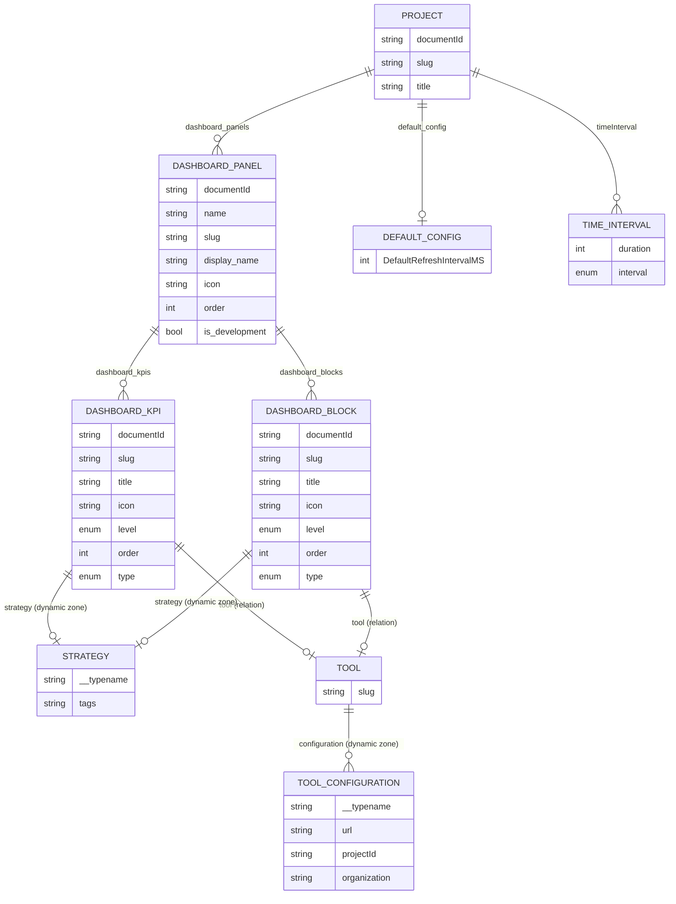
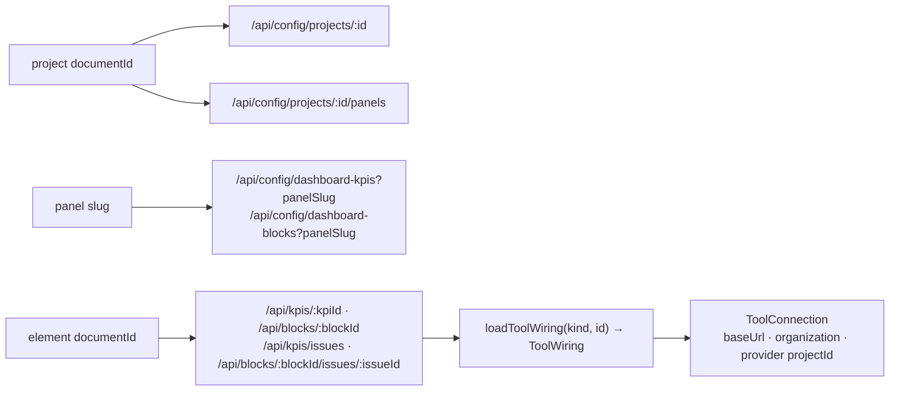
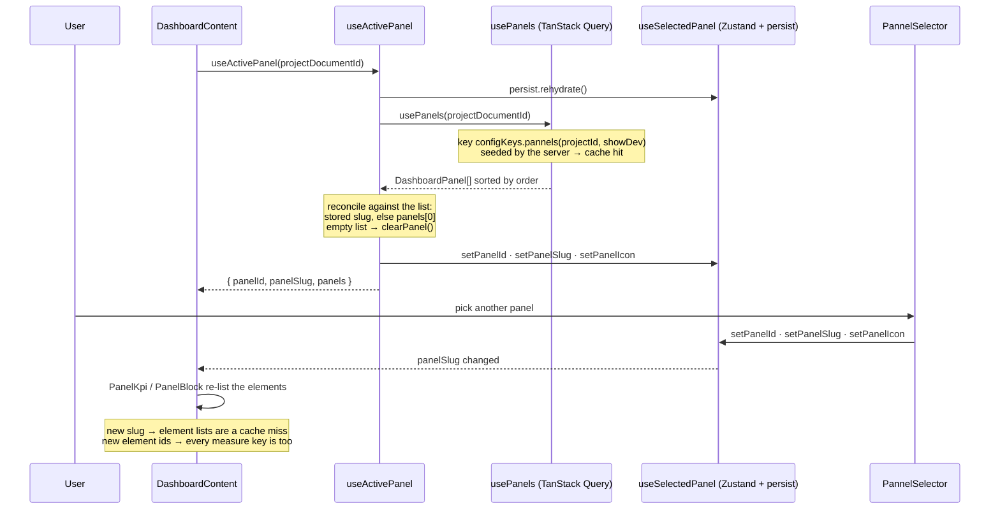
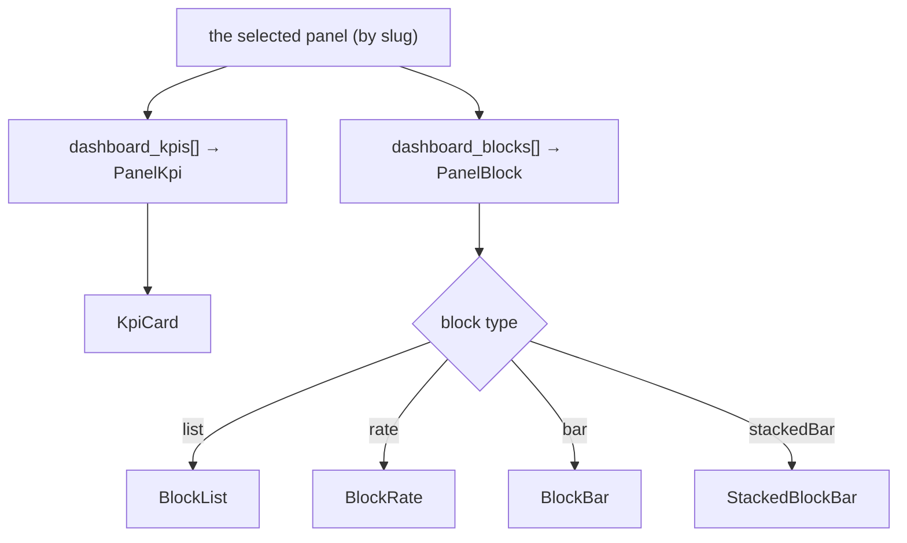
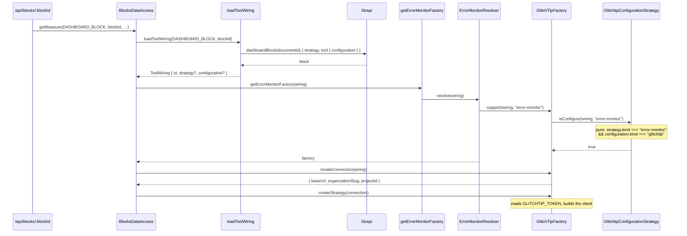
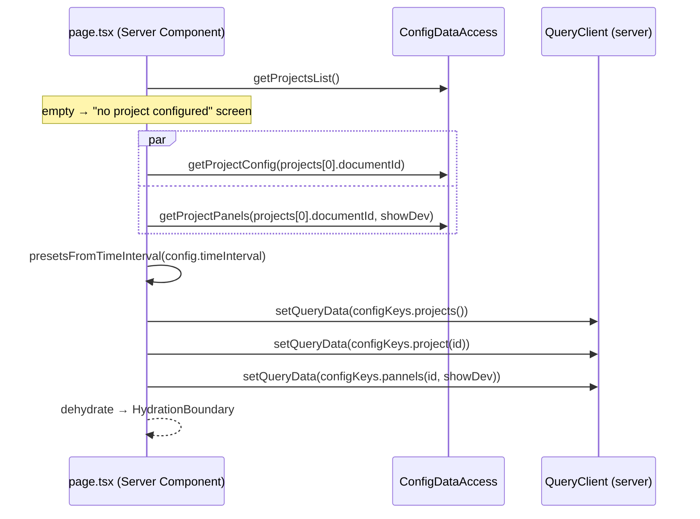

# Dashboard panels

A **dashboard panel** is a view: a name, an icon, an order, and an ordered set of **elements** — the KPI cards and the blocks it shows. The kiosk displays one panel at a time, picked in the header.

The panel itself carries **no wiring**. Each element does: a `DashboardKpi` or a `DashboardBlock` declares which monitor strategy answers it and which tool it reads from. Two blocks on the same panel can therefore read two different GlitchTip projects, and a KPI can be pointed at another instance than the block below it.

That has moved twice — read this before touching a data path:

| Era | What carried the wiring |
|---|---|
| first | the **project** (one project, one set of providers) |
| then | the **panel** (`mapped_tools`, `tool_configuration` on the panel) |
| **today** | the **element** (`strategy` + `tool` on each `DashboardKpi` / `DashboardBlock`) |

Anything still describing `mapped_tools`, a `/strategies` route or `isPanelHasStrategy` predates the current model.

## The Strapi content model



What lives where:

| Level | Fields | Why there |
|---|---|---|
| Project | `default_config.DefaultRefreshIntervalMS`, `timeInterval[]` | the polling cadence and the window presets are the same whichever panel you look at |
| Panel | `slug`, `display_name`, `icon`, `order`, `is_development` | the header selector's entry, nothing more |
| Element | `strategy` (one of `error-monitor`, `log-monitor`, `tracker-monitor`), `tool` | the wiring — it is what differs between two cards |
| Element | `type`, `level`, `title`, `description`, `icon`, `order` | how the card renders |
| Tool | `configuration[]` — url, organization, provider project id | shared: ten elements can point at one `Tool` entry |

Two consequences of `tool` being a **relation** rather than an inline component: the instance URL is edited once for every element using it, and changing it moves every one of them at the same time.

`is_development` hides a panel unless the URL carries `?showDevelopmentPanel=true`, which is how a work-in-progress panel stays out of the kiosk rotation.

## Three identifiers, one parameter name

Everything is a Strapi `documentId` and most signatures call it `documentId`. Read the call site to know which one you hold.

| Value | Read from | Consumed by |
|---|---|---|
| **project `documentId`** | `useSelectedProject` / the catalog | `/api/config/projects/*`, the cadence, the window presets, the panel list |
| **panel `slug`** | `useSelectedPanel().panelSlug` | the GraphQL filter listing that panel's KPIs and blocks |
| **element `documentId`** | the KPI or block being rendered | **every data route** and the whole monitor layer |



Pass the wrong id and the read fails with `Strapi dashboard-kpi "<id>" not found.` — the message names the collection that was searched, which is usually enough to spot which id you sent.

## Selecting a panel

Two responsibilities, deliberately split:

- **[useActivePanel](https://github.com/webteamuxco/dashboard-monitor/tree/main/apps/dashboard/src/app/features/dashboard/hooks/useActivePanel.ts)** *resolves* the active panel. Called by `DashboardContent`, so it runs on every kiosk.
- **`PannelSelector`** only handles *user changes*. It is mounted solely in interactive mode, which is why resolution cannot live there — a read-only kiosk would otherwise select no panel and render nothing.

This mirrors `useActiveProject` / `ProjectSelector` exactly.



Details that matter:

- **The selection is reconciled against the current project's panels**, never trusted as-is: the first panel by `order` is selected when nothing matches, and the id is re-resolved from the list when the stored *slug* belongs to another project — two projects can both have a `production` panel.
- **A project with no panel clears the selection.** Holding the previous project's panel would keep its cards on screen, since the element lists are keyed on the slug. The hook distinguishes `undefined` (the list is still loading — keep the current frame rather than blanking the kiosk) from `[]` (the project has no panel), which is why `fetchProjectPanels` collapses the route's `null` into an empty list.
- **The selector hides itself below two panels** (`if (panels.length < 2) return`) — resolution is unaffected, so a single-panel project works with no visible control.
- **The list key carries the project id and the dev flag** (`["config", "pannels", projectId, showDevelopmentPanel]`). Without the project id, switching project served the previous project's panels until the 5-minute `staleTime` expired.
- **The icon is a Strapi string** in kebab-case (`panels-right-bottom`), resolved against `lucide-react`'s `icons` map by `getLucideIcon()`. An unknown name silently falls back to `Circle`.

## What a panel renders

The panel's **elements** decide, and it is the element's `type` — not its strategy — that picks the component:



Every KPI renders a `KpiCard`; a block mounts one body out of the `type → { shape, body }` record in `BlockCardContent`. The element's `strategy.kind` only decides which monitor family answers the measure, server-side. Those strategy names come from `@/lib/shared/strategiesEnum` — the same constants the resolvers use as their `STRATEGY_RESOLVER`, so the wiring and the monitor layer cannot drift apart.

A `DashboardKpi` reads its own `type` too: `interval` measures over the selected window preset, every other type reads a total and carries no window in its key at all.

A panel with no element renders an empty grid — no error, because nothing was requested. The loud failure happens one layer down, when an element's data route resolves a factory that its tool does not support, and it is scoped to that one card.

## Resolution: from element to provider



The single Strapi read is `loadToolWiring(kind, documentId)`, memoized per request with React `cache()`. Everything after it is **pure and synchronous**: the resolver, `support()` and `createConnection()` never touch the network. The vendor is read from the configuration component's `__typename` (mapped into `configuration.kind`), never from `tool.slug` — that slug is an editable label in admin and can drift.

Adding a third element kind is one entry in the `loaders` record of [loadToolWiring.ts](https://github.com/webteamuxco/dashboard-monitor/tree/main/apps/dashboard/src/lib/config/domain/loadToolWiring.ts), one query and one repository method. Nothing in the monitor layer changes.

## Configuring a panel in Strapi

1. **On the project** — `title`, `slug`; optionally `default_config.DefaultRefreshIntervalMS` (polling cadence) and `timeInterval[]` (window presets). Both are project-wide.
2. **On each panel** — `name`, `slug`, `display_name` (what the selector shows), `icon` (a kebab-case lucide name), `order` (the list is sorted by it; the first one is the default), `is_development`.
3. **On each element** (`DashboardKpi` / `DashboardBlock`) — attach it to the panel, then give it:
   - `title`, `icon`, `level`, `order`, `description`
   - `type` — `list` / `interval` for a KPI, `list` / `rate` / `bar` / `stackedBar` for a block
   - `strategy` — exactly one of `error-monitor`, `log-monitor` (with its `tags`), `tracker-monitor`
   - `tool` — the `Tool` entry whose `configuration` carries the url, the organization and the provider project id
4. **On each tool** — `slug` plus one configuration component: GlitchTip (instance URL, organization slug, provider project id) or PostHog (instance URL, project id).

An element attached to **no** panel is invisible: the element lists filter on `dashboard_panels.slug`, so a KPI whose relation is empty never reaches the dashboard even though it exists and is published. That is the first thing to check when a card you configured does not show up.

## Naming trap: `panel` vs `pannel`

Both spellings exist and are load-bearing. Server-side names are correct (`DashboardPanel`, `getProjectPanels`, `dashboard_panels`, `/panels`); several client-side ones are not:

| Misspelled | Where |
|---|---|
| `PannelSelector.tsx` | component file + export |
| `usePannels.ts` | file name (the hook itself is `usePanels`) |
| `fetchProjectPannels.ts` | file name (the function is `fetchProjectPanels`) |
| `pannelId` | field of `useSelectedPanel` |
| `configKeys.pannels(documentId, showDevelopmentPanel)` | query key factory |
| `dashboard-selected-pannel` | `localStorage` key |

Renaming them is a coordinated change — the `localStorage` key in particular resets every kiosk's persisted selection — so it belongs in its own commit, not slipped into an unrelated one.

## What the server prefetch actually seeds

[page.tsx](https://github.com/webteamuxco/dashboard-monitor/tree/main/apps/dashboard/src/app/page.tsx) is a Server Component, and what it hydrates is the **configuration**, not the measures:



So the catalog, the cadence, the presets and the panel list are on the first paint; each card's measure is fetched by its own hook after mount. That is a deliberate simplification of an older design that also prefetched every widget: the elements of a panel are only known once a panel is selected, and the selection is a client concern.

If a panel is added, removed or reordered in Strapi between the server render and the client's selection, the seeded panel list is simply stale for one refetch — the same graceful degradation as a project switch.

## Persistence across reloads

The selection survives a reload, the same way the project selection does. `useSelectedPanel` uses `persist` + `skipHydration: true`, and `useActivePanel` rehydrates it after mount:

```typescript
useEffect(() => {
  void useSelectedPanel.persist.rehydrate();
}, []);
```

`skipHydration` is what makes that safe: the server render and the first client render both start from the empty selection, so they agree, and the stored panel is applied one tick later.

Clearing it:

```javascript
localStorage.removeItem("dashboard-selected-pannel"); // note the spelling
```
