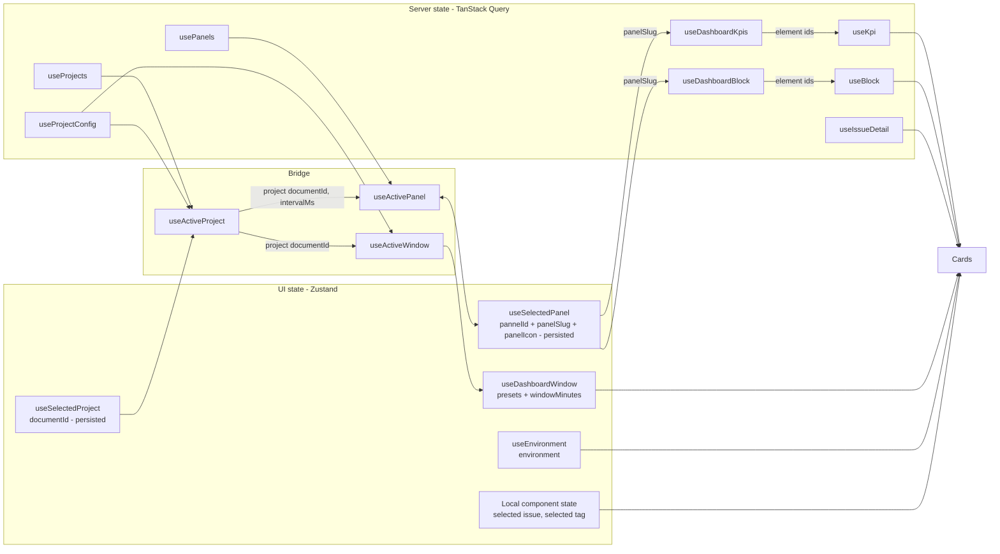
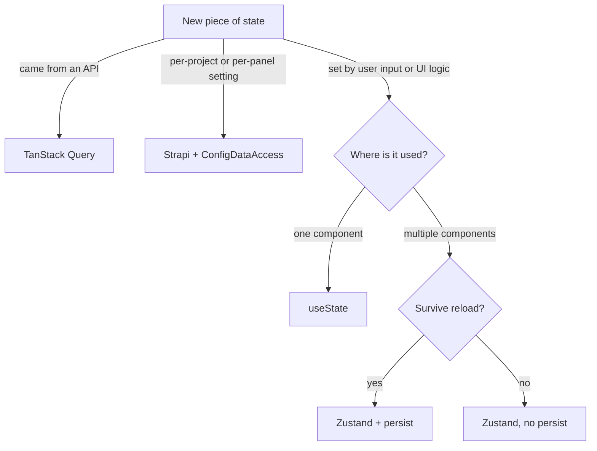

# State management

`dashboard-monitor` uses two state libraries with **clearly separated responsibilities**:

- **TanStack Query** — server state (anything fetched from an API, including the Strapi project config and the panel list)
- **Zustand** — UI state (what the user selects: project, panel, window, environment)

Mixing them creates redundancy. Keeping them apart keeps each layer thin.



The chain is: *project selection* → its panels → *panel selection* → its elements → one measure per element, each keyed on the element id.

## TanStack Query — server state

### Setup

[src/app/providers.tsx](https://github.com/webteamuxco/dashboard-monitor/tree/main/apps/dashboard/src/app/providers.tsx):

```typescript
function makeQueryClient() {
  return new QueryClient({
    defaultOptions: {
      queries: {
        staleTime: 30_000,
        refetchOnWindowFocus: false,
        retry: 1,
      },
    },
  });
}
```

Mounted in [src/app/layout.tsx](https://github.com/webteamuxco/dashboard-monitor/tree/main/apps/dashboard/src/app/layout.tsx) via `<Providers>`.

- **`staleTime: 30s`** — data is considered fresh for 30s after fetch. Re-renders don't trigger a refetch within that window.
- **`refetchOnWindowFocus: false`** — the kiosk has no "focus events" — polling is enough.
- **`retry: 1`** — one retry on failure, then surface the error.

### Per-feature hooks

Each feature exports a single hook. They all follow the same shape:

```typescript
// hooks/useKpi.ts
export function useKpi(
  kpiId: string, // the element's Strapi documentId
  windowMinutes: number | null,
  environment: string | null,
  intervalMs: number,
) {
  return useQuery({
    queryKey: dashboardKpiKeys.measure(kpiId, windowMinutes, environment),
    queryFn: () => fetchKpiMeasureClient(kpiId, windowMinutes, environment),
    refetchInterval: intervalMs > 0 ? intervalMs : false,
  });
}
```

`intervalMs` is threaded down from `DashboardContent` so all cards share the same cadence, taken from the selected **project**'s Strapi `defaultConfig.refreshIntervalMs` (fallback: 30 000 ms) — the cadence is project-wide, the data is element-scoped.

Hooks that depend on a selection which only exists after mount are gated with `enabled`:

```typescript
export function useDashboardKpis(panelSlug: string | null, intervalMs: number) {
  return useQuery({
    queryKey: dashboardKpiKeys.config(panelSlug),
    queryFn: () => fetchDashboardKpisClient(panelSlug ?? ""),
    enabled: !!panelSlug,
    refetchInterval: intervalMs > 0 ? intervalMs : false,
  });
}
```

The `enabled` guard is load-bearing here, not a nicety: the element-list GraphQL filter is built from the slug, and an **empty** filter matches every KPI and every block of the whole Strapi instance. Firing that query with `""` would fill a panel with another project's cards.

The three config hooks are the exception on cadence — they use `staleTime: 5 * 60_000` and no polling, because the catalog barely moves:

```typescript
export function useProjectConfig(documentId: string) {
  return useQuery({
    queryKey: configKeys.project(documentId),
    queryFn: () => fetchProjectConfigClient(documentId),
    staleTime: 5 * 60_000,
    enabled: Boolean(documentId),
  });
}
```

### Query keys

Each feature owns a `queryKeys.ts` file. This avoids stringly-typed keys scattered across the codebase.

```typescript
// features/kpis/queryKeys.ts
export const dashboardKpiKeys = {
  config: (panelSlug: string | null) =>
    ["dashboardKpis", "config", panelSlug] as const,
  measure: (
    kpiId: string,
    windowMinutes: number | null,
    environment: string | null = null,
  ) => ["dashboardKpis", "measure", kpiId, windowMinutes, environment] as const,
};
```

Inventory (the id column says *which* Strapi value the key embeds):

| Key | Shape | Id |
|---|---|---|
| `configKeys.projects()` | `["config", "projects"]` | — |
| `configKeys.project(id)` | `["config", "project", id]` | project |
| `configKeys.pannels(id, showDev)` | `["config", "pannels", id, showDev]` | project |
| `dashboardKpiKeys.config(slug)` | `["dashboardKpis", "config", slug]` | panel slug |
| `dashboardKpiKeys.measure(id, win, env)` | `["dashboardKpis", "measure", id, win, env]` | dashboard KPI |
| `dashboardBlockKeys.config(slug)` | `["dashboardBlocks", "config", slug]` | panel slug |
| `dashboardBlockKeys.measure(id, win, env, limit, tag)` | `["dashboardBlocks", "measure", id, win, env, limit, tag]` | dashboard block |
| `issuesKeys.detail(issueId)` | `["issues", "detail", issueId]` | — (provider issue id) |

Two rules:

1. **Keep keys structural** (constants → variables, broad to narrow). `invalidateQueries({ queryKey: ["dashboardBlocks"] })` invalidates every block query; `["dashboardBlocks", "measure"]` only the measures; adding the id narrows it to one card.
2. **The id is the first variable segment** of every data key. That is what makes a project, panel *or element* switch a plain cache miss instead of a manual invalidation. `configKeys.pannels(documentId, showDevelopmentPanel)` carries the project id for exactly that reason — without it, switching project served the previous project's panel list until the 5-minute `staleTime` expired — and the dev flag because they are two different lists.

`errorRateKeys` and `visitorsKeys` still exist for the two [dormant features](features.md#dormant-features), as do `issuesKeys.recentKpi` and `issuesKeys.isConfig`, which nothing builds any more.

### Hydration from server

[src/app/page.tsx](https://github.com/webteamuxco/dashboard-monitor/tree/main/apps/dashboard/src/app/page.tsx) seeds the three **config** queries with `setQueryData` on a server-side `QueryClient`, then dehydrates it and wraps children in `<HydrationBoundary state={...}>`. See [data-flow.md](data-flow.md).

**The keys must match exactly across the boundary.** The server resolves the dev-panel flag with `readDevelopmentPanelParam()` and the window with `presetsFromTimeInterval()`; the client starts from the same values. Diverging here doesn't break anything visibly — it just silently refetches on mount, which defeats the seeding.

The **measures are not prefetched**: a panel's elements are only known once a panel is selected, and that selection is a client concern. What the hydrated cache buys is the chrome — the catalog, the cadence, the presets and the panel list — with the cards fetching on mount and polling from there. See [panels.md](panels.md#what-the-server-prefetch-actually-seeds).

## Zustand — UI state

Four stores, each scoped to one concern.

### useSelectedProject

[src/app/features/dashboard/state/useSelectedProject.ts](https://github.com/webteamuxco/dashboard-monitor/tree/main/apps/dashboard/src/app/features/dashboard/state/useSelectedProject.ts)

```typescript
export const useSelectedProject = create<SelectedProjectStore>()(
  persist(
    (set) => ({
      documentId: null,
      setDocumentId: (documentId) => set({ documentId }),
    }),
    { name: "dashboard-selected-project", skipHydration: true },
  ),
);
```

- **State:** `{ documentId: string | null }`
- **Action:** `setDocumentId(documentId)`
- **Persistence:** `localStorage` key `dashboard-selected-project`, with **`skipHydration: true`**

`skipHydration` is deliberate: the server render and the first client render must both start from `null` so they fall back to the server-resolved project and the seeded config keys still match. `useActiveProject` calls `persist.rehydrate()` in an effect after mount, then reconciles: if the stored project no longer exists in the catalog, it falls back to the initial one.

### useSelectedPanel

[src/app/features/dashboard/state/useSelectedPanel.ts](https://github.com/webteamuxco/dashboard-monitor/tree/main/apps/dashboard/src/app/features/dashboard/state/useSelectedPanel.ts)

```typescript
export const useSelectedPanel = create<SelectedPanelStore>()(
  persist(
    (set) => ({
      panelSlug: null,
      pannelId: "",
      panelIcon: "panels-right-bottom",
      setPanelId: (pannelId) => set({ pannelId }),
      setPanelSlug: (panelSlug) => set({ panelSlug }),
      setPanelIcon: (panelIcon) => set({ panelIcon }),
      clearPanel: () => set({ pannelId: "", panelSlug: null, panelIcon: null }),
    }),
    { name: "dashboard-selected-pannel", skipHydration: true },
  ),
);
```

- **State:** `{ panelSlug: string | null, pannelId: string, panelIcon: string | null }`
- **Actions:** `setPanelId`, `setPanelSlug`, `setPanelIcon` — always called together — and `clearPanel`
- **Persistence:** `localStorage` key `dashboard-selected-pannel`, `skipHydration: true`

The three values are the selection, not server data: `panelSlug` keys the element lists, `panelIcon` is what the selector renders, and `pannelId` is what identifies the selection when reconciling it against a new project's list.

`useActivePanel` owns them, mirroring `useActiveProject`: it calls `persist.rehydrate()` after mount, then reconciles the stored slug against the project's panel list — selecting the first panel by `order` when nothing matches, and re-resolving the id when the stored slug belongs to another project (two projects can both have a `production` panel). A project with **no** panel clears the selection through `clearPanel()` instead of holding the previous one — the widgets are keyed on the panel slug, so keeping it would leave the previous project's KPIs and blocks on screen. The distinction that makes this work is `undefined` (the list is still loading, keep the current frame) versus `[]` (the answer is "no panel"), which is also why `fetchProjectPanels` collapses the route's `null` into an empty list. `PannelSelector` only writes user changes; it is mounted solely in interactive mode, so resolution cannot live there or a read-only kiosk would mount no widget at all.

Note the `pannel` spelling on the id field, the store's `localStorage` key, `configKeys.pannels()` and three file names. It is a typo that became load-bearing — renaming it resets every kiosk's persisted selection, so it belongs in its own commit. See [panels.md](panels.md#naming-trap-panel-vs-pannel).

### useDashboardWindow

[src/app/features/dashboard/state/useDashboardWindow.ts](https://github.com/webteamuxco/dashboard-monitor/tree/main/apps/dashboard/src/app/features/dashboard/state/useDashboardWindow.ts)

- **State:** `{ presets: WindowPreset[], windowMinutes: number }`
- **Actions:** `setWindowMinutes(minutes)`, `hydrateFromStrapi(presets, windowMinutes)`
- **Persistence:** none (in-memory only)
- **Defaults:** presets `30m / 1h / 12h / 24h`, initial window from `NEXT_PUBLIC_DASHBOARD_RESERVATIONS_WINDOW_MINUTES` (or 30)

The defaults are only a fallback: `DashboardContent` calls `hydrateFromStrapi()` with the presets derived from the selected project's `timeInterval[]`, resolved server-side by `presetsFromTimeInterval()`. A project declaring `{ duration: 6, interval: "hours" }` gets a `6h` preset.

`hydrateFromStrapi` runs once, inside a `useState` initializer, so it applies the server-resolved values before the first paint without an effect. Because that initializer only ever sees the project the **server** rendered, `useActiveWindow(documentId)` re-applies the presets on every later project switch: it reads the active project's config from the cache TanStack Query already holds (`useProjectConfig`, the same key `useActiveProject` uses — no extra request), derives the presets through the same `presetsFromTimeInterval()`, and keeps the selected window when the new project also offers it, falling back to that project's first preset otherwise. It reads the current selection through `getState()` rather than subscribing, since it reacts to the project's configuration and not to the user picking a window. While the next project's config is still loading it does nothing, so the presets never flash back to the built-in defaults between two projects. If the store shows the 30m/1h/12h/24h defaults on a project that *does* declare intervals, the value never made it out of Strapi: check that `GetProjectById` still selects `timeInterval { duration interval }` — the DTO cast won't tell you.

Also exports `isDashboardInteractive()` — reads `NEXT_PUBLIC_DASHBOARD_INTERACTIVITY`. Used to hide the selectors on read-only kiosks.

The block, KPI and visitors hooks subscribe to `windowMinutes` to refetch when the user picks a new preset — but a card whose element is not windowed selects `null` from the store instead of the value, so changing preset neither re-renders it nor invalidates its key.

### useEnvironment

[src/app/features/dashboard/state/useEnvironment.ts](https://github.com/webteamuxco/dashboard-monitor/tree/main/apps/dashboard/src/app/features/dashboard/state/useEnvironment.ts)

- **State:** `{ environment: string | null }` — `null` means "all environments"
- **Action:** `setEnvironment(environment)`
- **Persistence:** none
- **Default:** `resolveDefaultEnvironment()`, an isomorphic helper so every caller agrees on both sides of the boundary

Feeds the block and KPI measure keys.

### Local component state

Anything truly scoped to a single component stays in `useState`. Two examples, both deliberate:

- `selectedIssueId` in `BlockList` drives the detail sheet open/closed — no other component needs to know about it.
- the selected tag in `BlockCard`, for a log-monitor block declaring several. Putting it in Zustand would mean keying the store by element id for a value nothing outside that card reads. The *active* id is derived from the tag list rather than stored, so a tag removed in admin falls back to the first instead of asking the provider for something that no longer exists.

Rule of thumb: lift to Zustand only when two unrelated components need the same state.

## Decision matrix



## Common operations

### Trigger a manual refresh

```typescript
const queryClient = useQueryClient();
queryClient.invalidateQueries({ queryKey: dashboardBlockKeys.measure(blockId, windowMinutes) });
```

The header's **Refresh** button takes the blunt version, `invalidateQueries()` with no key, which refetches every mounted query at once.

### Force refetch on a specific event

If the user changes `windowMinutes`, the environment, the project or the panel, the affected hooks re-run automatically because those values are part of their query keys. No manual invalidation needed.

### Reset the persisted selections

```javascript
localStorage.removeItem("dashboard-selected-project");
localStorage.removeItem("dashboard-selected-pannel");
```

Or programmatically: `useSelectedProject.persist.clearStorage()` / `useSelectedPanel.persist.clearStorage()`.

## Conventions to follow

- **Don't call `fetch` directly in components.** Always go through a hook.
- **Don't put server data in Zustand.** TanStack Query already does caching, dedup, and staleness — duplicating that in a store creates two sources of truth. The selected project and panel are *choices* (Zustand); their config, panel list and elements are *data* (TanStack Query).
- **Don't subscribe to the whole store when you only need one slice.** Use a selector: `useDashboardWindow((s) => s.windowMinutes)`. Selecting `null` instead of the value is how an unwindowed card opts out of window changes entirely — the store then has nothing to notify it about.
- **Always use the centralized `queryKeys` factory** — never inline `["dashboardBlocks", blockId]` in a component.
- **Anything resolved on both sides of the hydration boundary lives in one shared helper** (`environments.ts`, `windowPresets.ts`), never duplicated.
