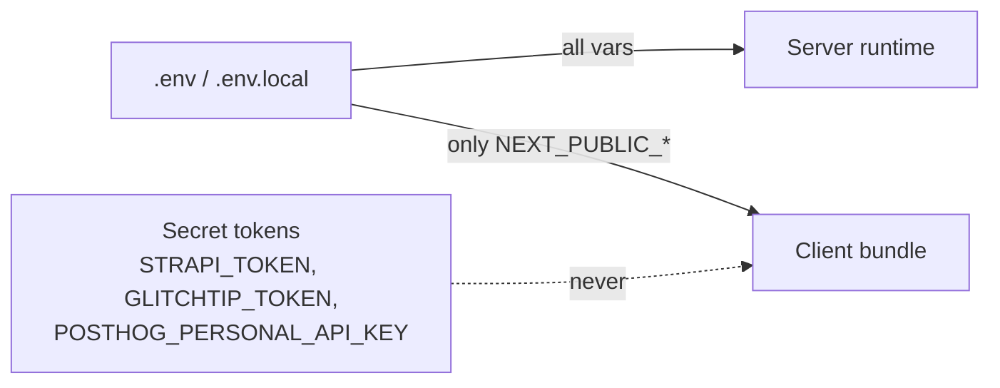

# Configuration

Configuration comes from **two places**:

- **Strapi admin** — everything project-scoped: which projects exist, which tool backs each monitor family, each tool's connection details, the refresh cadence, the window presets.
- **Environment variables** — the API secrets, plus a few display-only UI knobs.

The rule of thumb: if a value differs per project, it belongs in Strapi. If it is a credential or a build-time UI toggle, it belongs in the environment.

The canonical env template lives in [.env.example](../.env.example) (committed). Copy it to `.env.local` and fill it in.

## Loading rules

Next.js applies its own conventions on top of the shell environment:

- Variables defined in `.env` / `.env.local` are loaded automatically at build and dev time.
- Variables prefixed `NEXT_PUBLIC_` are inlined into the client bundle. **Never prefix a secret with `NEXT_PUBLIC_`.**
- Variables without that prefix are server-only — they are stripped from the client bundle.



## Strapi admin (required)

Without a reachable Strapi holding at least one published project, the dashboard renders a configuration message instead of the panels.

### `STRAPI_BASE_URL`

- **Example:** `http://localhost:1337`
- **Consumed by:** [StrapiClientFactory.ts:7](../src/lib/config/domain/StrapiClientFactory.ts#L7)
- **Effect:** root of the Strapi instance. The GraphQL endpoint is derived as `<root>/graphql`, so a value ending in `/api` makes every request fail with `405 Method Not Allowed`.

### `STRAPI_TOKEN`

- **Type:** secret (server-only)
- **Consumed by:** [StrapiClientFactory.ts:8](../src/lib/config/domain/StrapiClientFactory.ts#L8)
- **Effect:** Bearer token for the Strapi GraphQL API. Needs read access to projects, mapped tools, strategies and tool configurations.

Both are validated together — missing either throws `Strapi env vars missing: STRAPI_BASE_URL, STRAPI_TOKEN`.

## Provider secrets

These are the **only** provider values left in the environment. Instance URL, organization and project id come from the project's tool configuration in Strapi.

### `GLITCHTIP_TOKEN`

- **Type:** secret (server-only)
- **Consumed by:** [AbstractGlitchtipFactory.ts:28](../src/lib/shared/factory/AbstractGlitchtipFactory.ts#L28)
- **Effect:** Bearer token sent on every GlitchTip API call, for both the error and log monitors. Required as soon as a project maps `glitchtip`.

### `POSTHOG_PERSONAL_API_KEY`

- **Type:** secret (server-only)
- **Consumed by:** [AbstractPosthogFactory.ts:22](../src/lib/shared/factory/AbstractPosthogFactory.ts#L22)
- **Effect:** PostHog personal API key, sent as Bearer on HogQL queries. Required as soon as a project maps `posthog`.

One token per vendor, per deployment. Pointing two projects at two different GlitchTip instances is possible today only if the same token is valid on both.

## Dashboard UI knobs (browser-exposed)

### `NEXT_PUBLIC_PROJECT_TITLE`

- **Example:** `"UXCO Dashboard Monitor"`
- **Default:** none (header title stays empty if unset)
- **Consumed by:** [DashboardHeader.tsx](../src/app/features/dashboard/ui/DashboardHeader.tsx)
- **Effect:** label displayed in the dashboard header.

### `NEXT_PUBLIC_DASHBOARD_INTERACTIVITY`

- **Supported values:** `true`, `false`
- **Default:** `false`
- **Consumed by:** [useDashboardWindow.ts](../src/app/features/dashboard/state/useDashboardWindow.ts) (`isDashboardInteractive()`)
- **Effect:** when `false`, hides the UI controls (window selector, …) — read-only kiosk mode.

### `NEXT_PUBLIC_DASHBOARD_RESERVATIONS_WINDOW_MINUTES`

- **Default:** `30`
- **Consumed by:** [page.tsx](../src/app/page.tsx), [windowPresets.ts](../src/app/features/dashboard/state/windowPresets.ts) (`readDefaultWindowMinutesFromEnv()`)
- **Effect:** **fallback** initial window, used only when the selected project declares no `timeInterval` in Strapi. A project with time intervals overrides both the presets and the initial value.

### `NEXT_PUBLIC_DASHBOARD_ENVIRONMENTS`

- **Example:** `production,staging`
- **Default:** empty (selector hidden, no environment filter)
- **Consumed by:** [environments.ts](../src/app/features/dashboard/state/environments.ts)
- **Effect:** comma-separated list shown in the header environment selector. Filters issues and error rate.

### `NEXT_PUBLIC_DASHBOARD_DEFAULT_ENVIRONMENT`

- **Default:** first entry of the list above, or `null` ("all environments") when the list is empty
- **Consumed by:** [environments.ts](../src/app/features/dashboard/state/environments.ts) (`resolveDefaultEnvironment()`)
- **Effect:** environment selected on load. Must be one of the values above, otherwise it falls back.

> This resolver is deliberately isomorphic: `page.tsx` and the Zustand store must agree on the default, or the prefetched query keys would not match on hydration.

## What Strapi configures (not env)

| Setting | Where in Strapi | Consumed by |
|---|---|---|
| Project catalog (title, slug, `documentId`) | Project entries | header selector, `/api/config/projects` |
| Which tool backs a monitor family | Project → mapped tools → strategies (`error-monitor`, `log-monitor`, `tracker-monitor`) × tool slug | each family's Resolver |
| Instance URL, organization, provider project id | Project → tool configuration component | `createConnection()` of each factory |
| Refresh cadence | Project → default config → `DefaultRefreshIntervalMS` | [useActiveProject.ts](../src/app/features/dashboard/hooks/useActiveProject.ts), falls back to 30 000 ms |
| Window presets | Project → `timeInterval[]` (`duration` × `interval`) | [windowPresets.ts](../src/app/features/dashboard/state/windowPresets.ts), falls back to 30m / 1h / 12h / 24h |

The active project itself is **not** configured: it is chosen in the header and persisted client-side under the `localStorage` key `dashboard-selected-project`. On first load the server picks the first project of the list.

## Minimal working `.env.local`

```bash
STRAPI_BASE_URL=http://localhost:1337
STRAPI_TOKEN=...

GLITCHTIP_TOKEN=...
POSTHOG_PERSONAL_API_KEY=...
```

Everything else has a sensible default. The rest of the wiring is done in Strapi admin.

## Adding a new variable

When you introduce a new `process.env.X`:

1. First ask whether it belongs in Strapi instead. Anything project-scoped does.
2. Add it to `.env.example` with an empty value and an English comment explaining its purpose and the supported values.
3. Document it in this file under the relevant section, with a link to the file:line that consumes it.
4. If the code can run without it, define a clear default inline (e.g. `?? 30`). Otherwise throw an explicit error early (`throw new Error("X is required")`) — silent failure is worse than a loud crash.
5. Provider secrets are read in the abstract vendor factory, never in a strategy or an HTTP client.
