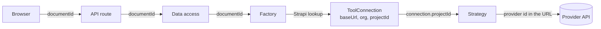
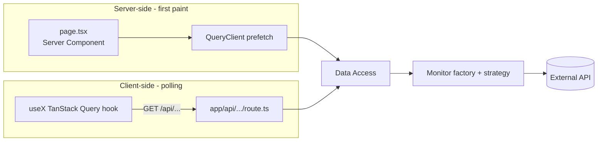
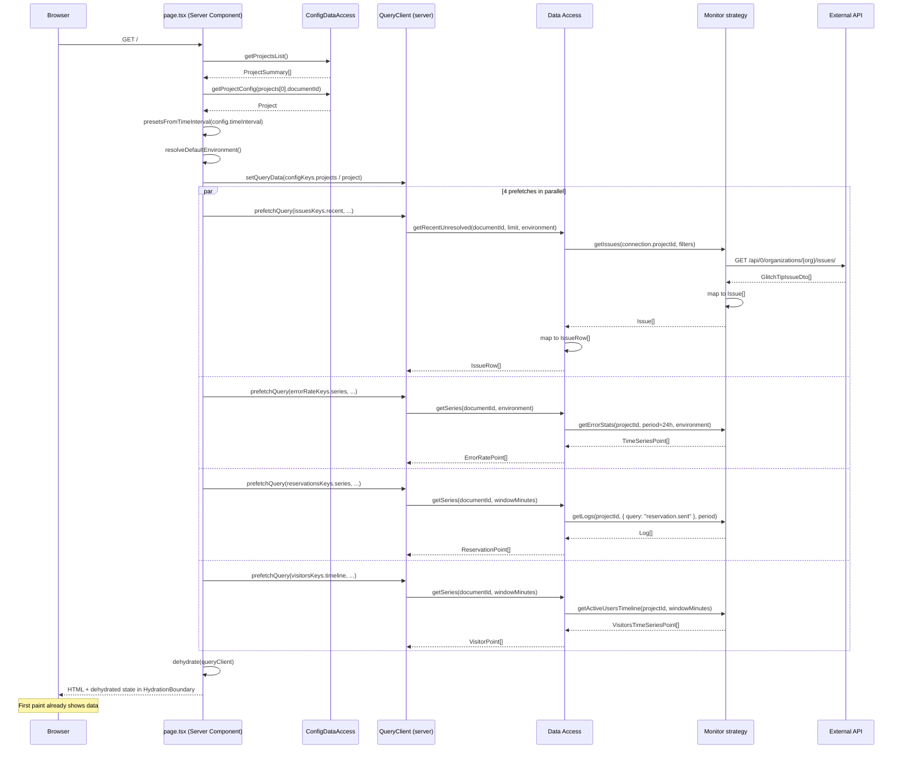
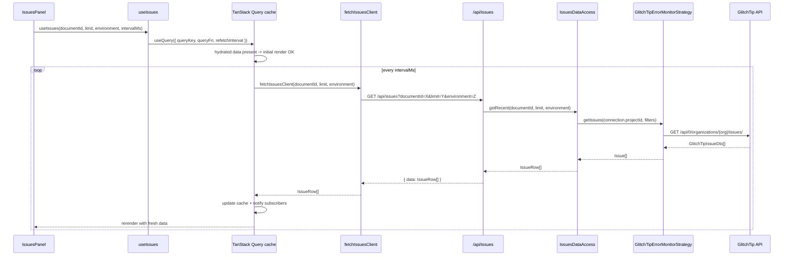
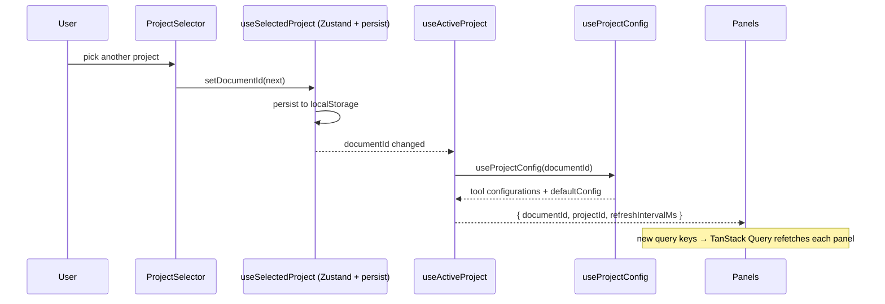
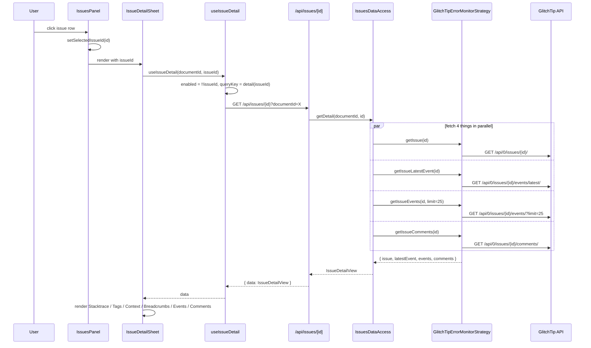
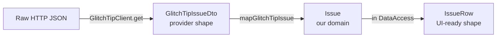
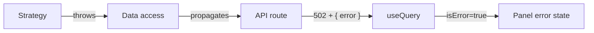

# Data flow

This doc traces concrete request paths through the layers, so you can map any UI behavior back to its source. For the layered overview, see [architecture.md](architecture.md).

## The identifier that travels

Everything is keyed on the Strapi **`documentId`** of the selected project. It is what the browser sends, what the API routes validate, and what the monitor layer resolves a factory from. The **provider project id** (GlitchTip numeric id, PostHog project id) never leaves the server: it is read from the project's tool configuration and handed to the strategy.



## The two flavors of request

There are two distinct fetch paths in this app:

1. **Server prefetch** — runs once per page load, inside the Server Component. Hydrates the TanStack Query cache so the first paint already has data.
2. **Client polling** — runs in the browser, on a timer, after hydration. This is what keeps the kiosk fresh.

Both paths go through the *same* data-access layer; the difference is only who calls it.



## Path 0: resolving the monitor for a project

Every data-access call starts with the same three steps. They are shown once here and elided in the sequences below.

```mermaid
sequenceDiagram
    participant DA as Data Access
    participant Get as get&lt;Family&gt;Monitor
    participant Factory
    participant Cfg as Tool configuration strategy
    participant Strapi

    DA->>Get: get<Family>Monitor(documentId)
    Get->>Factory: support(documentId, "<strategy>")
    Factory->>Cfg: isConfigure(documentId, "<strategy>", "<tool>")
    Cfg->>Strapi: GraphQL (cached per request)
    Strapi-->>Cfg: strategies[]
    Cfg-->>Factory: true
    Get-->>DA: factory

    DA->>Factory: createConnection(documentId)
    Factory->>Cfg: resolveConnection(documentId)
    Cfg->>Strapi: GraphQL (cached per request)
    Strapi-->>Cfg: tool configuration
    Cfg-->>DA: { baseUrl, organizationSlug?, projectId }

    DA->>Factory: createStrategy(connection)
    Factory-->>DA: strategy (client built with the env secret)
```

Both Strapi lookups are wrapped in React `cache()`, so four panels resolving the same project during one render hit Strapi once per query, not four times.

## Path 1: server prefetch on first load



Key properties:

- All four prefetches run in parallel (`Promise.all`).
- The same query keys are used server-side and client-side, so TanStack Query rehydrates seamlessly. This is why the default environment and the initial window are resolved by shared, isomorphic helpers — a mismatch would silently refetch everything on mount.
- Two early exits happen before any prefetch: no published project, or a selected project with no GlitchTip tool configuration. Both render an explicit message instead of empty panels.

## Path 2: client polling



`intervalMs` comes from the selected project's Strapi `defaultConfig.refreshIntervalMs`, falling back to 30 000 ms. Each panel polls independently — there is no global tick.

## Path 3: switching project

Changing the header selector changes one Zustand value; every query key that embeds `documentId` refetches on its own.



No manual invalidation: the project id is part of every key, so the switch is just a cache miss.

## Path 4: on-demand fetch (issue detail)

A *user-triggered* fetch path: clicking an issue row opens the detail sheet and fetches its full payload (issue + latest event + recent events + comments).



Issue endpoints are organization-scoped rather than project-scoped, so the detail calls take the issue id alone — but the route still requires `documentId` to resolve which GlitchTip instance to talk to.

The detail query is **not** prefetched server-side — it only fires when a row is clicked. Once fetched, it's cached under `["issues", "detail", issueId]` for the rest of the session (subject to `staleTime: 30000`).

## DTO -> domain mapping

Every external response goes through a Mapper before reaching the data access layer. This is what keeps the rest of the codebase provider-agnostic.



Three shapes, three responsibilities:

- **DTO** — verbatim mirror of the provider's response. Lives in `adapters/<provider>/dto/`.
- **Domain** — our internal monitor-family type (`Issue`, `Log`, `VisitorsTimeSeriesPoint`). Lives in `src/lib/<family>/domain/`.
- **Feature type** — what a panel actually consumes (`IssueRow`, `ErrorRatePoint`). Lives in `src/app/features/<name>/domain/`.

If you find yourself importing a DTO outside its adapter folder, that's a leak. Add a mapper.

The same split exists on the config side: `StrapiProject` DTOs → `projectMapper` → `Project` / `ProjectSummary` / `ToolConfiguration`.

## Error handling

API routes wrap their data-access calls and return `{ error: string }` with status `502` on failure. The TanStack Query hook receives the error; the panel renders an error state.



Common error sources:

- Missing `STRAPI_*` env var → `StrapiClientFactory` throws on the very first lookup.
- Project not mapped in admin → the resolver throws `No <X>Factory supports type "<strategy>"`.
- Project mapped but its tool configuration is incomplete → the configuration strategy throws, naming the missing fields.
- Missing provider secret → the abstract vendor factory throws when building the client.
- Provider 4xx/5xx → the HTTP client throws with status and a truncated body.
- Mapping failure (unexpected DTO shape) → throw in the mapper.

All of these surface as a 502 with the original message. Nothing is swallowed and no fallback masks a provider outage — the dashboard degrades visibly.

TanStack Query retries once (`retry: 1`) before surfacing the error.
