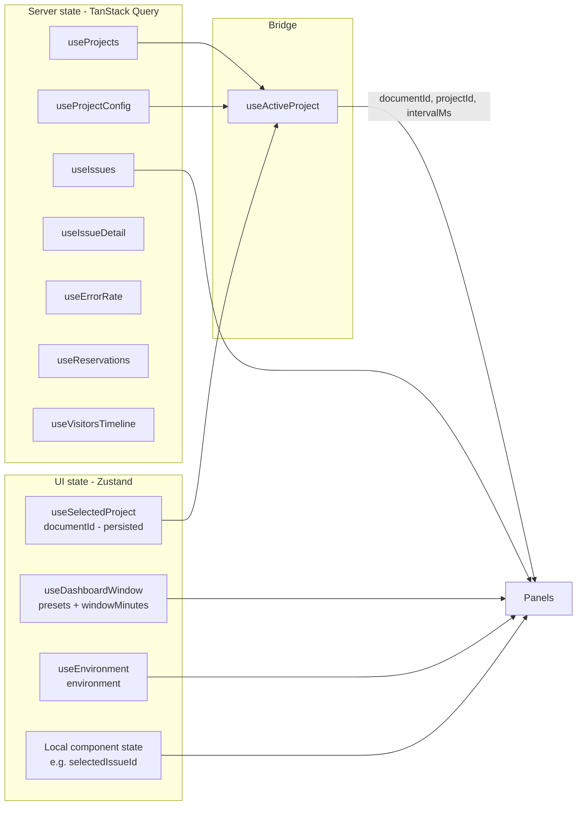
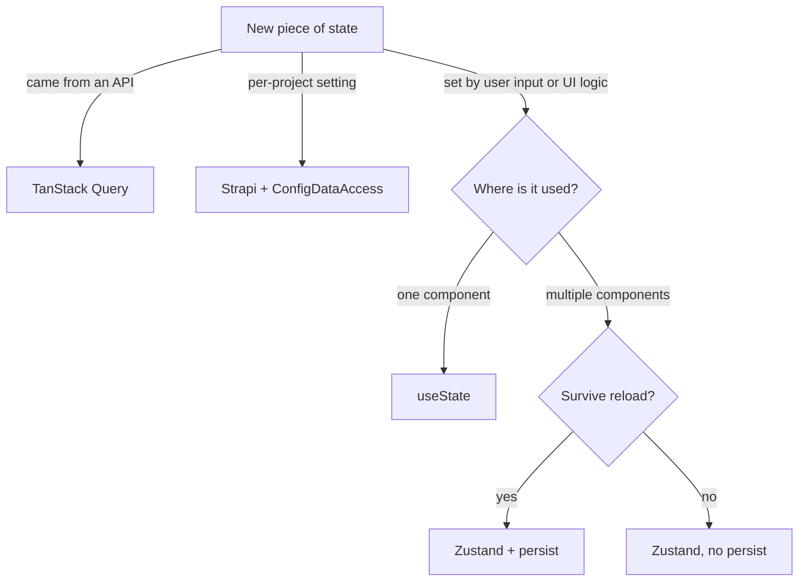

# State management

`dashboard-monitor` uses two state libraries with **clearly separated responsibilities**:

- **TanStack Query** — server state (anything fetched from an API, including the Strapi project config)
- **Zustand** — UI state (what the user selects: project, window, environment)

Mixing them creates redundancy. Keeping them apart keeps each layer thin.



## TanStack Query — server state

### Setup

[src/app/providers.tsx](../src/app/providers.tsx):

```typescript
function makeQueryClient() {
  return new QueryClient({
    defaultOptions: {
      queries: {
        staleTime: 30_000,
        refetchOnWindowFocus: false,
        retry: 1,
      },
    },
  });
}
```

Mounted in [src/app/layout.tsx](../src/app/layout.tsx) via `<Providers>`.

- **`staleTime: 30s`** — data is considered fresh for 30s after fetch. Re-renders don't trigger a refetch within that window.
- **`refetchOnWindowFocus: false`** — the kiosk has no "focus events" — polling is enough.
- **`retry: 1`** — one retry on failure, then surface the error.

### Per-feature hooks

Each feature exports a single hook. They all follow the same shape:

```typescript
// hooks/useIssues.ts
export function useIssues(
  documentId: string,
  limit: number,
  environment: string | null,
  intervalMs: number,
) {
  return useQuery({
    queryKey: issuesKeys.recent(documentId, limit, environment),
    queryFn: () => fetchIssuesClient(documentId, limit, environment),
    refetchInterval: intervalMs > 0 ? intervalMs : false,
  });
}
```

`intervalMs` is threaded down from `DashboardContent` so all panels share the same cadence, taken from the selected project's Strapi `defaultConfig.refreshIntervalMs` (fallback: 30 000 ms).

The two config hooks are the exception — they use `staleTime: 5 * 60_000` and no polling, because the project catalog barely moves:

```typescript
export function useProjectConfig(documentId: string) {
  return useQuery({
    queryKey: configKeys.project(documentId),
    queryFn: () => fetchProjectConfigClient(documentId),
    staleTime: 5 * 60_000,
    enabled: Boolean(documentId),
  });
}
```

### Query keys

Each feature owns a `queryKeys.ts` file. This avoids stringly-typed keys scattered across the codebase.

```typescript
// features/issues/queryKeys.ts
export const issuesKeys = {
  recent: (documentId: string, limit: number, environment: string | null = null) =>
    ["issues", "recent", documentId, limit, environment] as const,
  detail: (issueId: string) =>
    ["issues", "detail", issueId] as const,
};
```

Inventory:

- `configKeys.projects()` → `["config", "projects"]`
- `configKeys.project(documentId)` → `["config", "project", documentId]`
- `issuesKeys.recent(documentId, limit, environment)` → `["issues", "recent", documentId, limit, environment]`
- `issuesKeys.detail(issueId)` → `["issues", "detail", issueId]`
- `errorRateKeys.series(documentId, environment)` → `["errorRate", "series", documentId, environment]`
- `reservationsKeys.series(documentId, windowMinutes, environment)` → `["reservations", "series", documentId, windowMinutes, environment]`
- `visitorsKeys.timeline(documentId, windowMinutes)` → `["visitors", "timeline", documentId, windowMinutes]`

Two rules:

1. **Keep keys structural** (constants → variables, broad to narrow). `queryClient.invalidateQueries({ queryKey: ["issues"] })` invalidates *all* issues queries; `["issues", "recent"]` only the list; `["issues", "recent", documentId]` only that project.
2. **`documentId` is the first variable segment** of every data key. That is what makes a project switch a plain cache miss instead of a manual invalidation.

### Hydration from server

[src/app/page.tsx](../src/app/page.tsx) seeds the config queries with `setQueryData`, prefetches the four panel queries in parallel using a server-side `QueryClient`, then dehydrates the cache and wraps children in `<HydrationBoundary state={...}>`. The client mounts already-populated. See [data-flow.md](data-flow.md).

**The keys must match exactly across the boundary.** The server resolves the environment with `resolveDefaultEnvironment()` and the window with `presetsFromTimeInterval()`; the client stores start from the same values. Diverging here doesn't break anything visibly — it just silently refetches everything on mount, which defeats the prefetch.

## Zustand — UI state

Three stores, each scoped to one concern.

### useSelectedProject

[src/app/features/dashboard/state/useSelectedProject.ts](../src/app/features/dashboard/state/useSelectedProject.ts)

```typescript
export const useSelectedProject = create<SelectedProjectStore>()(
  persist(
    (set) => ({
      documentId: null,
      setDocumentId: (documentId) => set({ documentId }),
    }),
    { name: "dashboard-selected-project", skipHydration: true },
  ),
);
```

- **State:** `{ documentId: string | null }`
- **Action:** `setDocumentId(documentId)`
- **Persistence:** `localStorage` key `dashboard-selected-project`, with **`skipHydration: true`**

`skipHydration` is deliberate: the server render and the first client render must both start from `null` so they fall back to the server-resolved project and the prefetched query keys still match. `useActiveProject` calls `persist.rehydrate()` in an effect after mount, then reconciles: if the stored project no longer exists in the catalog, it falls back to the initial one.

### useDashboardWindow

[src/app/features/dashboard/state/useDashboardWindow.ts](../src/app/features/dashboard/state/useDashboardWindow.ts)

- **State:** `{ presets: WindowPreset[], windowMinutes: number }`
- **Actions:** `setWindowMinutes(minutes)`, `hydrateFromStrapi(presets, windowMinutes)`
- **Persistence:** none (in-memory only)
- **Defaults:** presets `30m / 1h / 12h / 24h`, initial window from `NEXT_PUBLIC_DASHBOARD_RESERVATIONS_WINDOW_MINUTES` (or 30)

The defaults are only a fallback: `DashboardContent` calls `hydrateFromStrapi()` with the presets derived from the selected project's `timeInterval[]`. A project declaring `{ duration: 6, interval: "hours" }` gets a `6h` preset.

Also exports `isDashboardInteractive()` — reads `NEXT_PUBLIC_DASHBOARD_INTERACTIVITY`. Used to hide the selectors on read-only kiosks.

The reservations and visitors hooks subscribe to `windowMinutes` to refetch when the user picks a new preset.

### useEnvironment

[src/app/features/dashboard/state/useEnvironment.ts](../src/app/features/dashboard/state/useEnvironment.ts)

- **State:** `{ environment: string | null }` — `null` means "all environments"
- **Action:** `setEnvironment(environment)`
- **Persistence:** none
- **Default:** `resolveDefaultEnvironment()`, the same isomorphic helper the server prefetch uses

Feeds the issues, error rate and reservations query keys.

### Local component state

Anything truly scoped to a single component stays in `useState`. Example: `selectedIssueId` in `IssuesPanel` drives the detail sheet open/closed — no other component needs to know about it.

Rule of thumb: lift to Zustand only when two unrelated components need the same state.

## Decision matrix



## Common operations

### Trigger a manual refresh

```typescript
const queryClient = useQueryClient();
queryClient.invalidateQueries({ queryKey: issuesKeys.recent(documentId, limit, environment) });
```

### Force refetch on a specific event

If the user changes `windowMinutes`, the environment, or the project, the affected hooks re-run automatically because those values are part of their query keys. No manual invalidation needed.

### Reset the persisted project selection

```javascript
localStorage.removeItem("dashboard-selected-project");
```

Or programmatically: `useSelectedProject.persist.clearStorage()`.

## Conventions to follow

- **Don't call `fetch` directly in components.** Always go through a hook.
- **Don't put server data in Zustand.** TanStack Query already does caching, dedup, and staleness — duplicating that in a store creates two sources of truth. The selected project is a *choice* (Zustand); the project's config is *data* (TanStack Query).
- **Don't subscribe to the whole store when you only need one slice.** Use a selector: `useDashboardWindow((s) => s.windowMinutes)`.
- **Always use the centralized `queryKeys` factory** — never inline `["issues", documentId]` in a component.
- **Anything resolved on both sides of the hydration boundary lives in one shared helper** (`environments.ts`, `windowPresets.ts`), never duplicated.
