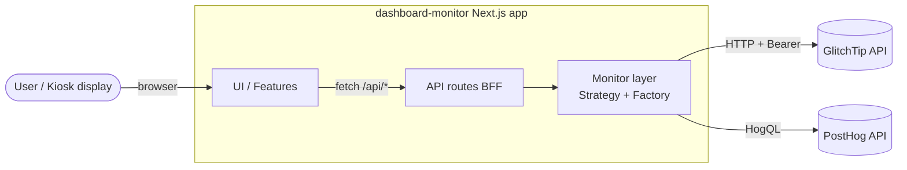
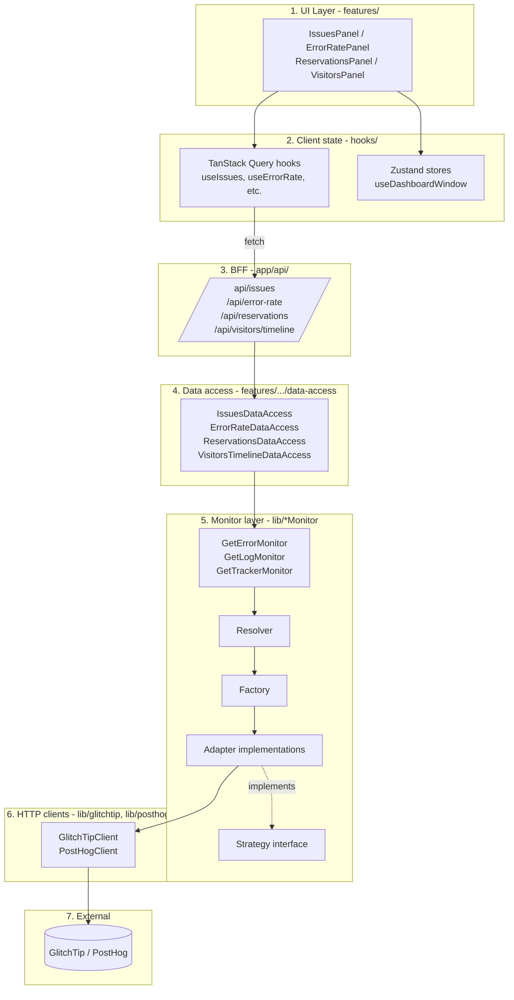
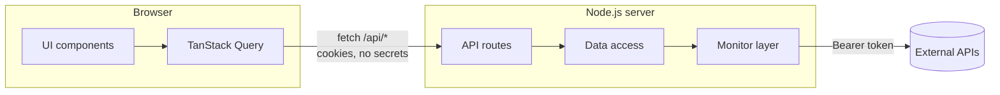
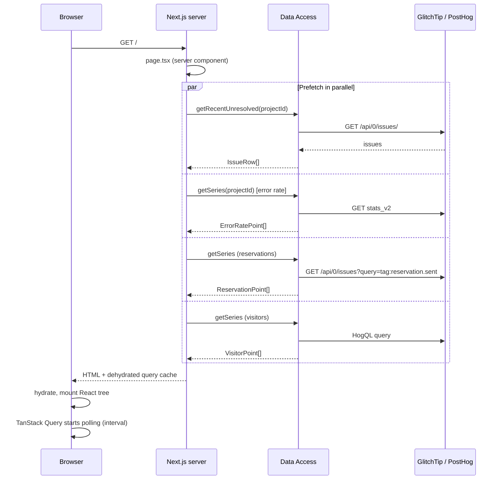

# Architecture

This document describes the overall architecture of `dashboard-monitor`: the layers, the boundaries, and the rationale.

For the deep dive on the Strategy/Factory pattern, see [monitors.md](monitors.md). For end-to-end request traces, see [data-flow.md](data-flow.md).

## Goals

- **Provider-agnostic dashboard.** The UI should not know whether errors come from GlitchTip, Sentry, or anything else. Swapping providers must be a config change, not a refactor.
- **Server-only secrets.** API tokens (GlitchTip, PostHog) must never leak to the browser bundle.
- **Snappy kiosk.** The dashboard auto-refreshes on a configurable interval and prefetches data server-side on first load.

## High-level context

The Next.js app is the only thing the user talks to. All external API calls are server-side. The browser never sees a GlitchTip or PostHog token.

## Layered view

### Responsibilities per layer

1. **UI Layer** (`src/app/features/*/ui/`) — pure React components. No `fetch`, no business logic. Reads data from TanStack Query hooks and UI state from Zustand.
2. **Client state** (`src/app/features/*/hooks/`, `src/app/features/dashboard/state/`) — TanStack Query for server data, Zustand for ephemeral UI state.
3. **BFF (Backend-For-Frontend)** (`src/app/api/*/route.ts`) — thin Next.js route handlers. Parse query params, call the data access layer, return JSON. Marked `force-dynamic` (no caching).
4. **Data access** (`src/app/features/*/data-access/`) — server-only orchestrators. Compose monitor calls, map DTOs to feature domain types (`IssueRow`, `ErrorRatePoint`, etc.). Wrapped in React `cache()` for request-level deduplication.
5. **Monitor layer** (`src/lib/{errorMonitor,logMonitor,trackerMonitor}/`) — the Strategy/Factory abstraction. See [monitors.md](monitors.md).
6. **HTTP clients** (`src/lib/glitchtip/`, `src/lib/posthog/`) — low-level transport. Bearer auth, JSON parsing, error mapping.
7. **External APIs** — the actual providers.

## Server / client boundary

All monitor code is guarded by `import "server-only"` (see [GetErrorMonitor.ts:1](../src/lib/errorMonitor/GetErrorMonitor.ts#L1)). If a client component ever imports it by mistake, the build fails. Tokens never reach the bundle.

Variables prefixed `NEXT_PUBLIC_*` are intentionally non-sensitive: they're driver names (`glitchtip`, `posthog`) and display-only knobs (window sizes, interactivity flag).

## Initial render path (kiosk first load)

The home page is a **Server Component** (`src/app/page.tsx`) that prefetches all panel queries server-side and hydrates the client. This means the kiosk displays data on the first paint without a client-side fetch round-trip.

After hydration, TanStack Query takes over and polls each endpoint on `DASHBOARD_REFRESH_INTERVAL_MS`.

## Design rationale

### Why Strategy/Factory for monitors?

The product needs to be **independent of any single vendor**. GlitchTip might be replaced by Sentry. PostHog might be replaced by Mixpanel. The Strategy interface fixes the contract from the UI's perspective; the Factory localizes vendor-specific construction (URL, token, slug) in one place. See [monitors.md](monitors.md) for the full pattern.

### Why a BFF instead of calling monitors from Server Components directly?

Two reasons:

1. **Client-side polling.** TanStack Query needs an HTTP endpoint to poll. Server Components don't expose one.
2. **Clean cache invalidation.** Each query key maps to one route, which gives a clear story for `invalidateQueries`.

Server Components still do the **initial prefetch** (no extra round-trip on first paint), and TanStack Query handles **everything after** via the BFF.

### Why force-dynamic everywhere?

The dashboard is real-time. Stale data is worse than a slightly slower response. Next.js's default caching would serve hour-old data; `dynamic = "force-dynamic"` opts out. Latency-critical optimization happens at the TanStack Query layer (staleTime, polling interval) instead.

### Why Zustand and TanStack Query both?

They solve different problems:

- **TanStack Query** owns *server state*: cache, invalidation, polling, retry. Anything that came from an API.
- **Zustand** owns *UI state*: selected window size, "is the detail sheet open", config panel open/closed. Things that never round-trip to the server.

Mixing the two responsibilities into one tool (e.g. Redux for everything) creates ceremony around what should be trivial. See [state-management.md](state-management.md).

## Extension points

The places you should look first when adding a feature:

- **New external provider** → new adapter under `src/lib/<family>/adapters/<provider>/` (see [monitors.md](monitors.md)).
- **New data view** → new feature folder under `src/app/features/<name>/`, with `data-access/`, `domain/`, `hooks/`, `ui/`, `queryKeys.ts`. Wire a new route under `src/app/api/<name>/route.ts`.
- **New monitor family** (e.g. "uptime") → mirror the structure of `src/lib/errorMonitor/`: `strategy/`, `factory/`, `adapters/`, `Get<Name>Monitor.ts`.
