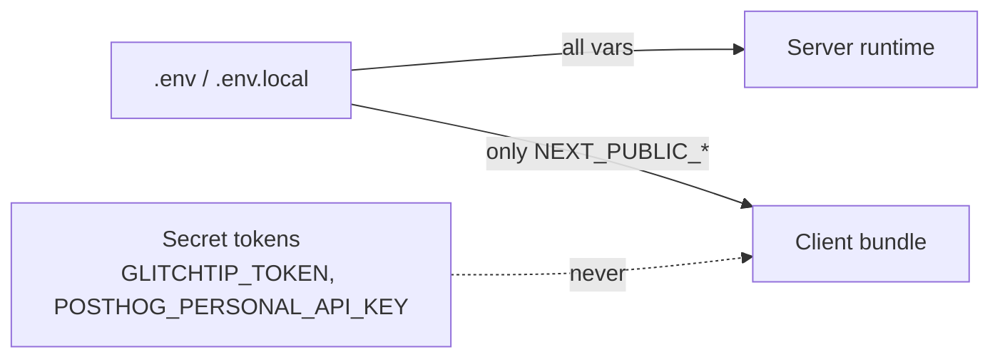

# Configuration

All runtime configuration is driven by environment variables. This doc lists every variable, what it does, and where the code reads it.

The canonical templates live in [.env.example](../.env.example) (committed) and [.env](../.env) (local, gitignored).

## Loading rules

Next.js applies its own conventions on top of the shell environment:

- Variables defined in `.env` / `.env.local` are loaded automatically at build and dev time.
- Variables prefixed `NEXT_PUBLIC_` are inlined into the client bundle. **Never prefix a secret with `NEXT_PUBLIC_`.**
- Variables without that prefix are server-only — they are stripped from the client bundle.



## Driver selectors

These three variables choose which adapter the monitor layer instantiates. See [monitors.md](monitors.md) for the resolution mechanism.

### `NEXT_PUBLIC_ERROR_MONITOR_DRIVER`

- **Supported values:** `glitchtip`
- **Default:** none (throws if missing)
- **Consumed by:** [src/lib/errorMonitor/GetErrorMonitor.ts:15](../src/lib/errorMonitor/GetErrorMonitor.ts#L15)
- **Effect:** picks the `errorMonitor` adapter. Required.

### `NEXT_PUBLIC_LOG_MONITOR_DRIVER`

- **Supported values:** `glitchtip`
- **Default:** none (throws if missing)
- **Consumed by:** [src/lib/logMonitor/GetLogMonitor.ts:16](../src/lib/logMonitor/GetLogMonitor.ts#L16)
- **Effect:** picks the `logMonitor` adapter. Required.

### `NEXT_PUBLIC_TRACKER_MONITOR_DRIVER`

- **Supported values:** `posthog`
- **Default:** none (throws if missing)
- **Consumed by:** [src/lib/trackerMonitor/GetTrackerMonitor.ts:14](../src/lib/trackerMonitor/GetTrackerMonitor.ts#L14)
- **Effect:** picks the `trackerMonitor` adapter. Required.

## GlitchTip credentials

Used by both the `errorMonitor` and `logMonitor` GlitchTip adapters.

### `GLITCHTIP_URL`

- **Example:** `https://app.glitchtip.com` or `http://localhost:8000/`
- **Consumed by:** [GlitchTipFactory.ts:14](../src/lib/errorMonitor/adapters/glitchtip/GlitchTipFactory.ts#L14), [GlitchTipLogMonitorFactory.ts](../src/lib/logMonitor/adapters/glitchtip/GlitchTipLogMonitorFactory.ts)
- **Effect:** base URL of the GlitchTip instance. Required when GlitchTip is the active driver.

### `GLITCHTIP_TOKEN`

- **Type:** secret (server-only)
- **Consumed by:** same factories as above
- **Effect:** Bearer token sent in `Authorization` header on every GlitchTip API call. Required.

### `GLITCHTIP_ORGANIZATION_SLUG`

- **Example:** `uxco`
- **Consumed by:** same factories
- **Effect:** GlitchTip organization slug used in API paths (`/api/0/organizations/{slug}/...`). Required.

## PostHog credentials

Used by the `trackerMonitor` PostHog adapter.

### `POSTHOG_HOST`

- **Example:** `https://eu.posthog.com` or `https://us.posthog.com`
- **Consumed by:** [PostHogFactory.ts:14](../src/lib/trackerMonitor/adapters/posthog/PostHogFactory.ts#L14)
- **Effect:** base URL of the PostHog instance. Required.

### `POSTHOG_PROJECT_ID`

- **Example:** `188041`
- **Consumed by:** [PostHogFactory.ts:16](../src/lib/trackerMonitor/adapters/posthog/PostHogFactory.ts#L16)
- **Effect:** PostHog project numeric ID, used in the query path. Required.

### `POSTHOG_PERSONAL_API_KEY`

- **Type:** secret (server-only)
- **Consumed by:** [PostHogFactory.ts:15](../src/lib/trackerMonitor/adapters/posthog/PostHogFactory.ts#L15)
- **Effect:** PostHog personal API key, sent as Bearer. Required.

## Dashboard runtime knobs

### `DASHBOARD_DEFAULT_PROJECT_ID`

- **Type:** server-only
- **Consumed by:** [src/app/page.tsx:37](../src/app/page.tsx#L37)
- **Effect:** GlitchTip project displayed by default on the kiosk page. Required for the home page to function.

### `DASHBOARD_REFRESH_INTERVAL_MS`

- **Default:** `30000` (30 seconds)
- **Consumed by:** [src/app/page.tsx](../src/app/page.tsx) (via `getRefreshIntervalMs()`)
- **Effect:** auto-refresh interval applied to all panel TanStack Query hooks. Set `0` to disable polling.

### `NEXT_PUBLIC_DASHBOARD_INTERACTIVITY`

- **Supported values:** `true`, `false`
- **Default:** `false`
- **Consumed by:** [useDashboardWindow.ts:33](../src/app/features/dashboard/state/useDashboardWindow.ts#L33)
- **Effect:** when `false`, hides UI controls (window selector, etc.) — useful for read-only kiosks.

### `NEXT_PUBLIC_VISITORS_LIVE_WINDOW_MINUTES`

- **Default:** `5`
- **Consumed by:** [IssuesKpiRow.tsx:17](../src/app/features/dashboard/ui/IssuesKpiRow.tsx#L17)
- **Effect:** window (in minutes) considered as "live visitors" for the KPI card.

### `NEXT_PUBLIC_DASHBOARD_RESERVATIONS_WINDOW_MINUTES`

- **Default:** `30`
- **Consumed by:** [page.tsx:31](../src/app/page.tsx#L31), [useDashboardWindow.ts:17](../src/app/features/dashboard/state/useDashboardWindow.ts#L17)
- **Effect:** initial value of the dashboard's sliding window selector. The user can override at runtime via the window preset buttons.

## Config-panel defaults

These seed the in-app config panel. Only relevant if you use the panel UI to override settings.

### `NEXT_PUBLIC_DASHBOARD_DEFAULT_ORGANIZATION_SLUG`

- **Consumed by:** [DashboardConfig.ts:20](../src/app/features/config/glitchtip/domain/DashboardConfig.ts#L20)
- **Effect:** default organization slug shown in the config panel.

### `NEXT_PUBLIC_DASHBOARD_DEFAULT_POLLING_INTERVAL_SEC`

- **Default:** `30`
- **Bounds:** `[1, 300]` seconds (`POLLING_INTERVAL_BOUNDS` in `DashboardConfig.ts`)
- **Consumed by:** [DashboardConfig.ts:23](../src/app/features/config/glitchtip/domain/DashboardConfig.ts#L23)
- **Effect:** default polling interval (seconds) seeded into the config panel.

### `NEXT_PUBLIC_DASHBOARD_DEFAULT_METRICS_ENDPOINT`

- **Consumed by:** [DashboardConfig.ts:26](../src/app/features/config/glitchtip/domain/DashboardConfig.ts#L26)
- **Effect:** default metrics endpoint shown in the config panel.

## Minimal working `.env`

The smallest config that boots the dashboard:

```bash
NEXT_PUBLIC_ERROR_MONITOR_DRIVER=glitchtip
NEXT_PUBLIC_LOG_MONITOR_DRIVER=glitchtip
NEXT_PUBLIC_TRACKER_MONITOR_DRIVER=posthog

GLITCHTIP_URL=https://app.glitchtip.com
GLITCHTIP_TOKEN=...
GLITCHTIP_ORGANIZATION_SLUG=your-org

POSTHOG_HOST=https://eu.posthog.com
POSTHOG_PROJECT_ID=...
POSTHOG_PERSONAL_API_KEY=...

DASHBOARD_DEFAULT_PROJECT_ID=1
```

Everything else has sensible defaults.

## Adding a new variable

When you introduce a new `process.env.X`:

1. Add it to `.env.example` with an empty value and an English comment explaining its purpose and the supported values.
2. If you have a non-empty local default in `.env`, add it too — but never commit secret values.
3. Document it in this file under the relevant section, with a link to the file:line that consumes it.
4. If the code can run without it, define a clear default inline (e.g. `?? 30`). Otherwise throw an explicit error early (`throw new Error("X is required")`) — silent failure is worse than a loud crash.
