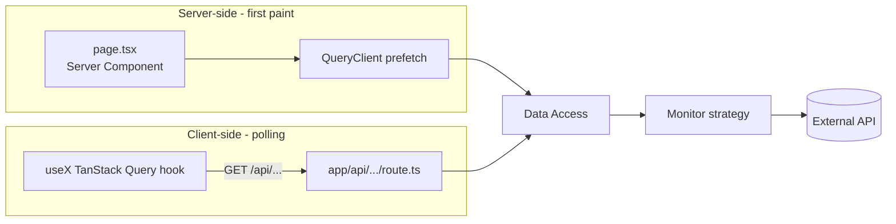
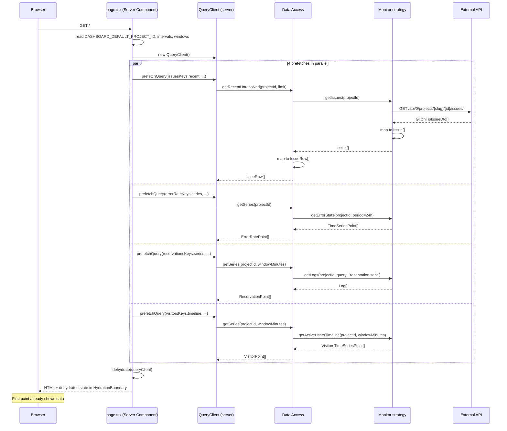
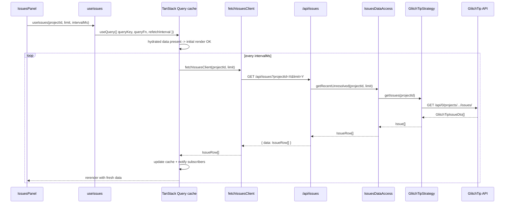
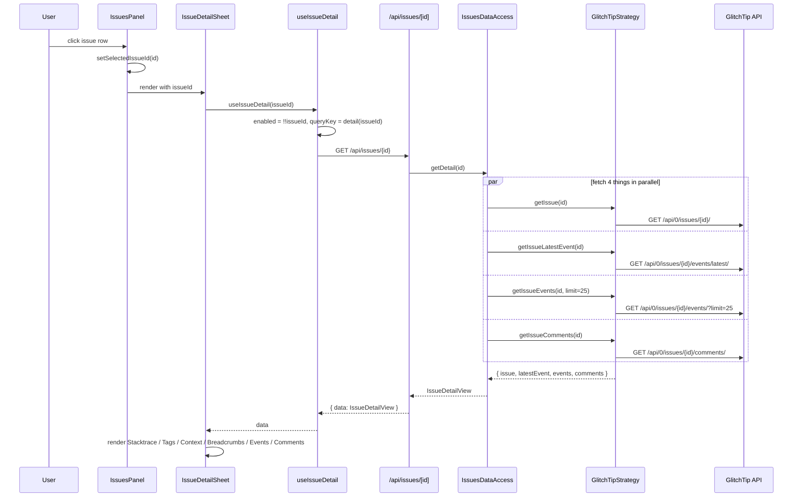
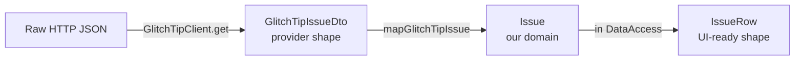
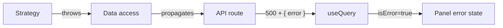

# Data flow

This doc traces concrete request paths through the layers, so you can map any UI behavior back to its source. For the layered overview, see [architecture.md](architecture.md).

## The two flavors of request

There are two distinct fetch paths in this app:

1. **Server prefetch** — runs once per page load, inside the Server Component. Hydrates the TanStack Query cache so the first paint already has data.
2. **Client polling** — runs in the browser, on a timer, after hydration. This is what keeps the kiosk fresh.

Both paths go through the *same* data-access layer; the difference is only who calls it.

## Path 1: server prefetch on first load

Key properties:

- All four prefetches run in parallel (`Promise.all` via QueryClient).
- The same query keys are used server-side and client-side, so TanStack Query rehydrates seamlessly.
- After hydration, the panels mount and TanStack Query takes over.

## Path 2: client polling

`intervalMs` comes from `DASHBOARD_REFRESH_INTERVAL_MS` (default 30000). Each panel polls independently — there is no global tick.

## Path 3: on-demand fetch (issue detail)

A *user-triggered* fetch path: clicking an issue row opens the detail sheet and fetches its full payload (issue + latest event + recent events + comments).

The detail query is **not** prefetched server-side — it only fires when a row is clicked. Once fetched, it's cached under `["issues", "detail", issueId]` for the rest of the session (subject to `staleTime: 30000`).

## DTO -> domain mapping

Every external response goes through a Mapper before reaching the data access layer. This is what keeps the rest of the codebase provider-agnostic.

Three shapes, three responsibilities:

- **DTO** — verbatim mirror of the provider's response. Lives in `adapters/<provider>/dto/`.
- **Domain** — our internal monitor-family type (`Issue`, `Log`, `VisitorsTimeSeriesPoint`). Lives in `src/lib/<family>/domain/`.
- **Feature type** — what a panel actually consumes (`IssueRow`, `ErrorRatePoint`). Lives in `src/app/features/<name>/domain/`.

If you find yourself importing a DTO outside its adapter folder, that's a leak. Add a mapper.

## Error handling

API routes wrap their data-access calls and return `{ error: string }` on failure. The TanStack Query hook receives the error; the panel renders an error state.

Common error sources:

- Missing env var → `GetXMonitor` throws → 500 on first request.
- Provider 4xx/5xx → `HttpClient` throws `Error("HTTP <status>: ...")` → 500 to client.
- Mapping failure (unexpected DTO shape) → throw in the mapper → 500 to client.

TanStack Query retries once (`retry: 1`) before surfacing the error.
