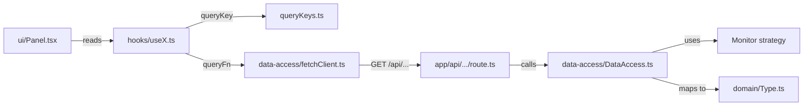

# Features

A "feature" is a self-contained vertical slice of the dashboard: its data fetching, its domain types, its hooks, and its UI. Features live under [src/app/features/](../src/app/features/).

The standard layout of a feature folder is:

```text
<feature>/
├── data-access/    # Server-side orchestration + client-side fetchers
├── domain/         # Internal types (the shape consumed by UI)
├── hooks/          # TanStack Query hooks
├── ui/             # React components
└── queryKeys.ts    # Centralized query keys (when applicable)
```



## Feature catalog

### issues

[src/app/features/issues/](../src/app/features/issues/)

Lists unresolved error issues and shows full details (events, stacktrace, comments, breadcrumbs) in a side sheet.

- **Monitor consumed:** `errorMonitor` (`getIssues`, `getIssue`, `getIssueLatestEvent`, `getIssueEvents`, `getIssueComments`)
- **API routes:** `GET /api/issues?projectId&limit`, `GET /api/issues/[id]`
- **Domain types:** `IssueRow`, `IssueDetailView`
- **Hooks:** `useIssues(projectId, limit, intervalMs)`, `useIssueDetail(issueId)`
- **UI:** `IssuesPanel`, `IssueDetailSheet`
- **Query keys:** `["issues", "recent", projectId, limit]`, `["issues", "detail", issueId]`

The detail sheet is only mounted when an issue is selected; the `useIssueDetail` hook is `enabled: !!issueId` so no fetch happens before the user clicks a row.

### errorRate

[src/app/features/errorRate/](../src/app/features/errorRate/)

Displays a 24-hour error count chart (one point per hour bucket) using Recharts.

- **Monitor consumed:** `errorMonitor` (`getErrorStats` with 24h period)
- **API route:** `GET /api/error-rate?projectId`
- **Domain type:** `ErrorRatePoint { bucketEpoch: number; label: string; count: number }`
- **Hooks:** `useErrorRate(projectId, intervalMs)`
- **UI:** `ErrorRatePanel` (Recharts AreaChart)
- **Query key:** `["errorRate", "series", projectId]`

### reservations

[src/app/features/reservations/](../src/app/features/reservations/)

Tracks "reservation sent" business events over a sliding time window. Backed by the log monitor with a tag filter rather than a dedicated metrics endpoint — convenient and provider-agnostic.

- **Monitor consumed:** `logMonitor` (`getLogs` with `query: "reservation.sent"`)
- **API route:** `GET /api/reservations?projectId&windowMinutes`
- **Domain type:** `ReservationPoint { minuteIso: string; label: string; count: number }`
- **Hooks:** `useReservations(projectId, windowMinutes, intervalMs)`
- **UI:** `ReservationsPanel`
- **Query key:** `["reservations", "series", projectId, windowMinutes]`

### visitors

[src/app/features/visitors/](../src/app/features/visitors/)

Shows live visitor counts split between **new** and **returning** users over a sliding window. Powered by a HogQL query against PostHog.

- **Monitor consumed:** `trackerMonitor` (`getActiveUsersTimeline`)
- **API route:** `GET /api/visitors/timeline?projectId&windowMinutes`
- **Domain type:** `VisitorPoint { minuteIso: string; label: string; newCount: number; returningCount: number }`
- **Hooks:** `useVisitorsTimeline(projectId, windowMinutes, intervalMs)`
- **UI:** `VisitorsPanel`
- **Query key:** `["visitors", "timeline", projectId, windowMinutes]`

### dashboard

[src/app/features/dashboard/](../src/app/features/dashboard/)

Dashboard-wide state and chrome. Not a data feature — it owns the kiosk's window selector, header, and KPI row.

- **State (Zustand):** `useDashboardWindow` ([state/useDashboardWindow.ts](../src/app/features/dashboard/state/useDashboardWindow.ts)) — holds `windowMinutes`, exposes `setWindowMinutes(minutes)`, and provides `isDashboardInteractive()` (reads `NEXT_PUBLIC_DASHBOARD_INTERACTIVITY`).
- **Constants:** `WINDOW_PRESETS` = `[30m, 1h, 3h]`
- **UI:** `DashboardHeader`, `IssuesKpiRow`, `PlaceholderChartPanel`

`IssuesKpiRow` is a horizontal strip of KPI cards (live visitors, recent error count, etc.) sitting above the main panels.

### config

[src/app/features/config/](../src/app/features/config/)

UI to inspect / switch monitor drivers and provider-specific defaults. Persisted in `localStorage`.

- **Shared (`shared/`)**
  - `domain/DashboardConfig.ts` — `{ selectedLogTool, selectedErrorTool }`
  - `state/useDashboardConfig.ts` — Zustand store with `persist` middleware (key `"dashboard-config"`). Exposes `setLogTool`, `setErrorTool`, `togglePanel`.
  - `ui/ConfigPanel.tsx`, `ui/ToolSelector.tsx`
- **GlitchTip-specific (`glitchtip/`)**
  - Reads `NEXT_PUBLIC_DASHBOARD_DEFAULT_ORGANIZATION_SLUG`, `NEXT_PUBLIC_DASHBOARD_DEFAULT_POLLING_INTERVAL_SEC`, `NEXT_PUBLIC_DASHBOARD_DEFAULT_METRICS_ENDPOINT` to seed defaults.
  - `POLLING_INTERVAL_BOUNDS = { min: 1, max: 300 }`

> The config panel surfaces the active driver. It does not currently rewrite the env vars at runtime — switching drivers persistently still requires editing `.env` and restarting.

## How a feature is added

1. **Create the folder skeleton** under `src/app/features/<name>/` with `data-access/`, `domain/`, `hooks/`, `ui/`, plus `queryKeys.ts`.
2. **Define the domain type** in `domain/<Name>Point.ts`. This is what UI consumes — keep it minimal and presentation-friendly.
3. **Add the data access layer**:
   - `data-access/<Name>DataAccess.ts` (server) — call the right monitor and map to your domain type. Wrap in `cache()`.
   - `data-access/fetch<Name>Client.ts` (client) — small `fetch` wrapper for the API route.
4. **Add the API route** at `src/app/api/<route>/route.ts` (`export const dynamic = "force-dynamic"`).
5. **Centralize query keys** in `queryKeys.ts`.
6. **Wrap fetch in a TanStack Query hook** in `hooks/use<Name>.ts`. Use `refetchInterval` for polling.
7. **Build the panel** in `ui/<Name>Panel.tsx`. Pure UI — no fetch.
8. **Wire it into [page.tsx](../src/app/page.tsx)** and prefetch it in the server component.

See any of `issues`, `errorRate`, `reservations`, `visitors` as a working template.
