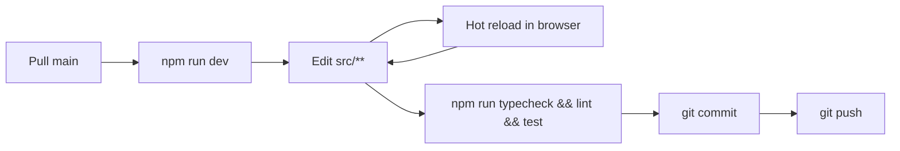

# Getting started

This guide walks you from a fresh clone to a running dashboard in about 5 minutes.

## Prerequisites

- **Node.js** ≥ 20 (Next.js 16 requires it)
- **npm** ≥ 10 (or pnpm / yarn — examples use npm)
- Access credentials for the backends you intend to use:
  - **GlitchTip:** URL, API token, organization slug, project ID
  - **PostHog:** host URL, personal API key, project ID

## 1. Install

```bash
git clone <repo-url>
cd dashboard-monitor
npm install
```

`npm install` also runs `husky` to set up git hooks (`prepare` script).

## 2. Configure environment

Copy the template and fill in your credentials:

```bash
cp .env.example .env
```

Minimum required to boot:

```bash
NEXT_PUBLIC_ERROR_MONITOR_DRIVER=glitchtip
NEXT_PUBLIC_LOG_MONITOR_DRIVER=glitchtip
NEXT_PUBLIC_TRACKER_MONITOR_DRIVER=posthog

GLITCHTIP_URL=https://app.glitchtip.com
GLITCHTIP_TOKEN=<your-token>
GLITCHTIP_ORGANIZATION_SLUG=<your-org>

POSTHOG_HOST=https://eu.posthog.com
POSTHOG_PROJECT_ID=<your-project-id>
POSTHOG_PERSONAL_API_KEY=<your-api-key>

DASHBOARD_DEFAULT_PROJECT_ID=<glitchtip-project-id>
```

See [configuration.md](configuration.md) for the full list of variables and their defaults.

> Don't have a PostHog instance? You can still boot the app — the visitors panel will simply show an error. Same applies in reverse for GlitchTip.

## 3. Run

### Dev server

```bash
npm run dev
```

Open <http://localhost:3000>. Hot reload is on; saving any `src/**` file reloads the page.

### Production build

```bash
npm run build
npm start
```

## 4. Verify the wiring

After the page loads, you should see four panels populated within ~1s:

- **Issues** (top-left) — list of recent unresolved errors
- **Error Rate** (top-right) — 24h area chart
- **Reservations** (bottom-left) — sliding-window event timeline
- **Visitors** (bottom-right) — new vs returning visitors over the window

If a panel shows an error, check the server logs for the underlying cause. Most issues are missing/incorrect credentials — see [Troubleshooting](#troubleshooting).

## 5. Quality gates

Before pushing:

```bash
npm run typecheck   # TypeScript
npm run lint        # ESLint
npm test            # Vitest
```

CI should run all three. The `husky` `prepare` script wires pre-commit hooks (if configured).

## Daily development workflow



Most changes are inside one feature folder — UI tweaks, mapper adjustments, hook tuning. For deeper changes, consult:

- [architecture.md](architecture.md) — to know what layer you're touching
- [monitors.md](monitors.md) — if you're adding/modifying an adapter
- [features.md](features.md) — if you're adding a new panel
- [state-management.md](state-management.md) — for query keys and store conventions

## Troubleshooting

### "NEXT_PUBLIC_X_MONITOR_DRIVER env variable is not set"

You forgot one of the three driver vars. Set it in `.env` and restart `npm run dev`.

### "GlitchTip env vars missing: GLITCHTIP_URL, GLITCHTIP_TOKEN, ..."

Your `GLITCHTIP_*` vars are missing or empty. Set them. The check runs lazily on first request — restart is not strictly required, but recommended to avoid cached state.

### "No ErrorMonitorFactory supports type 'X'"

You set `NEXT_PUBLIC_ERROR_MONITOR_DRIVER` to a value that no registered factory recognizes. Either:

- Fix the value (currently supported: `glitchtip`), or
- Add a new adapter (see [monitors.md](monitors.md#adding-a-new-adapter)).

### Panels load but show stale data

`DASHBOARD_REFRESH_INTERVAL_MS=0` disables polling. Set it to a positive number (e.g. `30000`).

### TanStack Query devtools

To inspect query state in dev, add `@tanstack/react-query-devtools` and mount `<ReactQueryDevtools />` inside `Providers`. Not included by default to keep the bundle clean.

### Reset persisted UI config

The config panel state is stored in `localStorage` under `dashboard-config`. To reset:

```javascript
localStorage.removeItem("dashboard-config")
```

(Then refresh the page.)

## Useful project pointers

- **Add a new external provider** → [monitors.md](monitors.md#adding-a-new-adapter)
- **Add a new data view** → [features.md](features.md#how-a-feature-is-added)
- **Understand the request lifecycle** → [data-flow.md](data-flow.md)
- **Tune polling / caching** → [state-management.md](state-management.md)
