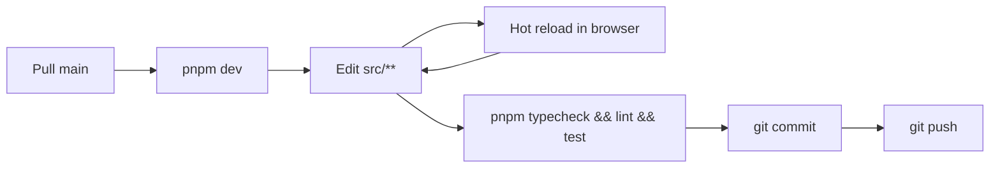

# Getting started

This guide walks you from a fresh clone to a running dashboard.

## Prerequisites

- **Node.js** ≥ 20 (Next.js 16 requires it)
- **pnpm** ≥ 9 (the repo ships a `pnpm-lock.yaml`; examples use pnpm)
- A reachable **Strapi** instance holding the dashboard's project catalog, with an API token that can read projects, mapped tools, strategies and tool configurations
- Access credentials for the backends you intend to use:
  - **GlitchTip:** API token (the instance URL, organization and project id come from Strapi)
  - **PostHog:** personal API key (host and project id come from Strapi)

## 1. Install

```bash
git clone <repo-url>
cd dashboard-monitor
pnpm install
```

`pnpm install` also runs `husky` to set up git hooks (`prepare` script).

## 2. Configure environment

Copy the template and fill in your credentials:

```bash
cp .env.example .env.local
```

Minimum required to boot:

```bash
STRAPI_BASE_URL=http://localhost:1337
STRAPI_TOKEN=<your-strapi-token>

GLITCHTIP_TOKEN=<your-token>
POSTHOG_PERSONAL_API_KEY=<your-api-key>
```

That is the whole provider configuration in the environment. Everything project-scoped lives in Strapi. See [configuration.md](configuration.md) for the full list and the Strapi/env split.

> `STRAPI_BASE_URL` is the instance root, not the API path. A value ending in `/api` makes every GraphQL request fail with `405 Method Not Allowed`.

## 3. Configure the project in Strapi

The dashboard renders nothing useful until at least one **published** project exists. For each project, set:

1. **Identity** — title and slug. The `documentId` Strapi generates is what the dashboard keys everything on.
2. **Mapped tools** — pair a strategy with a tool:
   - `error-monitor` × `glitchtip`
   - `log-monitor` × `glitchtip`
   - `tracker-monitor` × `posthog`
3. **Tool configurations** — the connection details for each mapped tool:
   - GlitchTip: instance URL, organization slug, project id
   - PostHog: instance URL, project id
4. *(optional)* **Default config** — `DefaultRefreshIntervalMS`, the polling cadence. Defaults to 30 000 ms.
5. *(optional)* **Time intervals** — the window presets offered in the header (e.g. `30 minutes`, `6 hours`). Defaults to 30m / 1h / 12h / 24h.

A strategy left unmapped means the matching panel fails loudly with `No <X>Factory supports type "<strategy>"` — by design, so a misconfiguration is visible rather than silent.

## 4. Run

### Dev server

```bash
pnpm dev
```

Open <http://localhost:3000>. Hot reload is on; saving any `src/**` file reloads the page.

### Production build

```bash
pnpm build
pnpm start
```

## 5. Verify the wiring

After the page loads you should see the KPI strip and the panels populated within ~1s:

- **KPI row** — open issues, new issues in the window, new visitors, returning visitors, reservations
- **Issues** (left) — list of recent unresolved errors
- **Error Rate** (top-right) — 24h area chart
- **Reservations** (bottom-right) — sliding-window event timeline

The header carries the project selector, the window presets and — when `NEXT_PUBLIC_DASHBOARD_ENVIRONMENTS` is set — the environment selector.

If a panel shows an error, check the server logs for the underlying cause. Most issues are a missing Strapi mapping or an incorrect credential — see [Troubleshooting](#troubleshooting).

## 6. Quality gates

Before pushing:

```bash
pnpm typecheck   # TypeScript
pnpm lint        # ESLint
pnpm test        # Vitest
```

Husky enforces these.

## Daily development workflow


```mermaid
flowchart LR
    Start[Pull main] --> Dev[pnpm dev]
    Dev --> Edit[Edit src/**]
    Edit --> HR[Hot reload in browser]
    HR --> Edit
    Edit --> Check[pnpm typecheck && lint && test]
    Check --> Commit[git commit]
    Commit --> Push[git push]
```

Most changes are inside one feature folder — UI tweaks, mapper adjustments, hook tuning. For deeper changes, consult:

- [architecture.md](architecture.md) — to know what layer you're touching
- [monitors.md](monitors.md) — if you're adding/modifying an adapter
- [features.md](features.md) — if you're adding a new panel
- [state-management.md](state-management.md) — for query keys and store conventions

## Troubleshooting

### "Strapi env vars missing: STRAPI_BASE_URL, STRAPI_TOKEN"

Neither can be omitted. Set both in `.env.local` and restart `pnpm dev`.

### "Strapi request failed: 405 Method Not Allowed on …/graphql"

`STRAPI_BASE_URL` points at something that is not the instance root — most often a value ending in `/api`. The GraphQL endpoint is derived as `<root>/graphql`.

### "No project is configured in Strapi"

The catalog query returned nothing. Either no project exists, or none is **published**, or the token lacks read access.

### "Project X has no GlitchTip configuration"

The project exists but its tool configuration component is missing the GlitchTip entry. The home page needs it to display the GlitchTip project id in the header.

### "No ErrorMonitorFactory supports type 'error-monitor'"

The selected project has no mapped tool pairing the `error-monitor` strategy with a registered tool. Either:

- add the mapping in Strapi admin (currently supported tool: `glitchtip`), or
- add a new adapter and register it (see [monitors.md](monitors.md#adding-a-new-adapter)).

The same message shape applies to `log-monitor` and `tracker-monitor`.

### "GlitchTip env var missing: GLITCHTIP_TOKEN is required."

The project maps GlitchTip but the token isn't set. Same for `POSTHOG_PERSONAL_API_KEY` on the visitors panels. The check runs lazily on first request.

### "GlitchTip configuration of Strapi project X is incomplete"

The tool configuration exists but one of url / organization / projectId is empty. The message names what is required.

### Panels load but never refresh

The refresh cadence comes from the project's `defaultConfig.DefaultRefreshIntervalMS`. A value of `0` disables polling; clear it to fall back to 30 s.

### The wrong project is displayed on load

The selection is persisted client-side. Reset it with:

```javascript
localStorage.removeItem("dashboard-selected-project")
```

(Then refresh the page.) On a fresh browser the first project of the Strapi list is used.

### TanStack Query devtools

To inspect query state in dev, add `@tanstack/react-query-devtools` and mount `<ReactQueryDevtools />` inside `Providers`. Not included by default to keep the bundle clean.

## Useful project pointers

- **Add a new external provider** → [monitors.md](monitors.md#adding-a-new-adapter)
- **Add a new data view** → [features.md](features.md#how-a-feature-is-added)
- **Understand the request lifecycle** → [data-flow.md](data-flow.md)
- **Tune polling / caching** → [state-management.md](state-management.md)
