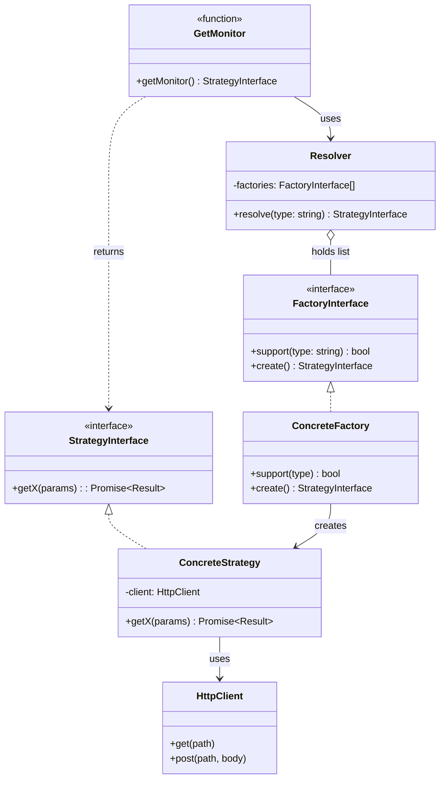
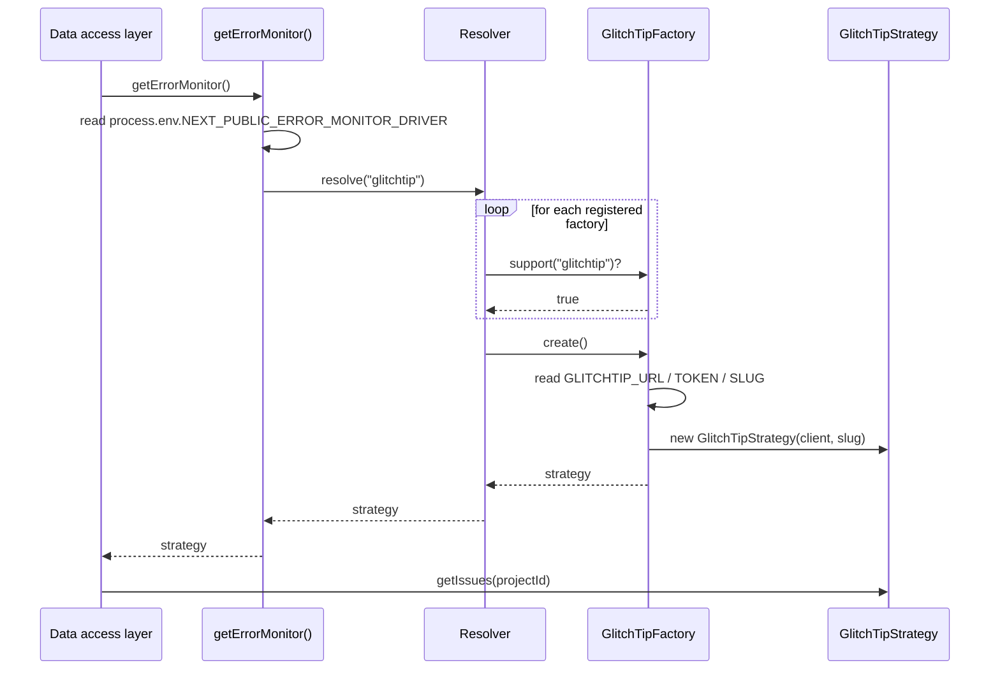
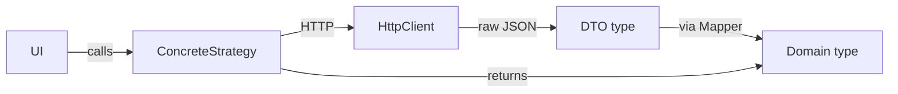

# Monitors: Strategy & Factory pattern

The monitor layer is the **central abstraction** of this project. It defines how the dashboard talks to external observability providers (GlitchTip, PostHog, …) without coupling the UI to any of them.

There are three monitor *families*, each independent:

- **`errorMonitor`** — issues, events, error stats (currently: GlitchTip)
- **`logMonitor`** — log aggregation with filtering (currently: GlitchTip)
- **`trackerMonitor`** — visitor timeline / live users (currently: PostHog)

All three follow the same shape. This doc describes that shape once, then shows how to add a new adapter.

## The pattern



### Roles

- **Strategy interface** — the contract the UI/data-access layer depends on. Stable across providers.
- **Factory interface** — knows *how* to build a Strategy. Each concrete factory matches one provider (`GlitchTipFactory`, `PostHogFactory`).
- **Resolver** — given a `type` string, picks the right factory and asks it to build. Iterates `factories.find(f => f.support(type))`.
- **Get*Monitor()** — the public entry point. Reads the driver env var, calls the Resolver, returns a ready-to-use Strategy. Marked `import "server-only"`.
- **Concrete Strategy** — provider-specific implementation. Holds an HTTP client, runs requests, calls **Mappers** to translate DTOs to domain types.
- **HTTP Client** — low-level transport (`GlitchTipClient`, `PostHogClient`). No business logic.

## Resolution flow



## The three monitor families

### errorMonitor

[src/lib/errorMonitor/strategy/ErrorMonitorStrategyInterface.ts](../src/lib/errorMonitor/strategy/ErrorMonitorStrategyInterface.ts)

```typescript
export interface ErrorMonitorStrategyInterface {
  getIssues(projectId: string, filters?: IssueFilters): Promise<Issue[]>;
  getErrorStats(projectId: string, period: Period): Promise<TimeSeriesPoint[]>;
  getIssue(issueId: string): Promise<Issue>;
  getIssueLatestEvent(issueId: string): Promise<IssueEvent | null>;
  getIssueEvents(issueId: string, limit?: number): Promise<IssueEvent[]>;
  getIssueComments(issueId: string): Promise<IssueComment[]>;
}
```

- **Driver env var:** `NEXT_PUBLIC_ERROR_MONITOR_DRIVER`
- **Entry point:** [GetErrorMonitor.ts](../src/lib/errorMonitor/GetErrorMonitor.ts)
- **Registered adapters:** `glitchtip` ([GlitchTipFactory.ts](../src/lib/errorMonitor/adapters/glitchtip/GlitchTipFactory.ts))
- **Domain types:** `Issue`, `IssueEvent`, `IssueComment`, `TimeSeriesPoint`, `ErrorLevel`

### logMonitor

[src/lib/logMonitor/strategy/LogMonitorStrategyInterface.ts](../src/lib/logMonitor/strategy/LogMonitorStrategyInterface.ts)

```typescript
export interface LogMonitorStrategyInterface {
  getLogs(projectId: string, filters?: LogFilters, period?: Period): Promise<Log[]>;
}
```

- **Driver env var:** `NEXT_PUBLIC_LOG_MONITOR_DRIVER`
- **Entry point:** [GetLogMonitor.ts](../src/lib/logMonitor/GetLogMonitor.ts)
- **Registered adapters:** `glitchtip` ([GlitchTipLogMonitorFactory.ts](../src/lib/logMonitor/adapters/glitchtip/GlitchTipLogMonitorFactory.ts))
- **Domain types:** `Log`, `LogLevel`, `LogFilters`

> The reservations feature consumes this monitor with a tag filter (`reservation.sent`) to aggregate business events on top of the log layer.

### trackerMonitor

[src/lib/trackerMonitor/strategy/TrackerMonitorStrategyInterface.ts](../src/lib/trackerMonitor/strategy/TrackerMonitorStrategyInterface.ts)

```typescript
export interface TrackerMonitorStrategyInterface {
  getActiveUsersTimeline(
    projectId: string,
    windowMinutes: number,
  ): Promise<VisitorsTimeSeriesPoint[]>;
}
```

- **Driver env var:** `NEXT_PUBLIC_TRACKER_MONITOR_DRIVER`
- **Entry point:** [GetTrackerMonitor.ts](../src/lib/trackerMonitor/GetTrackerMonitor.ts)
- **Registered adapters:** `posthog` ([PostHogFactory.ts](../src/lib/trackerMonitor/adapters/posthog/PostHogFactory.ts))
- **Domain types:** `VisitorsTimeSeriesPoint`

## Anatomy of an adapter

Take `GlitchTipFactory` as the canonical example:

```typescript
// src/lib/errorMonitor/adapters/glitchtip/GlitchTipFactory.ts
import { GLITCHTIP } from "../../ErrorMonitorTypeEnums";

export class GlitchTipFactory implements ErrorMonitorFactoryInterface {
  support(type: string): boolean {
    return type === GLITCHTIP; // "glitchtip"
  }

  create(): ErrorMonitorStrategyInterface {
    const baseUrl = process.env.GLITCHTIP_URL;
    const token = process.env.GLITCHTIP_TOKEN;
    const organizationSlug = process.env.GLITCHTIP_ORGANIZATION_SLUG;

    if (!baseUrl || !token || !organizationSlug) {
      throw new Error("GlitchTip env vars missing: ...");
    }

    const client = new GlitchTipClient({ baseUrl, token });
    return new GlitchTipStrategy(client, organizationSlug);
  }
}
```

Three responsibilities:

1. **Identify itself** via `support()`.
2. **Read its config** from `process.env` (provider-specific vars).
3. **Wire** the HTTP client and pass it to the Strategy.

The Strategy holds the business logic for translating the interface methods into HTTP calls and mapping DTOs:



DTOs (`GlitchTipIssueDto`, `GlitchTipEventDto`, etc.) mirror the external API shape exactly. Mappers translate them into our internal `Issue`, `IssueEvent`, etc. so the rest of the codebase never sees a provider-specific field.

## Adding a new adapter

Suppose you want to add **Sentry** as a second `errorMonitor` backend. Steps:

### 1. Register the type string

[src/lib/errorMonitor/ErrorMonitorTypeEnums.ts](../src/lib/errorMonitor/ErrorMonitorTypeEnums.ts):

```typescript
export const GLITCHTIP = "glitchtip";
export const SENTRY = "sentry"; // <-- add

export const errorMonitorMapper: ErrorMonitorType = {
  toolList: [GLITCHTIP, SENTRY], // <-- add
};
```

### 2. Create the adapter folder

```text
src/lib/errorMonitor/adapters/sentry/
├── SentryFactory.ts        # implements ErrorMonitorFactoryInterface
├── SentryStrategy.ts       # implements ErrorMonitorStrategyInterface
├── dto/                    # raw API response shapes
│   ├── SentryIssue.ts
│   ├── SentryEvent.ts
│   └── ...
└── mappers/                # DTO -> domain
    ├── IssueMapper.ts
    └── ...
```

A separate low-level HTTP client can go under `src/lib/sentry/SentryClient.ts` if it's reusable across families. If it's specific to errors, you can keep it inside the adapter folder.

### 3. Implement the Factory

```typescript
// src/lib/errorMonitor/adapters/sentry/SentryFactory.ts
import "server-only";
import { SENTRY } from "../../ErrorMonitorTypeEnums";

export class SentryFactory implements ErrorMonitorFactoryInterface {
  support(type: string): boolean {
    return type === SENTRY;
  }

  create(): ErrorMonitorStrategyInterface {
    const baseUrl = process.env.SENTRY_URL;
    const token = process.env.SENTRY_TOKEN;
    const org = process.env.SENTRY_ORGANIZATION_SLUG;

    if (!baseUrl || !token || !org) {
      throw new Error("Sentry env vars missing: SENTRY_URL, SENTRY_TOKEN, SENTRY_ORGANIZATION_SLUG");
    }

    return new SentryStrategy(new SentryClient({ baseUrl, token }), org);
  }
}
```

### 4. Implement the Strategy

Match every method of `ErrorMonitorStrategyInterface`. Inside each method: HTTP call → DTO → Mapper → domain object. Tests for this should mock the HTTP client and assert the mapper output.

### 5. Register in GetErrorMonitor

[src/lib/errorMonitor/GetErrorMonitor.ts](../src/lib/errorMonitor/GetErrorMonitor.ts):

```typescript
const factories: ErrorMonitorFactoryInterface[] = [
  new GlitchTipFactory(),
  new SentryFactory(), // <-- add
];
```

### 6. Document env vars

Add `SENTRY_URL`, `SENTRY_TOKEN`, `SENTRY_ORGANIZATION_SLUG` to both `.env.example` and [docs/configuration.md](configuration.md).

### 7. Switch the driver

Set `NEXT_PUBLIC_ERROR_MONITOR_DRIVER=sentry` and you're done. Zero changes in UI, hooks, API routes, or data access.

## Adding a new monitor family

If you need a *new family* (e.g. uptime monitoring), mirror the structure of `src/lib/errorMonitor/`:

```text
src/lib/uptimeMonitor/
├── domain/                      # internal types
├── strategy/
│   └── UptimeMonitorStrategyInterface.ts
├── factory/
│   ├── UptimeMonitorFactoryInterface.ts
│   └── UptimeMonitorResolver.ts
├── adapters/<provider>/
│   ├── <Provider>Factory.ts
│   ├── <Provider>Strategy.ts
│   ├── dto/
│   └── mappers/
├── UptimeMonitorTypeEnums.ts
└── GetUptimeMonitor.ts          # public entry point
```

Then add a driver env var (`NEXT_PUBLIC_UPTIME_MONITOR_DRIVER`) and document it.

## Testing strategy

- **Mappers** — pure functions, test with a frozen DTO fixture asserting the output shape.
- **Strategies** — mock the HTTP client, verify that the right path/params are called and the mapper output flows through.
- **Factories** — assert that missing env vars throw, and that `support()` matches the right type string.
- **Resolver** — assert it picks the right factory and throws on an unknown type.

## Common pitfalls

- **Importing a Get*Monitor from a client component.** Will fail at build time because of `import "server-only"`. This is intentional — keep monitor logic on the server.
- **Forgetting to register the new Factory in `Get*Monitor.ts`.** The Resolver will say `No <X>Factory supports type "<your-driver>"`. Check that the array contains your new factory.
- **Leaking provider DTO types upward.** The data access layer must only see domain types (`Issue`, `Log`, …). If you find yourself importing `GlitchTipIssueDto` in `IssuesDataAccess.ts`, that's a missing mapper.
