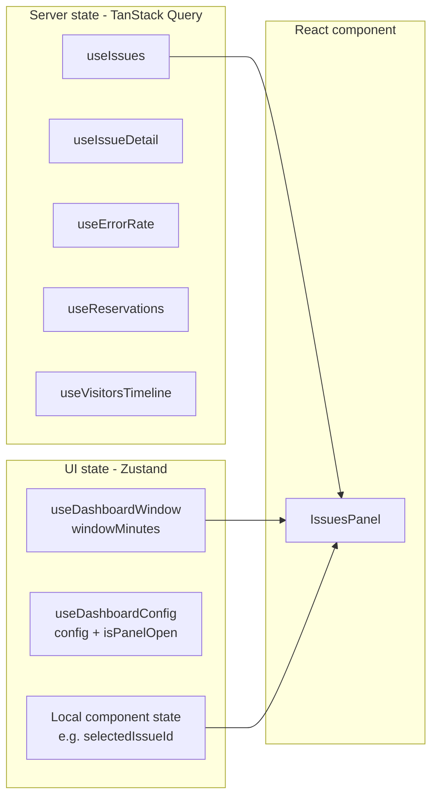
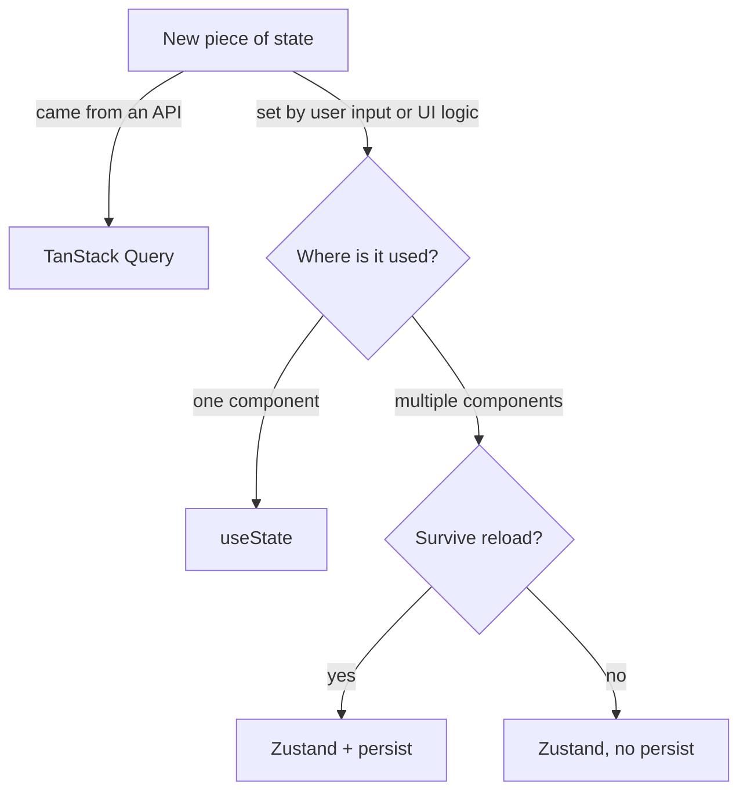

# State management

`dashboard-monitor` uses two state libraries with **clearly separated responsibilities**:

- **TanStack Query** — server state (anything fetched from an API)
- **Zustand** — UI state (anything ephemeral, never round-tripped)

Mixing them creates redundancy. Keeping them apart keeps each layer thin.



## TanStack Query — server state

### Setup

[src/app/providers.tsx](../src/app/providers.tsx):

```typescript
function makeQueryClient() {
  return new QueryClient({
    defaultOptions: {
      queries: {
        staleTime: 30_000,
        refetchOnWindowFocus: false,
        retry: 1,
      },
    },
  });
}
```

Mounted in [src/app/layout.tsx](../src/app/layout.tsx) via `<Providers>`.

- **`staleTime: 30s`** — data is considered fresh for 30s after fetch. Re-renders don't trigger a refetch within that window.
- **`refetchOnWindowFocus: false`** — the kiosk has no "focus events" — polling is enough.
- **`retry: 1`** — one retry on failure, then surface the error.

### Per-feature hooks

Each feature exports a single hook. They all follow the same shape:

```typescript
// hooks/useIssues.ts
export function useIssues(projectId: string, limit: number, intervalMs: number) {
  return useQuery({
    queryKey: issuesKeys.recent(projectId, limit),
    queryFn: () => fetchIssuesClient(projectId, limit),
    refetchInterval: intervalMs > 0 ? intervalMs : false,
  });
}
```

The `intervalMs` argument is threaded down from the kiosk page so all panels share the same cadence (driven by `DASHBOARD_REFRESH_INTERVAL_MS`).

### Query keys

Each feature owns a `queryKeys.ts` file. This avoids stringly-typed keys scattered across the codebase.

```typescript
// features/issues/queryKeys.ts
export const issuesKeys = {
  recent: (projectId: string, limit: number) =>
    ["issues", "recent", projectId, limit] as const,
  detail: (issueId: string) =>
    ["issues", "detail", issueId] as const,
};
```

Inventory:

- `issuesKeys.recent(projectId, limit)` → `["issues", "recent", projectId, limit]`
- `issuesKeys.detail(issueId)` → `["issues", "detail", issueId]`
- `errorRateKeys.series(projectId)` → `["errorRate", "series", projectId]`
- `reservationsKeys.series(projectId, windowMinutes)` → `["reservations", "series", projectId, windowMinutes]`
- `visitorsKeys.timeline(projectId, windowMinutes)` → `["visitors", "timeline", projectId, windowMinutes]`

Keep keys structural (constants → variables, last to last). That way `queryClient.invalidateQueries({ queryKey: ["issues"] })` invalidates *all* issues queries; `["issues", "recent"]` invalidates only the list; `["issues", "recent", projectId]` invalidates only that project.

### Hydration from server

[src/app/page.tsx](../src/app/page.tsx) prefetches each query in parallel using a server-side `QueryClient`, then dehydrates the cache and wraps children in `<HydrationBoundary state={...}>`. The client mounts already-populated. See [data-flow.md](data-flow.md) for the sequence.

## Zustand — UI state

Two stores, each scoped to one concern.

### useDashboardWindow

[src/app/features/dashboard/state/useDashboardWindow.ts](../src/app/features/dashboard/state/useDashboardWindow.ts)

```typescript
export const useDashboardWindow = create<DashboardWindowStore>((set) => ({
  windowMinutes: readDefaultFromEnv(),
  setWindowMinutes: (minutes) => set({ windowMinutes: minutes }),
}));
```

- **State:** `{ windowMinutes: number }`
- **Action:** `setWindowMinutes(minutes)`
- **Persistence:** none (in-memory only — defaults from `NEXT_PUBLIC_DASHBOARD_RESERVATIONS_WINDOW_MINUTES`, or 30 if missing/invalid)
- **Presets:** `WINDOW_PRESETS = [{30, "30m"}, {60, "1h"}, {180, "3h"}]`

Also exports `isDashboardInteractive()` — reads `NEXT_PUBLIC_DASHBOARD_INTERACTIVITY` and returns `true | false`. Used to hide window controls on read-only kiosks.

The reservations and visitors hooks subscribe to `windowMinutes` to refetch when the user picks a new preset.

### useDashboardConfig

[src/app/features/config/shared/state/useDashboardConfig.ts](../src/app/features/config/shared/state/useDashboardConfig.ts)

```typescript
export const useDashboardConfig = create<DashboardConfigStore>()(
  persist(
    (set) => ({
      config: getDefaultDashboardConfig(),
      isPanelOpen: false,
      setLogTool: (tool) => set((s) => ({ config: { ...s.config, selectedLogTool: tool } })),
      setErrorTool: (tool) => set((s) => ({ config: { ...s.config, selectedErrorTool: tool } })),
      openPanel: () => set({ isPanelOpen: true }),
      closePanel: () => set({ isPanelOpen: false }),
      togglePanel: () => set((s) => ({ isPanelOpen: !s.isPanelOpen })),
    }),
    {
      name: "dashboard-config",
      partialize: (state) => ({ config: state.config }),
    },
  ),
);
```

- **State:** `{ config: DashboardConfig, isPanelOpen: boolean }`
- **Actions:** `setLogTool`, `setErrorTool`, `openPanel`, `closePanel`, `togglePanel`
- **Persistence:** `localStorage` key `"dashboard-config"` via `persist` middleware
- **`partialize`** — only the `config` slice is persisted; `isPanelOpen` resets to `false` on reload.

### Local component state

Anything truly scoped to a single component stays in `useState`. Examples:

- `selectedIssueId` in `IssuesPanel` — drives the detail sheet open/closed. No other component needs to know about it.
- Form input drafts in the config panel before "save".

Rule of thumb: lift to Zustand only when two unrelated components need the same state.

## Decision matrix



## Common operations

### Trigger a manual refresh

```typescript
const queryClient = useQueryClient();
queryClient.invalidateQueries({ queryKey: issuesKeys.recent(projectId, limit) });
```

### Force refetch on a specific event

If the user changes `windowMinutes` in `useDashboardWindow`, the reservations hook re-runs automatically because `windowMinutes` is part of its query key. No manual invalidation needed — TanStack Query handles it.

### Reset persisted config

```typescript
localStorage.removeItem("dashboard-config");
```

Or, programmatically, expose a "reset" action on the store and call `useDashboardConfig.persist.clearStorage()`.

## Conventions to follow

- **Don't call `fetch` directly in components.** Always go through a hook.
- **Don't put server data in Zustand.** TanStack Query already does caching, dedup, and staleness — duplicating that in a store creates two sources of truth.
- **Don't subscribe to the whole store when you only need one slice.** Use a selector: `useDashboardWindow((s) => s.windowMinutes)`.
- **Always use the centralized `queryKeys` factory** — never inline `["issues", projectId]` in a component.
